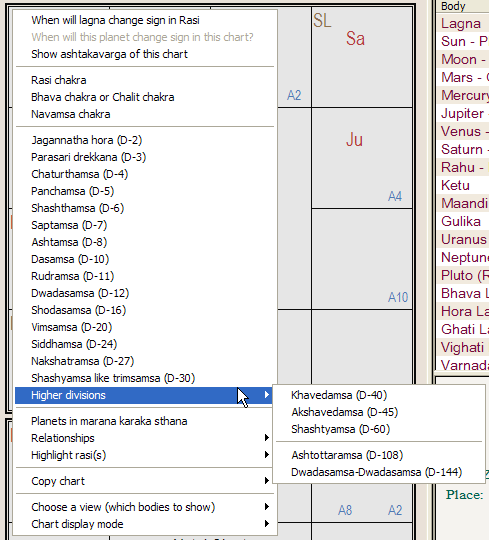
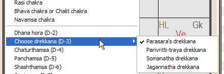
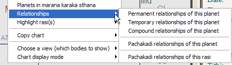
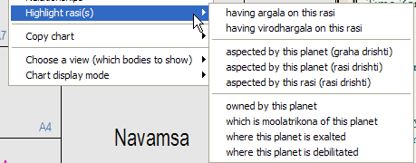
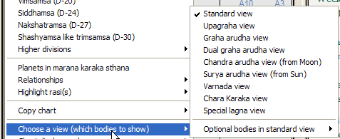

# Reference Manual

*© P.V.R. Narasimha Rao (2003). All rights reserved.*

**Topic ID:** `SZ.9TN`

**Keywords:** changing vargas;charts, working with;vargas, changing;working with charts

---

Working with charts

When you click the right mouse button on a chart, a pop-up menu will be displayed. This will contain the list of available vargas (divisional charts).

One can select the divisional chart of interest by clicking it in the above menu.

Charts above D-30 (viz D-40, D-45, D-60, D-108 and D-144) are under the sub-menu “Higher divisions”.

For D-2, D-3 and D-30, there are multiple versions of the charts that have specific purposes. When you click on D-2 or D-3 or D-30, the currently selected version will be displayed. If you display D-3 chart, for example, and then select the pop-up menu, it will now list "Choose drekkana (D-3)". By clicking on it, you can display the available options.

You can select the required option to change the type of D-3 displayed currently.

By clicking on “When will lagna change in this chart”, you can find out how much time should be added or subtracted to the birthtime to change lagna in the displayed divisional chart.

The menu item “When will this planet change sign in this chart” is normally disabled (grayed). When you click the right mouse button on a planet to display the menu, it is enabled. You can, for example, click on Mercury in D-24 chart to see how much time is to be added or subtracted to move Mercury to a different sign in D-24.

If you click "Show ashtakavarga of this chart", ashtakavarga of the current divisional chart will be displayed in the adjacent ashtakavarga frame (window).

If you click on “Planets in marana karaka sthana”, any planets occupying marana karaka sthana and the houses owned by them will be displayed. Please note that the houses and the significations owned by a planet in marana karaka sthana are destroyed in a chart.

If you click on “Relationships”, a sub-menu is displayed.

Permanent relationships of planets are fixed. Temporary relationship is based on their positions. Compound relationships are a combination of the two. Pachakadi relationships show which planets make a planet give its results (see the textbook “Narayana Dasa” by Pt. Sanjay Rath for more).

If you click on “Highlight rasi(s)”, a sub-menu is displayed.

You can highlight the own rasis, exaltation rasis, debilitation rasis and moolatrikonas of planets and see their sign-based aspects, planetary aspects, argalas (interventions) and virodhargalas (counter-interventions) using this. This is useful to learners.

You can copy the chart as text or a low resolution bitmap (picture) or as a high resolution bitmap (picture) that can be inserted into a document. Explore the “Copy chart” option.

You can select the bodies shown in the chart by clicking on “Choose a view (which bodies to show)”.

The standard view shows planets, Mandi, Gulika, lagna, main special lagnas and arudha padas of houses. Upagraha view shows all upagrahas. Graha arudha view shows the arudha padas of all the planets. Dual graha arudha view shows the arudha padas of all the planets by taking both the houses owned by a planet (in case of dual house ownership) instead of the stronger house. For example, Ma1 shows the arudha of Mars with respect to Aries (1st sign) and Ma8 shows the arudha of Mars with respect to Scorpio (8th sign). Chandra arudha and Surya arudha views show the arudha padas of all the 12 houses with respect to Moon and Sun. Varnada view shows varnada lagna and the varnadas of all houses. Chara karaka view shows the chara karakas. Special lagna view shows all the special lagnas.

Click the “Chart display mode” to “Automatic (Natal, Tajaka etc)” if you want to view natal chart as well as Tajaka chart in that chart space. This is the default setting for each chart space. If you set it to “Natal only”, that space will be reserved for natal chart only. Even when you are in Tajaka chart mode, still the natal chart will be displayed in that space. Using this, you can view the Tajaka chart in one space and natal chart in the other space.

Next topic 2TDFZ3