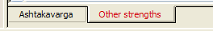
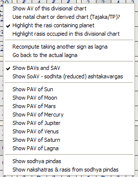
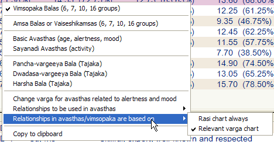
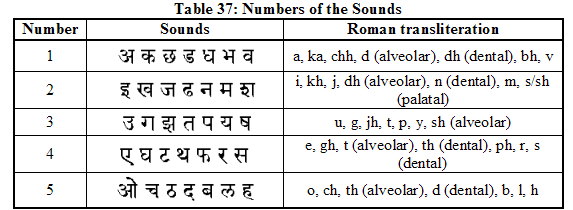

# Reference Manual

*© P.V.R. Narasimha Rao (2003). All rights reserved.*

**Topic ID:** `12UVBI`

**Keywords:** Planetary strengths;strengths;Strengths, planetary

---

Planetary strengths

Click on the “Strengths” tab at the top to go to planetary strength calculations. The bottom tab allows further selection between ashtakavarga and other strengths.

Ashtakavarga: In ashtakavarga view, one can click the right mouse button to get the following pop-up menu.

By clicking “Show AV of this divisional chart”, one can select the divisional chart whose ashtakavarga (AV) is displayed. By clicking “Use natal chart or derived chart (Tajaka/TP)”, one can select whether the AV of the natal chart is to be displayed or that of the derived chart (like Tajaka/TP) currently under display.

If one goes to ashtakavarga from a chart by clicking “Show ashtakavarga of this chart”, then AV of that chart is automatically displayed.

The menu item “Recompute taking another sign as lagna” can be used in Narayana dasa. Instead of finding AV using the lagna of the chart, one can find it using the dasa lagna of Narayana dasa.

Highlighting the signs occupied by planets in the chart for which AV is computed or another divisional chart helps in finding the strength of planets.

Other menu items help one find BAV (bhinna ashtakavarga), SAV (sarva ashtakavarga), SoAV (sodhita ashtakavarga), PAV's (prastara ashtakavargas) of various planets and sodhya pindas. The last item “Show nakshatras & rasis from sodhya pindas” helps in researching the timing of events from ashtakavarga and sodhya pindas.

Other strengths: In the “Other strengths” view, the top window shows shadbalas, ishta phalas and kashta phalas. The bottom window shows the yogas present in the divisional chart chosen. One can see all the yogas present in any divisional chart. One can also choose to view yogas of only one type (e.g. nabhasa yogas, raja yogas, solar yogas etc ). When the menu item “Just show a list of supported yogas (toggle)” is selected, just a list of all the yogas supported by the software is displayed instead of the list of yogas present in the chart. If this item is de-selected, then the list of yogas present in the chart is displayed instead of the entire list of yogas supported.

The middle window offers the following pop-up menu.

When one selects Vimsopaka balas, Vimsopaka balas of the shodasa varga, dasa varga, sapta varga and shadvarga scheme will be displayed. When one selects the amsa balas or vaiseshikamsas, vaiseshikamsas of all the planets will be displayed using the four varga schemes just mentioned. Basic avasthas include age related states (Kumara etc), alertness related states (Jagrita etc), mood related states (mudita etc). Sayanadi avasthas show the activity related states. There are 5 intensities given for each planet along with the avastha (state). Based on the first letter of the name, identify one of the 5 groups and find the intensity corresponding to it. Please refer to table 37 in “Vedic Astrology: An Integrated Approach”. It is reproduced below.

Pancha vargeeya bala, dwadasa vargeeya bala and harsha bala are used in Tajaka charts.

States related to alertness and mood vary from divisional chart to divisional chart. This pop-up menu allows you to select the divisional chart. The menu item “Relationships used in avasthas” allow you to choose either permanent or compound relationships in avasthas. In the calculation of avasthas, friendly signs and inimical signs are used. One can use permanent or compound relationships there. You can do research using the option. [ note : In Vimsopaka bala, only compound relationships are used, as it is pretty clear from the classics. There is ambiguity only in the case of avasthas and so an option is given in the software.]

Another option provided for researchers is whether the relationships used in avasthas and vimsopaka balas - if they are compound relationships - should be based on the placement in rasi chart or the relevant divisional chart itself.

Next topic 2VDFRC