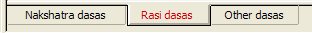
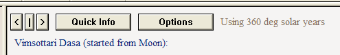
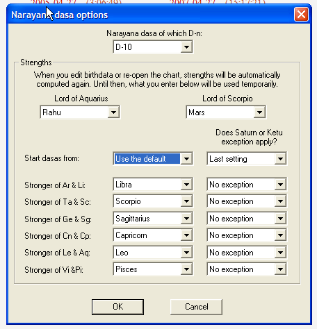

# Reference Manual

*© P.V.R. Narasimha Rao (2003). All rights reserved.*

**Topic ID:** `2VDFRC`

**Keywords:** Calculations, dasa;Dasa calculations;Dasas

---

Dasa calculations

Click on the “Dasas” tab at the top to go to dasa calculations. The bottom tab allows further selection of various types of dasas.

Nakshatra dasas: Nakshatra dasas include Vimsottari dasa, Ashtottari dasa, Kalachakra dasa, Yogini dasa, Dwisaptati sama dasa, Shatrimsa sama dasa, Dwadasottari dasa, Chaturaseeti sama dasa, Sataabdika dasa, Shodasottari dasa, Panchottari dasa and Shashtihayani dasa.

Rasi dasas: Phalita dasas included among rasi dasas are Narayana dasa, Sudasa, Drigdasa, lagna kendradi rasi dasa, Atma karaka kendradi rasi dasa, Trikona dasa, Chara dasa (Pararsara), Chara dasa (K.N. Rao), Yogardha dasa and Paryaya dasas (Chara, Sthira and Ubhaya Paryaya dasas, with only one applicable in each chart).

Ayur dasas included among rasi dasas are Shoola dasa, Niryana Shoola dasa, Brahma dasa, Sthira dasa, Mandooka dasa, Navamsa dasa and Varnada dasa.

Other dasas: Other dasas include Moola dasa, Tara dasa, Atma karaka kendradi graha dasa, Patyayini dasa, Sudarsana chakra dasa, Rasi-bhukta Vimsottari dasa, Tithi Astottari dasa and Tithi Yogini dasa.

Dasa Options: In each dasa window, one can find some buttons as shown below.

Clicking the first “<” button will take one to the previous cycle. Clicking the next “|” button will take one to the original cycle. After going back by several cycles, one can come to the original cycle by clicking this. Clicking the next “>” button will take one to the next cycle. The “Quick Info” button gives some quick information on the dasa.

When the “Option” button is available, it gives additional options. In the case of Vimsottari dasa, for example, one can choose whether dasas are started from Moon's star or lagna's star or Kshema star or Utpanna star or Adhana star or Mandi's star or Gulika's star or Trisphuta's star. In Shoola dasa, one can select Shoola dasa of the 1st house or 4th house (mother) or 9th house (father) or any other house. Various versions of Shoola dasa are used in the timing of the death and sickness of various relatives.

Nakshatra dasa miscellany: When the pop-up menu item “Use Tribhagi variation” is selected under nakshatra dasas, Tribhagi variation is used (if it is applicable to the current chart). In Tribhagi variation of the Vimsottari dasa, for example, there are 3 cycles of 40 years each. In each cycle, Sun dasa is for 2 years (6/3), Moon dasa is for 3.33 years (10/3) and so on.

The menu item “Vimsottari seed strength comparison help” in nakshatra dasa pop-up menu can be clicked for some help in selecting the stronger of various reference points used for starting Vimsottari dasa (Moon, lagna, Utpanna star etc ). It finds all the planets in quadrants from the chosen reference point. When finding the quadrants, houses can be based on signs or based on the “nine nakshatra padas make one house” principle. This can be used in research.

Narayana dasa options: The option window of Narayana dasa is displayed below. Options windows of other rasi dasas such as drigdasa are subsets of this window and behave the same way.

One can select the divisional chart of interest, select the stronger of Saturn & Rahu and of Mars & Ketu. If the dasa seed is selected to be “Use the default”, then the lord of the nth house of rasi chart is used as the dasa seed in D-n. The stronger of the sign containing him and the 7th house therefrom starts D-n Narayana dasa. To take another seed, simply change the “Start dasas from” to the sign required. Stronger sign out of Ar & Li, out of Ta & Li etc can also be selected. When it comes to Saturn & Ketu exceptions, you can change the exception status from what the software finds by default. If you want to do research, all the options are provided, so that you can change all the strength settings. If you don't want to do research, the software sets all the strengths based on what is taught by the author.

Tithi dasa options: There is an option in Tithi Ashtottari and Tithi Yogini dasas to choose janma tithi, dhana tithi, bhratri tithi etc for starting the dasas. This option was given to facilitate research, but please note that Tithi Ashtottari dasa started from janma tithi is used for all purposes in Tithi Pravesha charts. Dasas started from other special tithis are not used in tradition.

Locating an event: In all dasa pop-up menus, there is an item called “Locate an event”. When you click it, a dialog box will be displayed. Enter the date and time of the event. If you want, you can change the timezone also. If the person was living away from his country of birth when the event occurred, you can enter the time of the event and the timezone where the event occurred (instead of converting the time to the original timezone of birth manually). Then the software will find the dasa, antardasa, pratyantardasa etc running at the time of the event, upto the level you select. If you want, you can even find upto deha-antardasa.

Miscellany: You can click the left mouse button on a dasa or antardasa to divide it further. When you move the mouse on the dasa calculations, you will see a focus rectangle around the dasa division under the mouse. By clicking the left mouse, you can divide the dasa division in the focus rectangle to the next level (e.g. a pratyantardasa to sookshma-antardasas). To go back to the higher level, click on one of the headers that show the current dasa, antardasa etc. Suppose you are viewing prana-antardasas and want to go back to antardasa. Then click on the mahadasa.

By clicking “Entry chart of this period” in the pop-up menu, you can view the entry chart cast when the period in the focus rectangle commenced.

Using the pop-up menu, you can select the dasa year to be used. You can use normal solar year (365.2425 day years), savana years (360 day years), user defined years of n days, solar longitude based year (this is also a solar year, but is nonlinear; Sun's longitude is used as the measure of time for dividing periods further) or 360 tithi years (this is also nonlinear; Sun-Moon longitude differential is used as the measure of time). The choice can be applied to the current dasa or all dasas in the current dasa type ( viz nakshatra dasas, rasi dasas and other dasas) or all dasas.

Other options provided in the dasa windows include Tajaka dasa settings and compressed charts. You can choose whether to use natal references in Tajaka charts or not ( i.e. use natal Moon's star or Tajaka chart's Moon's star in Vimsottari dasa) and whether to progress the reference every year. You can choose whether to use dasa sesham in compressed dasas used in mundane charts. The default is to use it.

Next topic JI19PZ