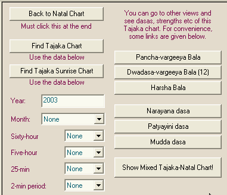

# Reference Manual

*© P.V.R. Narasimha Rao (2003). All rights reserved.*

**Topic ID:** `GJ8T3W`

**Keywords:** Tajaka;Tajaka calculations;Tajika;Tajika calculations

---

Tajaka calculations

Click on the “Tajaka” tab at the top to go to Tajaka calculations.

If you want a Tajaka annual solar return chart (varsha pravesha chakra), then enter the year, make sure that the month is set to “None” and click “Find Tajaka Chart”. If you want a monthly chart (maasa pravesha chakra), then enter the year, select the month, make sure that the “Sixty-hour chart” is set to “None” and click “Find Tajaka Chart”. If you want lower level Tajaka charts (like 60-hour charts, 5-hour charts, 25-minute charts and 2-minute charts) that are based on the lower level divisions of Sudarsana chakra dasa, select the required divisions and click “Find Tajaka Chart”.

A few links to strengths and dasas are given for convenience. After finding the Tajaka chart and displaying the Tajaka chart, you can click on those links to view Patyayini dasa, Pancha vargeeta bala etc .

Next topic 5OL3N0