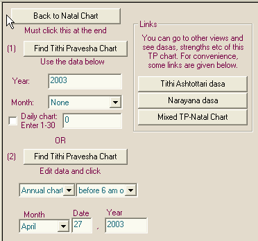

# Reference Manual

*© P.V.R. Narasimha Rao (2003). All rights reserved.*

**Topic ID:** `5OL3N0`

**Keywords:** Tithi Pravesha;TP

---

Tithi Pravesha

Click on the “Tithi Pravesha” tab at the top to go to Tithi Pravesha (TP) calculations.

If you want an annual TP chart, then enter the year, make sure that the month is set to “None” and click “Find Tithi Pravesha Chart”. If you want a monthly TP chart, then enter the year, select the month, make sure that the “Daily chart” checkbox is not checked and click “Find Tithi Pravesha Chart”. Note that there can be 13 months in a year sometimes and so 1st-13th months are listed. If you want a daily TP chart, enter the year, select the month, check the “Daily chart” checkbox and enter 1-30 for the index of the day in the month and click “Find Tithi Pravesha Chart”.

Alternatively, you can enter the desired date and find the annual/monthly/daily TP chart before/after 6 am on the given date. If you have an event and want the annual/monthly chart at the time of the event, this may work better.

A few links to dasas and mixed charts are given for convenience. After finding the TP chart and displaying the TP chart, you can click on those links to view Tithi Ashtottari dasa, Narayana dasa etc .

Next topic 3VX5K8