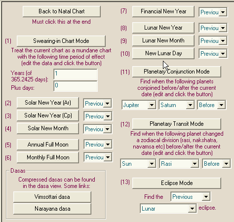

# Reference Manual

*© P.V.R. Narasimha Rao (2003). All rights reserved.*

**Topic ID:** `3VX5K8`

**Keywords:** Mundane;Mundane calculations

---

Mundane calculations

Click on the “Mundane” tab at the top to go to mundane calculations.

Use the swearing-in chart mode when dasas have to be compressed to a fixed period ( e.g. 4 years or 5 years or 3 months). Enter the years and dasas and click the “Swearing-in Chart Mode” to enter the mode. Then all dasas are compressed to the time period entered.

Solar new year chart (Ar) is the chart cast when Sun enters Aries. Dasas are compressed for one solar year. Solar new year chart (Cp) is the chart cast when Sun enters Capricorn. Dasas are compressed for one solar year. Solar new month chart is the chart cast when Sun enters any sign. Dasas are compressed for one solar month.

Annual Full Moon chart is cast when Sun and Moon are in exact samasaptaka (mutual 180 degree placement) in Aries and Libra respectively. Monthly Full Moon chart is cast when Sun and Moon are in exact samaspataka occupying any signs.

Financial New Year chart is cast when Sun and Moon conjoin in Libra, the natural sign of business. Lunar new year chart is cast when Sun and Moon conjoin in Pisces. Lunar new month chart is cast when Sun and Moon conjoin in any sign. New Lunar day chart is cast when every tithi starts, i.e. when the longitude difference between Sun and Moon is an exact multiple of 12 degrees.

Planetary Conjunction mode can be used to see when two planets conjoin before/after a given date and time. In this mode, dasas are compressed to the duration between two successive conjunctions of the two planets chosen. In a Saturn-Ketu conjunction chart, for example, dasas may be compressed to around 12 years if the next Saturn-Ketu conjunction occurs after 12 years.

Planetary transit mode can be used to find out when a planet enters a particular nakshatra or a particular sign in rasi or any divisional chart. Dasas are compressed to the period for which the planet stays in that nakshatra/rasi. If Jupiter's transit in Cancer in D-24 is found, for example, dasas are compressed to the period during which Jupiter stays in Cancer in D-24.

Eclipse mode is for finding the previous/next lunar eclipse, global solar eclipse or local solar eclipse. Dasas are again compressed to the period between two successive eclipses of the chosen type. The start and end times of various phases in the eclipse are given and the chart is cast for the maximum eclipse point.

Next topic MYIX2P