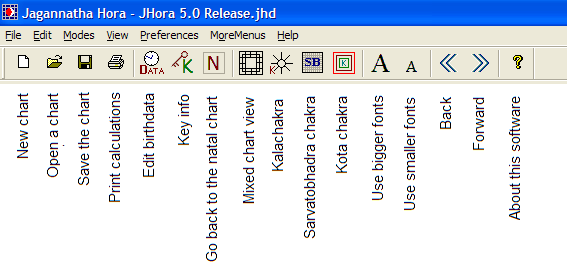
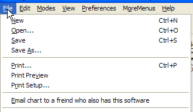
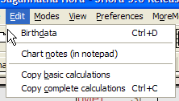
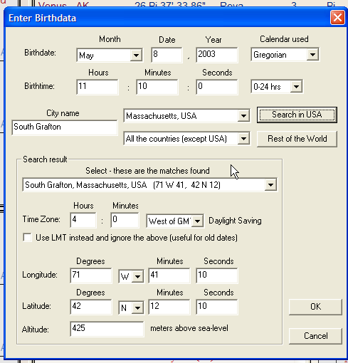

# Reference Manual

*© P.V.R. Narasimha Rao (2003). All rights reserved.*

**Topic ID:** `P_P.K`

**Keywords:** Main menu;Menu, edit;Menu, file;Menu, modes;Menu, view

---

Main menu

The main menu at the top of the software is shown below.

The functions of various icons in the toolbar are listed above. The functions of the main menu items will be listed below.

File menu: Using the file menu, you can create a new chart (with the current computer time and the default location chosen by you previously), open an existing chart or save the chart you worked with, or save it as a different chart (with a different name, so that the original chart opened is also retained).

You can also print the calculations (you can configure which calculations to print, using the preferences PA68C menu). You can also email the .JHD chart to a friend who has Jagannatha Hora or Jagannatha Hora Lite software.

Edit menu: Using the edit menu, you can edit the birthdata or edit the chart notes.

You can also copy the basic calculations or copy complete calculations in text format to the clipboard so that you can paste the calculations to another program (e.g. word or email program).

Entering birthdata: When you click “Birthdata” under the “Edit” menu, you will get the following dialog box.

Enter the date and time at the top. If you know the longitude, latitude and timezone of the place of birth, enter them directly and click “OK”. If not, enter the name of the city under “City name” and select the USA state or the country in the respective combo box and click the respective search button. In the top combo box in the “Search result” area, the cities that match the search criteria are returned. Go through the list and find the right city you want. When you select the right city, its longitude and latitude and timezone are used to automatically fill in the respective boxes. Then click “OK”.

note on timezone : The timezone is accurate for most countries. There can be errors for some countries. The atlas used is accurate for USA, India, Australia and most European countries based on today's timezone data. The atlas does not include historical changes in timezone. If timezone in a USA city changed in the past or war time was used in the past, the atlas does not find it automatically. So, it is a good idea to check the timezone given by the software with a professional atlas.

note on altitude : Altitude data is accurate only for USA cities. For cities in the rest of the world, this data is not accurate. In any case, altitude matters only if you chose topocentric calculations instead of geocentric calculations.

note on lmt : You can check the “Use LMT” checkbox if the birthdata you entered was noted using LMT (local mean time). As most of the clocks and watches are calibrated for the standard time rather than the local mean time, this box should mostly be unchecked unless you are sure that the time given is in LMT.

Modes and View menus: These menus offer easy access to go to various mode tabs such as Tajaka and TP and view various screens such as Kalachakra, Yogas etc . Under the “Modes” menu, there are items called “Go to the next lifecycle” and “Go to the previous lifecycle”. These can be used for going to the next lifecycle in the charts of nations and organizations. The theory is that the natal charts of nations and organizations become void after 144 years and a new lifecycle chart should be cast then. This option is useful for charts like USA chart. If you don't want to use 144 years, you can set the length of the lifecycle using the preferences PA68C menu.

Preferences menu will be covered in the next topic.

Next topic PA68C