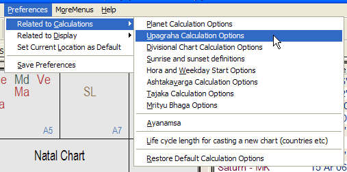
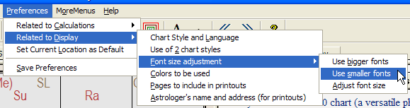
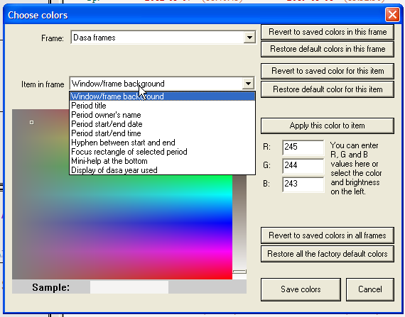

# Reference Manual

*© P.V.R. Narasimha Rao (2003). All rights reserved.*

**Topic ID:** `PA68C`

**Keywords:** Menu, preferences;Preferences;Preferences menu;User preferences

---

Preferences menu

The preferences menu contains several preferences related to calculations and related to display. Apart from them, the entry “Set Current Location as Default” can be used for setting the place of birth of the current chart as the default location used in new prasna charts. Simply open a new chart, edit the birthdata, change the place to the place you live in and then click “Preferences” and “Set Current Location as Default”. Then that location will be used whenever you create a new chart. This can be useful in prasnas. When you create a new chart, it is automatically the current time's prasna chart for your location!

When you change any preferences, they are not automatically saved. They are saved when you select “Save Preferences” in the Preferences menu or when you exit the program.

The preferences related to calculations are shown below.

Planet calculation options allow you to choose geocentric/topocentric positions, true/apparent positions and mean/true nodes. Geocentric positions are with respect to the center of earth. Topocentric positions are with respect to the birthplace. True positions are the true positions where the planet is. Apparent positions are where the planet appears to be. True nodes are not strictly retrograde - they go backwards sometime and forward sometime, but they go backward overall. On the other hand, mean nodes are strictly retrograde at all times, just as Maharshis taught us about the nodes. Don't be misled by the names - they are misnomers. Most traditional Vedic astrologers use mean nodes and we recommend them very strongly.

The upagraha calculation options are related to the computation of Vyatipata, Gulika, Mandi and Kala and some other upagrahas. You can also use sunrise and sunset or 6 am LMT and 6 pm LMT in the definition of upagrahas. The explanation in the dialog box is self-explanatory and go through it carefully. If you are unsure, leave the default settings.

The divisional chart calculations options allow you to choose between various alternative calculation options in some divisional charts. There are 5 different hora (D-2) charts, 4 different drekkana (D-3) charts, 2 different ashtamsa (D-8) charts, 2 different D-11 charts, 3 different trimsamsa (D-30) charts and 2 different ashtottaramsa (D-108) charts available in this software. In addition, there are different kinds of nadyamsa are available. In the uniform nadi method, each sign is divided into 150 equal parts and each part is one nadi. In the non-uniform Chandra Kala nadi method, rasi is divided into exactly 150 non-uniform parts using the boundaries in rasi, hora, drekkana etc (basically the 16 divisional charts of shodasa varga). The latter is recommended. Please note that no D-150 chart is given in the software. Only the nadis occupied by the planets are listed under “Amsa rulers” view of the “Basics” tab. Again, for the names of nadis, there are two options - (1) names given in Deva Keralam and (2) names given by C.G. Rajan.

The chara karaka definition option allows one to choose the eight chara karaka scheme taught by Parasara and Jaimini and recommended by Sri Jagannath Centre or the seven chara karaka scheme taught by Sri K.N. Rao.

The sunrise and sunset option allows 3 definitions of sunrise (and the corresponding symmetrical definitions of sunset). One can choose to take sunrise when Sun's center is truly on the eastern horizon or when the tip of Sun's disk is truly on the eastern horizon or when the tip of Sun's disk appears to be on the eastern horizon. The last one is not well-defined, because the exact refraction angle depends on the atmospheric conditions. Average conditions are assumed and hence the calculations need not be exact. Calculation in the first two settings is accurate.

Hora and weekday start options allow one to choose when weekday changes and the first hora of the day commences. For normal hora ( i.e. satya hora), one can choose sunrise or 6 am LMT as the start point of the day. For Mahakala hora (falsehood and illusion hora), one can choose 6 am LMT or 6 am standard time (time in the clock on the wall).

Ashtakavarga calculation options let one choose the definition of the ashtakavarga of Moon and Venus, wherever there are discrepancies between Parasara and Varahamihira. By checking all the six checkboxes provided, one can use Parasara's definition and, by unchecking all the six checkboxes provided, one can use Varahamihira's definition. One can experiment with a mixture too, but be careful with that.

Tajaka calculation options allow one to choose exact solar motion or mean solar motion when finding Tajaka charts. For finding muntha, there are three option. The first option finds muntha by progressing the natal ascendant by one sign per year in rasi chart and shows the same sign in all vargas. The second and third options take muntha to come from Sudarsana Chakra dasa and find it in each divisional chart separately. The second option starts antardasas from dasa sign and the third option starts antardasas from the lord of dasa sign. So muntha in monthly chart is affected accordingly.

Mrityu bhaga (MB) options allow one to go with the definition of Saravali, Jataka Parijatam and Sarvartha Chintamani or with the definition of Phala Deepika and Brihat Prajapatyam. There is a small discrepancy. There is another setting to be chosen. For example, the 19th degree is Jupiter's MB in Aries. It can mean that 19 deg - 20 deg is the death-inflicting region for Jupiter or that 18.5 deg - 19.5 deg is the region or that the 19th trimsamsa/degree (18 deg - 19 deg) is the region. The last one is the recommended setting, but you can experiment.

The ayanamsa preference lets you choose between a few well-known ayanamsas or define your own ayanamsa by giving the difference from Lahiri/Chitrapaksha ayanamsa. In the definition of ayanamsa, the nonlinear change in ayanamsa is considered and the simplistic (and definitely wrong) linear formulas given by various authors are ignored.

Lifecycle length setting allows you to set the lifecycle length. The default is 144 solar years. The theory is that the chart is an entity ( e.g. a country like USA or an organization) becomes void after 144 solar years and a new chart has to be cast after 144 years. Using the “Views” menu, you can go to the next lifecycle. The lifecycle length setting decides the length of the lifecycle.

The item “Restore Default Calculation Options” restores the factory default settings for all preferences related to calculations. You can use this to reset everything after playing with the options.

The preferences related to display are shown below.

Chart style and language option allows you to choose the chart style and the Indian language used for writing planet names in charts. Regular/irregular south Indian charts, north Indian diamond charts, east Indian Sun charts with/without frame are the five chart styles available. Ten Indian languages and English are available for planet names in charts. Moreover, one can choose whether Sanskrit names (Surya, Chandra etc ) should be used for planets or English names (Sun, Moon etc ) and whether Sanskrit names (Mesh, Vrish etc ) should be used for signs or English names (Ar, Ta etc ).

The option “Use of 2 chart styles” is suitable when you are collaborating with somebody who uses a different chart style than you. If you choose the north and east Indian chart styles, for example, the top chart is displayed in north Indian chart style and the bottom chart is displayed in east Indian chart style. When you change of the charts from, say, rasi to dasamsa, the other chart also automatically changes to dasamsa. Even in the six-chart view, only 3 charts are displayed and they are displayed in the two chart styles. This option is useful when collaborating or teaching.

The font size adjustment option is for making the fonts used in the software bigger or smaller.

The “Colors to be used” preference allows you to customize each and every color used in the software.

Go through the dialog box carefully if you don't like the default colors and want to change them. Simply select the view/frame you are interested in customizing ( e.g. dasa frames) and the item whose color you want to change ( e.g. focus rectangle of selected period) and set the color in the color picker area and click “Apply this color to item” when you are satisfied with the color you see. You can at all stages revert to the previously saved color(s) or the factory default color(s) for the selected item or selected frame or all frames. So you can undo the experiments that go wrong.

The “Pages to include in printouts” preference allows you to choose which pages (which sets of calculations) should be included in chart printouts. Go through the checkboxes in the dialog box carefully and check the ones that you want in your printouts.

Using the last item in display preferences sub-menu, you can enter your address, phone number, email address and website address into the software, so that your information appears at the top of the first page in each printout you take.

Next topic .WTCGR