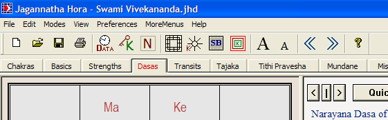
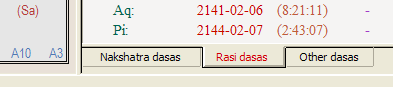
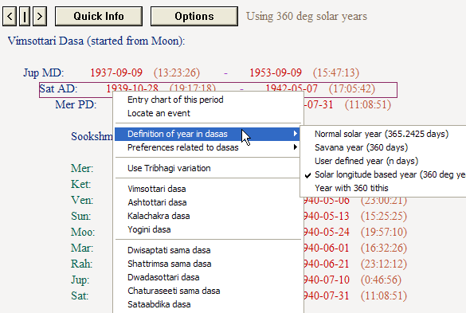
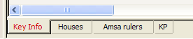
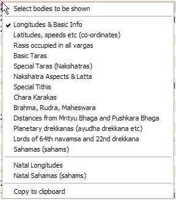
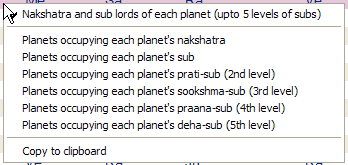
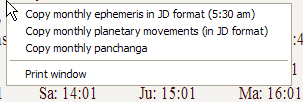
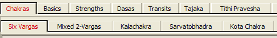

# Jagannatha Hora Help — Complete Text

---

### Topic 0: What is Vedic Astrology

# What is Vedic Astrology

*© P.V.R. Narasimha Rao (2003). All rights reserved.*

**Topic ID:** `_3WVWP`

**Keywords:** bibliography;books;references;textbooks

---

Vedic Astrology Textbooks

Most of the material in this help file is extracted from the following book:

“Vedic Astrology: An Integrated Approach”

By P.V.R. Narasimha Rao (author of this software)

Sagar Publications, 2001

Here are some more textbooks that may be useful to astrologers:

(1) “Astrology for Beginners”

By Dr. B.V. Raman

This textbook is for rank beginners. It introduces a few basics in detail.

(2) “Hindu Predictive Astrology”

By Dr. B.V. Raman

This textbook is for beginners. It introduces several basics in an easy language.

(3) “How To Judge A Horoscope” (Vols I and II)

By Dr. B.V. Raman

This is a landmark textbook for beginners and intermediate level students. This textbook gives many standard results for various houses and house lords in a clear fashion, with many examples.

(4) “Notable Horoscopes”

By Dr. B.V. Raman

This landmark textbook contains many brilliant examples of astrological analysis.

(5) “Vedic Astrology: An Integrated Approach”

By P.V.R. Narasimha Rao (author of this software)

Sagar Publications, 2001

This textbook is ideal for intermediate level students and intelligent beginners. It presents an integrated approach and introduces many building blocks of Vedic astrology clearly. It contains many examples and exercises. Most of the material in this help file is directly extracted from this book.

(6) “Crux of Vedic Astrology: Timing of Events”

By Pt. Sanjay Rath

This textbook is for intermediate and advanced level students. Pt. Rath is from a traditional family in Orissa, India and belongs to the parampara (master-student succession) of Sri Achyuta Dasa, one of the five associates of Lord Chaitanya. He is the parama guru of Sri Jagannath Vedic Centre. Hailed as one of the best Jyotish books of the last 100 years, this textbook touches many topics and teases and pleases intelligent and curious minds.

(7) “Jaimini Maharishi's Upadesa Sutras”

By Pt. Sanjay Rath

This textbook throws light on the advanced teachings of Maharshi Jaimini, with many examples.

(8) “Narayana Dasa”

By Pt. Sanjay Rath

This detailed textbook throws light on Narayana dasa, which is one of the most important dasas of Vedic astrology.

(8) “Vedic Remedies in Astrology”

By Pt. Sanjay Rath

This textbook gives a lot of mantras (sacred sounds) and esoteric formulas of Vedic astrology. For those astrologers who have faith in Hindu deities and Vedic remedial measures, this book is a must.

Classics:

(1) Brihat Parasara Hora Sastram (Sage Parasara)

(2) Jaimini Sutram (Sage Jaimini)

(3) Saravali (Kalyana Verma)

(4) Brihat Jatakam (Varahamihira)

(5) Phala deepika (Mantreswara)

(6) Hora Saram (Prithu Yasas)

(7) Sarvartha Chintamani (Venkatesa Daivajna)

(8) Jataka Parijatam (Vaidyanatha Deekshita)

(9) Garga Hora (Sage Garga)

(10) Kashyapa Hora

(11) Uttara Kalamritam (Kalidasa)

(12) Bhavartha Ratnakaram (Ramanuja)

(13) Jatakalankaram (Ganesa Kavi)

(14) Satya Jatakam (Satyacharya)

(15) Bhrigu Sutram (Sage Bhrigu)

(16) Bhrigu Nandi Nadi

(17) Suka Nadi

(18) Deva Keralam or Chandra Kala Nadi (Achyuta)

(19) Tajaka Neelakanthi (Neelakantha)

(20) Prasna Margam (Namboodiri Brahmin)

(21) Daivajna Vallabha (Varahamihira)

---

### Topic 1: What is Vedic Astrology

# What is Vedic Astrology

*© P.V.R. Narasimha Rao (2003). All rights reserved.*

**Topic ID:** `I7E22F`

**Keywords:** astrology

---

About astrology

Planets are constantly in motion with respect to earth in the skies. The positions of Sun, Moon and some planets close to earth can give important clues about the fortunes of individual human beings and groups of human beings. That is the basic premise of astrology. How exactly we can make guesses about the fortunes of individual human beings and groups of human beings based on the positions of those planets in the skies is the question that we will attempt to answer in these lessons. Astrology is the subject that deals with this question. There are many theories and philosophies in vogue and they are significantly different from each other.

Of these, Vedic astrology 5J_K.H5 is the most complete and comprehensive system.

---

### Topic 2: What is Vedic Astrology

# What is Vedic Astrology

*© P.V.R. Narasimha Rao (2003). All rights reserved.*

**Topic ID:** `5J_K.H5`

**Keywords:** Vedic astrology

---

About Vedic astrology

Materialistically speaking, India may not be a rich country today, but India has extremely rich cultural heritage. The depth of some of India's ancient knowledge (like astrology) is just amazing and it makes one wonder if the history of this great civilization is correctly represented in the pages of modern history. Astrology of India is the most comprehensive and complete system of astrology available today and it is the only one that comes close to answering the “twins puzzle” (namely, why are there so many twins in this world, who have a lot of significant differences between them). India's astrology can explain how twins can be different. The principles used in India's astrology are so sensitive to changes in birthtime that people born within 1-2 minutes can be significantly different in some aspects and similar in some others. This approach distinguishes between what a person truly is, what a person wants to be, what he thinks he is and what the world thinks he is. It has enough parameters, tools, techniques and degrees of freedom to model the extremely complicated human life.

This astrological approach is known in the world by many names. Early pioneers of modern Indian astrology, like Dr. B.V. Raman, called it “Hindu astrology”, because this system was first taught by ancient Hindu sages. However, some people do not like this expression because “Hindu” is not a Sanskrit word. This word was later coined by the western invaders from the name of a river flowing on the northwestern border of India (river “Sindhu” or “Indus”). They used the word “Hindu” to describe the land and the people on the eastern side of this river.

The religion practiced by a majority of Indians is known as “Hindu” religion today, but the fact is that there is no name for this religion in India's Sanskrit language, the language in which most of the literature of this religion – and astrology – appeared! Most other religions are known by the name of their main propagator, but India's ancient religion had no single propagator or prophet. This religion consisted of knowledge that revealed itself to spiritual masters of many generations. So there was no name for this religion and the word “Hindu” coined by western invaders was accepted by the world. However, as already stressed, this word finds no place in Sanskrit literature. Some people do not like using a non-Sanskrit word to describe India's astrology, considering that most of India's classical literature in astrology appeared in Sanskrit.

Later day authors came up with the name – “Vedic astrology". The word “Vedic” means “pertaining to Vedas". Vedas are the sacred scriptures of, what is known today as, Hinduism and they are supposed to contain knowledge of all subjects. Moreover, astrology in particular is supposed to be a “Vedaanga” (which means a limb of Vedas). In particular, it is said to be the eye of the Vedas. So the name “Vedic astrology” is becoming popular these days. This author also suggests using “Vedic astrology” or “Jyotish” (meaning “science of light"). Jyotishi is a practitioner of Jyotish, i.e. a Vedic astrologer.

Get a quick overview 3O9JMQ of Vedic astrology.

---

### Topic 3: What is Vedic Astrology

# What is Vedic Astrology

*© P.V.R. Narasimha Rao (2003). All rights reserved.*

**Topic ID:** `3O9JMQ`

**Keywords:** Overview, Vedic astrology

---

Quick overview

Basics

Grahas (planets)

The words “planet” and “star” are used in a slightly different sense in astrology than in astronomy. For example, Sun (a star) and Moon (a satellite of earth) are called planets in astrology, along with Mars etc . Basically, a graha or a planet is a body that has considerable influence on the living beings on earth. Distant stars have negligible influence on us, but Sun, Moon and planets in the solar system have a great influence on our activities. So the word graha (or planet) is used to describe them.

Seven planets are considered in Indian astrology. They are – Sun, Moon, Mars, Mercury, Jupiter, Venus and Saturn . In addition, two “chaayaa grahas” (shadow planets) are considered in Indian astrology – Rahu and Ketu . These are also called “the north node” and “the south node” respectively (or the head and tail of dragon). Rahu and Ketu are not real planets; they are just some mathematical points.

Apart from these 9 planets, there are 11 moving mathematical points known as Upagrahas (sub-planets or satellites). We also have lagna (ascendant), which is the point that rises on the eastern horizon as the earth rotates around itself. In addition, we have some mathematical points known as “ special ascendants" .

Rasis (signs)

The positions of all these planets, upagrahas, lagna and special lagnas in the zodiac are measured in degrees, minutes and seconds from the start of the zodiac (which is a fixed point in the sky). These positions are measured as seen from earth and they are called “geocentric positions". For the positions (calculated in degrees, minutes and seconds) of planets, lagna, special lagnas and upagrahas, we also use the words longitude and sphuta . When watched from earth, the longitude of any planet in the skies can be from 00'0'' (0 degrees 0 minutes 0 seconds) to 35959'59''. It should be noted that 00'0'' corresponds to the beginning of the zodiac. Many western astrologers consider Sayana or tropical (moving) zodiac, whereas Nirayana or sidereal (fixed) zodiac is considered in Vedic astrology.

The zodiac (sky) lasts 360 as mentioned above and it is divided into 12 equal parts. They are called “ rasis” (signs). English names, Sanskrit names, two-letter symbols and values of the start longitude and the end longitude (in degrees, minutes and seconds) of all twelve rasis are given in Table 1.

Table 1: Definition of Rasis

Rasi name Sanskrit name Symbol Start End
Aries Mesha Ar 00'0'' 2959'59''
Taurus Vrishabha/Vrisha Ta 300'0'' 5959'59''
Gemini Mithuna Ge 600'0'' 8959'59''
Cancer Karkataka/Karka Cn 900'0'' 11959'59''
Leo Simha Le 1200'0'' 14959'59''
Virgo Kanya Vi 1500'0'' 17959'59''
Libra Thula Li 1800'0'' 20959'59''
Scorpio Vrischika Sc 2100'0'' 23959'59''
Sagittarius Dhanus Sg 2400'0'' 26959'59''
Capricorn Makara Cp 2700'0'' 29959'59''
Aquarius Kumbha Aq 3000'0'' 32959'59''
Pisces Meena Pi 3300'0'' 35959'59''

Notation : If a planet is at 22137', then you can find from Table 1 that it is between 2100'0'' and 23959'59''. So, that planet is in Scorpio (or Vrischika). Its advancement from the start of the rasi occupied by is 1137'. Its position in the zodiac (22137') is shown by some people by the notation 1137' in Sc or simply 11 Sc 37 . This means “advanced by 1137' from the start of Sc (Scorpio)". Some people show it as 7s 11 37' . This means “after completing 7 signs, advanced by 1137' in the 8th sign (which is Scorpio)".

Each rasi again has many kinds of divisions and they are called “ vargas" . They will be defined in detail later.

Bhavas (houses)

Another important concept is “ house” (Sanskrit name: bhava ). In each chart, houses can be found with respect to several reference points and the reference points most commonly employed are lagna and special lagnas. Starting from the rasi occupied by the selected reference point and proceeding in the regular order across the zodiac, we associate each rasi with a house (first, second etc ). Always the rasi containing the reference point chosen is the 1st house. Next rasi is the 2nd house. The rasi after that is the 3rd house. We proceed until the 12th house like that. Just remember that when we encounter Pisces, we go to Aries after it. If no reference point is specified when houses are mentioned, it means that lagna is used as the reference.

If, for example, horalagna is in Cn, first house with respect to horalagna is in Cn. Second house is in Le (see Table 1). Third house is in Vi. Ninth house is in Pi. Tenth house is in Ar. Eleventh house is in Ta. Twelfth house is in Ge.

Different houses stand for different matters. Looking at the rasis and houses occupied by various planets, we can say a lot of things about the person. How exactly this is done will become clear in coming chapters.

Chakras (charts)

A “ chart” (Sanskrit name: chakra ) is prepared with the information of rasis occupied by all planets. For preparing any chart, we need to first determine the rasis occupied by all planets, upagrahas, lagna and special lagnas. In the visual representation of a chart, there are 12 boxes (are some other visual areas) with each representing a rasi. All planets, upagrahas and lagnas are written in the boxes corresponding to the rasis they occupy.

There are 3 popular ways of drawing charts in India: (1) South Indian style chart ruled by Jupiter, (2) North Indian style diamond chart ruled by Venus and (3) East Indian style Sun chart ruled by Sun. In this book, all the charts will be given in formats (1) and (2).

Out of the three chart formats, (1) and (3) are rasi-based and (2) is bhava-based. In rasi-based chart drawing formats, a rasi is always at a fixed position. Ar is always in one particular position and Ta is in another position and so on. Planets, lagna etc are placed in the box (or the visual area) representing the rasi occupied by it. In bhava-based chart drawing formats, a bhava (house) is always at a fixed position. Lagna (denoted by “Asc” for ascendant) is always in a particular visual area of the chart and the 2nd, 3rd etc houses are in fixed positions.

Example 1: Let us take Lord Sree Rama's rasi chart. The rasis occupied by planets and lagna are given below.

Ar – Sun; Ta – Mercury; Ge – Ketu; Cn – Ascendant (lagna), Moon & Jupiter; Li – Saturn; Sg – Rahu; Cp – Mars; Pi – Venus.

Figure 1: Indian Chart Styles

Rasi chart for the above data is drawn in South Indian, North Indian and East Indian formats in Figure 1. In the south Indian chart, notice the boxes containing Ar, Ta, Ge etc . In this format, these rasis will always be in the same positions. The same holds for the east Indian format. The north Indian format is different. Note the box containing “Asc” (ascendant – lagna). The same box will show the house containing lagna in all north Indian format charts. It may be Ar in one chart, Ta in another and Ge in yet another. The number corresponding to the rasi (1 for Ar, 2 for Ta, 3 for Ge and so on) is shown in the box. For example, the box with “Asc” has 4 in it and it shows Cn. So the 1st house is in Cn. Please note the order in which houses are visually arranged in this chart. The same pattern will be used in all charts.

note : Some people draw the east Indian format charts with an enclosing rectangle.

Varga chakras (divisional charts)

We saw that charts can be drawn with the information of which planet occupies which rasi. Based on the longitude of a planet, we can find the rasi occupied by it and mark its position in rasi chart.

In addition, we have what are known as “divisional charts” (Sanskrit name: varga chakras). These are based on dividing rasis into 2 parts, 3 parts, 4 parts and so on. We divide each rasi into n parts and map each part to a rasi again. Based on the rasis occupied by planets in these divisional mappings, we draw divisional charts (or harmonic charts). Each divisional chart throws light on a specific area of one's life. In each divisional chart, we find houses and analyze the chart as if it were an independent chart. The science of Vedic astrology stands on the basis of 4 pillars – (1) grahas or planets, (2) rasis or signs, (3) bhavas or houses, and, (4) varga chakras or divisional charts.

Nakshatras (constellations)

In Vedic astrology, the zodiac is divided into 27 nakshatras. Each nakshatra has a length of 360/27 = 13 20'. The first nakshatra, for example, stretches from the beginning of Aries to 13 20' in Aries. The second nakshatra stretches from there to 26 40' in Aries. The third nakshatra stretches from there to 10 in Taurus. The list of nakshatras with the respective starting and ending points is given in Table 2. The table also gives the “Vimsottari lords” of all nakshatras. This will be used later.

Each nakshatra is again divided into 4 quarters. They are called padas (legs/feet). The length of a nakshatra pada is 3 20'.

Table 2: Nakshatras

Name of Nakshatra Starts at Ends at Vimsottari Lord Ruling Deity
Aswini 00 Ar 00 13 Ar 20 Ketu Aswini Kumara
Bharani 13 Ar 20 26 Ar 40 Venus Yama
Krittika 26 Ar 40 10 Ta 00 Sun Agni
Rohini 10 Ta 00 23 Ta 20 Moon Bramha
Mrigasira 23 Ta 20 6 Ge 40 Mars Moon
Aardra 6 Ge 40 20 Ge 00 Rahu Shiva
Punarvasu 20 Ge 00 03 Cn 20 Jupiter Aditi
Pushyami 03 Cn 20 16 Cn 40 Saturn Jupiter
Aasresha 16 Cn 40 30 Cn 00 Mercury Rahu
Makha 00 Le 00 13 Le 20 Ketu Sun
Poorva Phalguni 13 Le 20 26 Le 40 Venus Aryaman
Uttara Phalguni 26 Le 40 10 Vi 00 Sun Sun
Hasta 10 Vi 00 23 Vi 20 Moon Viswakarma
Chitra 23 Vi 20 6 Li 40 Mars Vaayu
Swaati 6 Li 40 20 Li 00 Rahu Indra
Visaakha 20 Li 00 03 Sc 20 Jupiter Mitra
Anooraadha 03 Sc 20 16 Sc 40 Saturn Indra
Jyeshtha 16 Sc 40 30 Sc 00 Mercury Nirriti
Moola 00 Sg 00 13 Sg 20 Ketu Varuna
Poorvaashaadha 13 Sg 20 26 Sg 40 Venus Viswadeva
Uttaraashaadha 26 Sg 40 10 Cp 00 Sun Brahma
Sravanam 10 Cp 00 23 Cp 20 Moon Vishnu
Dhanishtha 23 Cp 20 6 Aq 40 Mars Vasu
Satabhishak 6 Aq 40 20 Aq 00 Rahu Varuna
Poorvaabhaadra 20 Aq 00 03 Pi 20 Jupiter Ajacharana
Uttaraabhaadra 03 Pi 20 16 Pi 40 Saturn Ahirbudhanya
Revati 16 Pi 40 30 Pi 00 Mercury Pooshan

For the purpose of some special charts like Kota Chakra and Sarvatobhadra Chakra, we consider 28 nakshatras. The last quarter of Uttarashadha is known as “Abhijit”. However, we consider 27 nakshatras for all other purposes.

Ayanamsa

Because of the movement in earth's precession, the starting point of the tropical zodiac changes slowly (with respect to fixed stars). Tropical (sayana) zodiac is analogous to measuring the positions of trees and buildings sitting in a slowly moving bus. Sidereal (nirayana) zodiac, on the other hand, considers a fixed zodiac. It considers the motion of the tropical zodiac (bus in our analogy) and makes an adjustment accordingly. We use the sidereal zodiac in Vedic astrology. The difference between the tropical zodiac and the sidereal zodiac is of great importance. What modern ephemeris gives us is the tropical positions of planets. To convert these positions, we have to subtract the difference between the two zodiacs. This difference varies with time. As earth's precession changes every year, the difference between the tropical zodiac and the sidereal zodiac changes. This difference is called “ayanamsa” (sidereal difference). There are many opinions on the correct value of ayanamsa, because nobody knows exactly which star is supposed to be the starting point of the real zodiac. We will use Chitrapaksha/Lahiri ayanamsa in this book, which is accepted by most Vedic astrologers of India.

Dasa Systems

Dasa systems are a hallmark of Vedic astrology. Vedic astrology has hundreds of dasa system. Each dasa system divides one's life into periods, sub-periods, sub-sub-periods and so on. All the periods are ruled by different planets or rasis. Some dasa systems are planet-based and some are rasi-based. Each dasa system is good at showing events of a specific nature. For each dasa system, we have some standard rules, based on which we analyze the natal chart and attribute different results to different periods and sub-periods. Each dasa system comes with rules for dividing one's life into periods and sub-periods and rules for attributing different results to different periods, based on the planetary positions in the natal chart. These periods are called “dasas” or “mahadasas” (MD). Sub-periods are called “antardasas” (AD). Sub-sub-periods are called “pratyantardasas” (PD).

Some dasas are good at showing matters related to longevity and death. They are called “ayur dasas” (dasas of longevity). Some dasas are good at showing general results. They are called “phalita dasas” (dasas of general results).

Mind is a very important part of our existence and Moon governs it. Some dasas are computed based on the nakshatra occupied by Moon and they are called “nakshatra dasas”. Some dasas are based on the rasis occupied by planets and they are called “rasi dasas”.

We will learn about 10 different dasa systems in these lessons and many more dasas and dasa variations are available in “Jagannatha Hora” software. Readers should not look at these dasas as different alternatives to look at the same life event. They should instead be looked at as ways to look at various aspects of the same life event. Different dasas systems provide different angles to look at the kaleidoscope of life.

Some of the dasas taught in these lessons are limited to specific matters. For example, we should look at Drigdasa for spiritual progress and we should look at Sudasa for money and wealth. Like that, some dasas are limited to specific matters.

For more information, please refer to “Vedic Astrology: An Integrated Approach” by P.V.R. Narasimha Rao, from which the above material is extracted.

Go to the next chapter: “ Bulding Blocks of Chart Analysis _CIZUP”

---

### Topic 4: Building Blocks of Chart Analysis

# Building Blocks of Chart Analysis

*© P.V.R. Narasimha Rao (2003). All rights reserved.*

**Topic ID:** `_CIZUP`

**Keywords:** rasis;signs

---

Rasis (signs)

Introduction

In the quick overview 3O9JMQ, we learnt that the zodiac of 360 is divided into 12 equal parts of 30. We learnt these are called rasis (signs). We learnt the definition of rasis. Different rasis have different properties and they stand for different things. We will learn them in this small chapter.

Characteristics of Rasis

Limbs of Vishnu

The whole zodiac is nothing but a manifestation of Lord Vishnu's body. Aries is the head. Taurus is the face. Gemini is the arms. Cancer is the heart. Leo is the stomach. Virgo is the hip. Libra is the space below navel. Scorpio is the private parts. Sagittarius is the thighs. Capricorn is the knees. Aquarius is the ankles. Pisces is the feet.

These are the limbs that rasis in the natural zodiac stand for. Because we are all part of the Supreme energy governing this world, the above mapping applies to us too. For example, we should pay attention to Leo for analyzing stomach problems and to Pisces for analyzing problems related to feet and so on.

Odd and Even

(1) Ar, Ge, Le, Li, Sg and Aq are called odd rasis or vishama rasis or oja rasis. They are also known as male rasis.

(1) Ta, Cn, Vi, Sc, Cp and Pi are called even rasis or sama rasis or yugma rasis. They are also known as female rasis.

This division is used in some dasas and in the determination of the sex of children.

Odd-footed and Even-footed

(1) Ar, Ta, Ge, Li, Sc and Sg are called odd-footed rasis or vishamapada rasis or ojapada rasis.

(1) Cn, Le, Vi, Cp, Aq and Pi are called even-footed rasis or samapada rasis or or yugmapada rasis.

This division is used in some dasas.

Movable, Fixed and Dual

(1) Ar, Cn, Li and Cp are known as chara rasis or movable rasis. They are ruled by Brahma, the Creator. Their nature is to move and to be dynamic.

(1) Ta, Le, Sc and Aq are known as sthira rasis or fixed rasis. They are ruled by Shiva, the Destroyer. Their nature is to be stable and constant.

(1) Ge, Vi, Sg and Pi are known as dwiswabhava rasis or dual rasis. They are ruled by Vishnu, the Sustainer.They are stable sometimes and dynamic sometimes.

Rasis & Five Elements

According to Hindu philosophy, this world is made up of 5 elements – fire, water, air, earth and ether. Water is a substance with a flexible state. Air is a substance with a varying state. Earth is a substance with a constant and solid state. Fire is a substance that transforms the state of things. Ether is something that is present everywhere.

For example, suppose one has a good memory and remembers something he learnt 10 years back. It involves a skill of earthy nature. Suppose a poet's imagination creates a nice poem that appeals to one's aesthetic sense. This involves watery skills. Suppose one is in a bad mood and his mind is wandering aimlessly. This shows airy state of the mind. These 5 elements are behind every material substance, every action, every thought, every emotion and every happening in this universe.

(1) Ar, Le and Sg are called agni rasis or fiery rasis.

(1) Ta, Vi and Cp are called bhoo rasis or earthy rasis.

(1) Ge, Li and Aq are called vaayu rasis or airy rasis.

(1) Cn, Sc and Pi are called jala rasis or watery rasis.

(1) The 5th element of aakaasa or ether is present in every rasi.

Let us see how these may be used. For example, the 5th house in one's chart shows one's emotional nature. The 5th house in a fiery sign may show a normally angry, aggressive or determined person. The 5th house in an earthy sign may show a balanced, logical and stable person. The 5th house in an airy sign may show someone with unstable and wandering emotions. The 5th house in a watery sign may show one with an imaginative and creative mind.

Indications of Rasis

Aries: Dynamic, enterprising, valiant, ruddy, head, forests, large forehead, hasty, impulsive, restless, thick eyebrows, leadership, overbearing, dry, lean, tall.

Taurus: Beautiful, face, stable, sluggish, loyal, meadows, plains, luxury halls, dining halls, eating places, fine teeth, large eyes, luxurious, faithful, thick hair, stout.

Gemini: Chest, garden, communication, journalism, schools, colleges, study rooms, cables, telephone, newspapers, tall, well-built, prominent cheeks, thick hair, broad chest, curious, learned, jovial.

Cancer: Heart, breast, watery fields, rivers, canals, kitchen, food, attractive, small build, emotional, deeply attached, mother-like, sensitive.

Leo: Stomach, digestion, navel, mountains, forests, caves, deserts, palaces, parks, forts, boilers, steel factories, thin, dry, hot, royal, self-pride, insolent, domineering.

Virgo: Hip, appendix, lush gardens, fields, orchards, libraries, bookstores, farms, intelligent, sharp, orator, nervous, physically weak, discretion, tactfulness.

Libra: Groins, Businessmen, markets, trade centers, banks, hotels, amusement parks, entertainment, toilets, cosmetics, balanced, wise, good talker.

Scorpio: Private parts, holes, deep caves, mines, garrages, small build, dusky complexion, bright eyes, secretive, scheming, occult, best friend or a worst enemy, peevish, sensitive.

Sagittarius: Thighs, royal, attorneys, government offices, aircraft, falling, sparse hair, muscular, deep eyes, uproght, honest, genial, gambler.

Capricorn: Knees, marsh lands, watery places, alligators, beasts, bushes, slender buils, long neck, prominent teeth, witty, perfectionist, patient, organizer, cautious, secretive, pragmatic.

Aquarius: Ankles, charity, philosophy, tall, bony, small eyes, mountain spring, places with water, ill-formed teeth, coarse hair, hard-working, stoic, honest.

Pisces: Feet, oceans, seas, prisons, hospitals, hermitages, short, plump, large eyes, large eyebrows, lazy, emotional, timid, honest, irresolute, talkative, intuitive.

For more information, please refer to “Vedic Astrology: An Integrated Approach” by P.V.R. Narasimha Rao, from which the above material is extracted.

Next topic Z4H1H5

---

### Topic 5: Building Blocks of Chart Analysis

# Building Blocks of Chart Analysis

*© P.V.R. Narasimha Rao (2003). All rights reserved.*

**Topic ID:** `Z4H1H5`

**Keywords:** grahas;planets

---

Grahas (planets)

Introduction

There are 7 grahas (planets) in Vedic astrology: Sun, Moon, Mars, Mercury, Jupiter, Venus and Saturn. There are two more chaayaa grahas (shadow planets): Rahu and Ketu. Rahu and Ketu are mathematical points. They are also called the north and south nodes or the head and tail of dragon. They are based on the points at which the orbit of Moon around earth cuts the orbit of earth around Sun.

Rasis represent situations that develop in one's life and influences that enter one's life. Planets in a chart represent human beings that play a role in one's life.

Just as the whole zodiac represents Lord Vishnu and rasis represent His limbs, planets represent Vishnu's avataras (incarnations).

Characteristics of Planets

Vishnu's Avataras

This world contains two essences – jeevaamsa (living essence) and paramaatmaamsa (absolute and supreme essence). Planets are the manifestations of different aspects of these essences. Vishnu's incarnations happened with these essences taken from various planets.

Meena/Matsya avatara (fish) came from Ketu. Koorma avatara (tortoise) came from Saturn. Varaaha/sookara avatara (boar) came from Rahu. Narasimha/Nrisimha avatara (half-man, half-lion) came from Mars. Vaamana avatara (learned dwarf) came from Jupiter. Parasu Rama/Bhaargava Rama came from Venus. Rama came from Sun. Krishna came from Moon. Buddha came from Mercury.

All these incarnations came into being with a significant percentage of paramaatmaamsa (supreme essence) than jeevaatmaamsa (living essence). Rama, Krishna, Narasimha and Varaha avataras had only paramaatmaamsa.

Other living beings are born with a significant percentage of jeevaamsa and a little of paramaatmaamsa from the planets.

Benefics and Malefics

(1) Jupiter and Venus are natural benefics (saumya grahas or subha grahas). Mercury becomes a natural benefic when he is alone or with more natural benefics. Waxing Moon of Sukla paksha is a natural benefic.

(1) Sun, Mars, Rahu and Ketu are natural malefics (kroora grahas or paapa grahas). Mercury becomes a natural malefic when he is joined by more natural malefics. Waning Moon of Krishna paksha is a natural malefic.

This information is important because the results given by planets are based on their inherent nature.

Main Governance

Sun governs soul. Moon governs mind. Mars governs strength. Mercury governs speech. Jupiter governs knowledge and happiness. Venus governs potency. Saturn governs grief.

Planets and Colors

Sun shows blood-red color. Moon shows tawny color. Mars shows blood-red color. Mercury shows grass green color. Jupiter shows tawny color. Venus is variegated. Saturn shows black color.

These colors can be useful, for example, when predicting the color of one's car. For now, readers should just memorize these characteristics.

Planetary Cabinet

Sun and Moon are kings. Mars is the leader (army chief). Mercury is the prince. Jupiter and Venus are the ministers. Saturn is the servant. Rahu and Ketu form the army.

Planetary Deities

Ruling deities of various planets are as given below: Agni (fire god) for Sun, Varuna (rain god) for Moon, Subrahmanya (army chief of gods) for Mars, Maha Vishnu (supreme sustaining force) for Mercury, Indra (ruler of gods) for Jupiter, Sachi Devi (Indra's wife) for Venus, Brahma (Creator) for Saturn.

Sex of Planets

Sun, Mars and Jupiter are male. Moon and Venus are female. Saturn and Mercury are female.

This information can be used for predicting the sex of children based on one's chart. For example, if the house ruling the first child is influenced by Jupiter, Mars and Mercury, we may predict a son. If it is influenced by Moon and Mercury, we may predict a daughter.

Planets & Five Elements

(1) Agni tattva (fiery element) is ruled by Mars. Sun also has the same nature.

(1) Bhoo tattva (earthy element) is ruled by Mercury.

(1) Vaayu tattva (airy element) is ruled by Saturn.

(1) Aakaasa tattva (ethery element) is ruled by Jupiter.

(1) Jala tattva (watery element) is ruled by Venus. Moon also has the same nature.

These rulerships throw light on the basic nature of planets. Being a fiery planet, Mars governs leadership, enterprise etc . Being an earthy planet, Mercury governs memory, logical abilities etc . Being an airy planet, Saturn governs wandering and free spirit. Being a watery planet, Venus governs imaginative and creative work. Being an ethery planet, Jupiter governs wisdom, intelligence and perceiving knowledge.

Planets & Varnas

Jupiter and Venus are Brahmanas (learned). Sun and Mars are Kshatriyas (warriors). Moon and Mercury are Vaisyas (traders). Saturn is a Sudra (worker).

Learning and intelligence is the forte of the learned class. Bravery is the forte of the warrior class. Getting along with others well is the forte of the trader class. Hard work is the forte of the working class. In this manner, we should understand varnas to show one's basic nature rather than the caste of one's family.

It should be noted that Moon, who was earlier classified in the planetary cabinet as a king, is said here to be of Vaisya varna. Sun is a king who is also a warrior. He is a brave king, who asserts himself. But Moon is a king who gets along well with everyone.

Planets & Gunas

Sun, Moon and Jupiter are saattwik planets. Mercury and Venus are raajasik planets. Mars and Saturn are taamasik planets.

note : There is a misconception today that sattwa guna means patience and not hurting others. An aggressive response to an offender is often thought to be raajasik. However, sattwa simply means “the state of being true”. Pleasing others with artificial goodness is not sattwa guna. Punishing a person for his mistakes is not necessarily rajo guna. If there is some passion and impurity in one's energetic response, then it shows rajo guna. But, if a warrior fights a sinning person with no passion or ego, it can still be a saattvic act. Lord Sri Rama and Sun are examples for this. Sun is a king of the warrior class and yet he is saattwik. Lord Rama, who was born with his amsa, is a saattwik person despite killing Ravana and other demons.

Sattva guna simply means purity and truthfulness in one's thoughts and action. Rajo guna shows some passion, energy and impurity in thoughts and actions. Tamo guna shows a dark, mean and depraved spirit in thoughts and actions.

Planetary Abodes

Sun lives in a temple. Moon lives in a watery place. Mercury lives in a sports ground. Jupiter lives in a treasure house. Venus lives in the bedroom. Saturn lives in a filthy area.

This description should give one an idea of the nature of planets.

Seven Dhaatus

Sapta dhaatus or 7 matters make up human body. The planetary rulerships are as follows: Sun rules bones. Moon rules blood. Mars rules marrow. Mercury rules skin. Jupiter rules fat. Venus rules semen (materials related to the reproductive system). Saturn rules muscles.

If Sun is afflicted, it can show some problems related to bones. Weakness of Moon may give blood related problems. And so on.

Planets & Time Periods

Sun rules an ayana. Moon rules a minute. Mars rules a week. Mercury rules a ritu. Jupiter rules a month. Venus rules a fortnight. Saturn rules a year.

These periods are very useful in prasna or horary astrology.

Planets & Tastes

Sun governs the pungent taste ( e.g. onion, ginger, pepper). Moon governs the saline taste ( e.g. sea salt, rock salt). Mars governs the bitter taste ( e.g. karela/bitter melon, dandelion root, rhubarb root, neem leaves). Mercury governs a mixed taste. Jupiter governs sweetness ( e.g. sugar, dates). Venus governs the sour taste ( e.g. lemon, tamarind). Saturn governs the astringent taste ( e.g. plantain, pomegranate).

The 2nd house shows one's preference in food. The planets influencing it may decide one's favorite taste. In addition, one should avoid the tastes of the planets who are likely bring disease. Suppose one is running a dasa or antardasa of a sign containing Moon as per Shoola dasa (a dasa that shows suffering). Then some suffering related to Moon is possible. Moon can give problems related to blood pressure as he governs blood. So eating too much salty food during such a period may result in high blood pressure. Similarly, one should cut down on sweets during a period in which Jupiter related troubles are indicated. Or, one may develop too much fat (Jupiter) or get other Jupiter related diseases.

Planetary Strengths

Mercury and Jupiter are strong in the eastern direction (lagna). Sun and Mars are strong in the southern direction (meridian – 10th house). Moon and Venus are strong in the northern direction (nadir – 4th house). Saturn is strong in the west (7th house). These are the digbalas (strengths associated with direction) of planets. These show the direction taken by one in one's life, as we will see later.

Moon, Mars and Saturn are strong in the night time. Sun, Jupiter and Venus are strong in the daytime. Mercury is always strong.

Natural malefics are strong in Krishna paksha. Natural benefics are strong in Sukla paksha.

Natural malefics are strong in Dakshina ayana. Natural benefics are strong in Uttara ayana.

Planets & Ritus

Planetary rulerships over ritus (seasons) are as follows: Venus governs vasanta ritu (spring). Mars governs greeshma ritu (summer). Moon governs varsha ritu (rainy season). Mercury governs hemanta ritu (season of dew). Jupiter governs seeta ritu (winter). Saturn governs sisira ritu (fall).

Dhatu, Moola and Jeeva

(1) Rahu, Mars, Saturn and Moon rule over dhaatus (metals and materials).

(1) Sun and Venus rule over moolas (roots and vegetables).

(1) Mercury, Jupiter and Ketu rule over jeevas (living beings).

Planetary Dignities

Each planet has a sign where it is exalted ( uchcha ), a sign where it is debilitated ( neecha ), a sign that is called its moolatrikona and one or two rasis that are owned by it. A planet is said to be strong in its own rasi or exaltation rasi or moolatrikona.

Table 3 shows own rasis, exaltation rasis, the degree of deep exaltation, debilitation rasi, the degree of deep debilitation and the moolatrikona of each planet.

Table 3: Dignities of Planets

Planet Own rasis Exaltation rasi (deep exaltation point) Debilitation rasi (deep debilitation point) Moolatrikona
Sun Le Ar (10) Li (10) Le
Moon Cn Ta (3) Sc (3) Ta
Mars Ar & Sc Cp (28) Cn (28) Ar
Mercury Ge & Vi Vi (15) Pi (15) Vi
Jupiter Sg & Pi Cn (5) Cp (5) Sg
Venus Ta & Li Pi (27) Vi (27) Li
Saturn Cp & Aq Li (20) Ar (20) Aq
Rahu Aq Ge Sg Vi
Ketu Sc Sg Ge Pi

Some special points regarding the results given by planets:

(1) Sun gives the results of being in moolatrikona in the first 20 of Le and the results of being in own rasi in the remaining 10.

(1) Moon gives the results of being in exaltation rasi in the first 3 of Ta and the results of being in moolatrikona in the remaining 27.

(1) Mars gives the results of being in moolatrikona in the first 12 of Le and the results of being in own rasi in the remaining 18.

(1) Mercury gives the results of being in exaltation rasi in the first 15 of Vi, the results of being in moolatrikona in the next 5 and the results of being in own rasi in the remaining 10.

(1) Jupiter gives the results of being in moolatrikona in the first 10 of Sg and the results of being in own rasi in the remaining 20.

(1) Venus gives the results of being in moolatrikona in the first half of Li and the results of being in own rasi in the second half of Li.

(1) Saturn gives the results of being in moolatrikona in the first 20 of Aq and the results of being in own rasi in the remaining 10.

An analogy may help one understand the subtle difference between own rasi, exaltation rasi and moolatrikona.

Own rasi of a planet ( e.g. Pisces of Jupiter) is like one's home. One is most natural and comfortable at home. That is exactly what a planet in own rasi is. Moolatrikona of a planet ( e.g. Sagittarius of Jupiter) is like one's office. One executes one's formal job and performs one's duty at office. One is powerful and duty-minded at office. Exaltation sign of a planet ( e.g. Cancer of Jupiter) is like a favorite party/picnic. One is excited to be at one's favorite party/picnic. So an exalted planet is like an excited person at his favorite picnic spot. Debilitation sign of a planet ( e.g. Capricorn of Jupiter) is like one's worst party. A debilitated planet is like an unhappy person stuck at a place he hates.

Jupiter is a saattwik and dharmik Brahmin. Ethery Jupiter, planet of perception, intelligence and wisdom, is most comfortable in saattwik Pisces, which is the 12th house of the natural zodiac. That is his home. However, he also has to uphold dharma. Upholding dharma is his duty . Whether he likes it or not, he has to do it. So fiery Sagittarius, 9th house in the natural zodiac, is his moolatrikona. Jupiter is like a "raaja purohit" (chief priest of a king) in Sagittarius. He has to sometimes take strong decisions to uphold dharma (like sentencing someone to death). In Pisces, he is like a peaceful Brahmin doing pooja at his home. In watery Cancer, the 4th house of the natural zodiac, Jupiter is excited to do some imaginative (watery) learning (4th house matter). In taamasik and earthy Capricorn, the 10th house of the natural zodiac, Jupiter hates doing tamasik and well-defined karma (action, 10th house matter). It is against his nature. Executing well-defined taamasik karma may be fine with taamasik planets Mars and Saturn, but Jupiter is unhappy with it. So Jupiter is debilitated in Cp.

Take Mercury as another example. He is an intellectual planet and significator of communications. “Intelligent communication” is the most comfortable activity for him. So his home is intellectual Gemini, the 3rd house (communications) of the natural zodiac. However, intelligent debates and arguments are the formal job assigned to him. Virgo is the 6th house (arguments) of the natural zodiac and it is Mercury's moolatrikona!

While saattwik and ethery Jupiter doesn't quite love the job of fiercely and fierily upholding dharma (by punishing demon king Bali in Vaamana avatara, for example), he does it with a sense of duty. But Mercury loves his official job! He loves engaging in intellectual debates. So Virgo (6th house of the natural zodiac) is not only his moolatrikona (office), but also his exaltation sign (favorite picnic spot). Still, "intelligent communications" (Gemini) is what he is most comfortable with (home).

Let us take one final example – Ketu. Ketu is most comfortable with occult activity, which are shown by the 8th house. So he owns the 8th house of the natural zodiac, i.e. Scorpio. His official duty, however, is giving upaasana (meditation) and moksha (liberation), which are shown by the 12th house. So his moolatrikona is in the 12th house of the natural zodiac, i.e. Pisces.

One should remember the above and understand the mood of a planet based on whether it is in own rasi or exaltation rasi or moolatrikona. Though all the three are good placements, there is a subtle difference in the mood of the planet and the results given by it.

Planetary Relationships

Natural Relationships

For each planet, its friends and enemies are found as follows: Take the moolatrikona of the planet. Lord of the rasi where it is exalted is its friend. Lords of 2nd, 4th, 5th, 8th, 9th and 12th rasis from it are also its natural friends. Lords of other rasis are its natural enemies. If a planet becomes a friend and an enemy on account of owning two rasis, then it is a neutral planet. The list of friends, neutral planets and enemies of all planets is listed in Table 4.

Table 4: Natural relationships

Planet Friends (mitra) Nuetral (sama) Enemies (satru)
Sun Moon, Mars, Jupiter Mercury Venus, Saturn
Moon Sun, Mercury Mars, Jupiter, Venus, Saturn
Mars Sun, Moon, Jupiter Venus, Saturn Mercury
Mercury Sun, Venus Mars, Jupiter, Saturn Moon
Jupiter Sun, Moon, Mars Saturn Mercury, Venus
Venus Mercury, Saturn Mars, Jupiter Sun, Moon
Saturn Mercury, Venus Jupiter Sun, Moon, Mars

Temporary Relationships

In addition to the permanent relationship, we have temporary relationships based on the planetary position in a chart. These temporary ( tatkaala ) relationships are specific to a chart.

Planets occupying the 2nd, 3rd, 4th, 10th, 11th and 12th rasis counted from the rasi occupied by a planet are its temporary friends. Planet occupying other rasis are its temporary enemies.

Example 2: Let us consider Lord Sree Rama's chart given in Figure 1 and find the temporary friends and temporary enemies of Sun and Moon.

Sun : Sun is in Ar. The 2nd, 3rd, 4th, 10th, 11th and 12th rasis counted from Ar are Ta, Ge, Cn, Cp, Aq and Pi. Planets in those rasis are Mercury, Moon, Jupiter, Mars and Venus. They are temporary friends of Sun in this chart. Saturn is the only temporary enemy.

Moon : Moon is in Cn. The 2nd, 3rd, 4th, 10th, 11th and 12th rasis counted from Cn are Le, Vi, Li, Ar, Ta and Ge. Planets in those rasis are Saturn, Sun and Mercury. They are temporary friends of Moon in this chart. Temporary enemies are Mars, Jupiter, Venus.

Note that Moon and Jupiter have the same temporary friends and temporary enemies. That is because they occupy the same rasi and temporary relationships are based on the rasis occupied by planets.

Compound Relationships

We get the compound relationships between planets by combining permanent and temporary relationships as shown in Table 5.

Table 5: Compound Relationships

Temporary friend Temporary enemy
Natural friend Adhimitra (good friend) Sama (neutral)
Natural neutral Mitra (friend) Satru (enemy)
Natural enemy Sama (neutral) Adhisatru (bad enemy)

Example 3: Let us continue from Example 2 and find the friends and enemies of Sun and Moon in Lord Sree Rama's chart given in Figure 1.

Sun : We found in Example 2 that Sun's temporary friends are Mercury, Moon, Jupiter, Mars and Venus. Of these, Moon, Mars and Jupiter are natural friends and they become adhimitras (good friends). Mercury is a neutral planet in natural relationship and he becomes a mitra (friend) in compound relationship. Venus is a natural enemy. Being a temporary friend, Venus becomes a sama (neutral) planet in compound relationship.

Saturn is the only temporary enemy of Sun. Being a natural enemy too, he becomes an adhisatru (bad enemy) of Sun.

Moon : We found in Example 2 that Moon's temporary friends are Sun, Mercury and Saturn. Of these, Sun and Mercury are natural friends and they become adhimitras (good friends). Saturn is a neutral in natural relationship and he becomes a mitra (friend) in compound relationship.

Moon's temporary enemies are Mars, Jupiter and Venus. They are all natural neutrals and they become satru (enemies) in compound relationship.

Whenever we refer to a planet being in a friendly house or an inimical house in the rest of this book, we mean the compound relationships. A planet occupying a rasi owned by a mitra or adhimitra is in a friendly house. A planet occupying a rasi owned by a satru or adhisatru is in an inimical house.

For more information, please refer to “Vedic Astrology: An Integrated Approach” by P.V.R. Narasimha Rao, from which the above material is extracted.

Next topic 5LKWYR

---

### Topic 6: Building Blocks of Chart Analysis

# Building Blocks of Chart Analysis

*© P.V.R. Narasimha Rao (2003). All rights reserved.*

**Topic ID:** `5LKWYR`

**Keywords:** ghati lagna;ghatika lagna;hora lagna;pranapada lagna;special ascendants;special lagnas;sree lagna;varnada lagna;visesha lagnas

---

Visesha Lagnas (special ascendants)

Bhaava Lagna

Bhaava lagna is at the position of Sun at the time of sunrise. It moves at the rate of one rasi per 2 hours . In the rest of this book, bhava lagna will be denoted by BL .

If sunrise takes place at 6:00 am and Sun is at 6s 447' then, horalagna is at 6s 447' at 6:00 am, at 6s 1947' at 7:00 am, at 7s 447' at 8:00 am, 8s 447' at 10:00 am and so on. Bhavalagna moves at the rate of 1 per 4 minutes ( i.e. , 15 per hour).

Hora Lagna

Hora lagna is at the position of Sun at the time of sunrise. It moves at the rate of one rasi per hora (hour) . In the rest of this book, horalagna will be denoted by HL .

If sunrise takes place at 6:00 am and Sun is at 6s 447' then, horalagna is at 6s 447' at 6:00 am, at 6s 1947' at 6:30 am, at 7s 447' at 7:00 am, 8s 447' at 8:00 am and so on. Horalagna moves at the rate of 1/2 per minute ( i.e. , 30 per hour).

Ghati Lagna

Ghati lagna is at the position of Sun at the time of sunrise. It moves at the rate of one rasi per ghati (ghati=1/60th of a day, i.e. , 24 minutes ). In the rest of this book, ghatilagna will be denoted by GL . Ghati lagna is also called “ghatika lagna”.

If sunrise takes place at 6:00 am and Sun is at 6s 447' then, ghatilagna is at 6s 447' at 6:00 am, at 6s 1947' at 6:12 am, at 7s 447' at 6:24 am, 8s 447' at 6:48 am and so on. Ghatilagna moves at the rate of 115' per minute ( i.e. , 30 per 24 minutes).

Sree Lagna

In Sanskrit, the word “Sree” means wealth. It also means Lakshmi, wife of Lord Narayana and goddess of wealth. Sree Lagna will be denoted by SL in the rest of this book. Sree Lagna is important for prosperity. Its use will be shown in the chapter on Sudasa. Computation of Sree Lagna will be explained for now.

(1) Find the constellation occupied by Moon.

(1) Find the fraction of the constellation traversed by Moon.

(1) Find the same fraction of the zodiac (360).

(1) Add this amount to the longitude of lagna. Subtract multiples of 360 if necessary. The resulting amount is the longitude of Sree Lagna (SL).

Example 4:

Let us take a native with Moon at 13 Li 06 and lagna at 25 Vi 05. Moon's longitude is 180 + 136' = 1936'. Lagna's longitude 150+255' is 1755'.

(1) Moon is in Swathi constellation, which runs from 640' to 200' in Libra.

(1) Moon's advancement in his constellation is 136' – 640' = 626'. As fraction of the whole constellation, this is (626')/(1320') = 386'/800' = 0.4825.

(1) The same fraction of the zodiac is 0.4825 x 360 = 173.7 = 17342'.

(1) Adding this amount to the longitude of lagna, we get 1755' + 17342' = 34847. This is the longitude of SL. So SL is in Pisces at 1847'.

Use of Special Lagnas

Use of special lagnas should be learnt from a competent guru or good textbooks. For now, it will suffice to say that hora lagna shows money and ghati lagna shows power.

In any chart, normal lagna shows self. Hora lagna shows self, from the point of view of money, wealth and prosperity. Ghati lagna shows self, from the point of view of fame, power and authority. For example, when we time good and bad periods for a businessman, hora lagna may be very important. When we time good and bad periods for a politician, ghati lagna may be very important.

For more information, please refer to “Vedic Astrology: An Integrated Approach” by P.V.R. Narasimha Rao, from which the above material is extracted.

Next topic DZ21E2

---

### Topic 7: Building Blocks of Chart Analysis

# Building Blocks of Chart Analysis

*© P.V.R. Narasimha Rao (2003). All rights reserved.*

**Topic ID:** `DZ21E2`

**Keywords:** gulika;mandi;sub-planets;upagrahas

---

Upagrahas (sub-planets)

Sun-based Upagrahas

Five upagrahas called Dhuma, Vyatipaata, Parivesha, Indrachaapa and Upaketu are defined based on Sun's longitude. The exact formulas are given in Table 6. All these upagrahas are very malefic in nature. Any houses occupied by them in rasi chart or divisional charts are spoiled by them.

Table 6: Sun-based Upagrahas

Upagraha Longitude Formula
Dhuma Sun's longitude + 13320'
Vyatipaata 360 – Dhuma's longitude
Parivesha Vyatipata's longitude + 180
Indrachaapa 360 – Parivesha's longitude
Upaketu Indrachaapa's longitude + 1640'

= Sun's longitude – 30

It may be noted that Dhuma and Indrachaapa are apart by 180 and Vyatipaata and Parivesha are apart by 180.

Other Upagrahas

Six upagrahas called Kaala, Mrityu, Arthaprahaara, Yamaghantaka , Gulika and Maandi are more difficult to compute. Kaala is a malefic upagraha similar to Sun. Mrityu is a malefic upagraha similar to Mars. Arthaprahaara is similar to Mercury. Yamaghantaka is similar to Jupiter. Gulika and Maandi are similar to Saturn.

A day starts at the time of sunrise and ends at the time of sunset. A night starts at the time of sunset and ends at the time of next day's sunrise. Depending on whether one is born during the day or the night, we divide the length of the day/night into 8 equal parts.

Daytime births : The first part is ruled by the lord of weekday and then we cover planets in the order of weekdays. The part after the one ruled by Saturn is lord-less. After that, Sun's part comes. For example, the first 1/8th of the daytime on a Thursday is ruled by Jupiter. Next part is ruled by Venus. The 3rd part is ruled by Saturn. The 4th part is lord-less. The 5th part is ruled by Sun. The 6th part is ruled by Moon. The 7th planet is ruled by Mars. The 8th part is ruled by Mercury.

Table 7: Ruling planets

Rulers of the 8 parts of the DAY
Weekday 1st 2nd 3rd 4th 5th 6th 7th 8th
Sun Sun Moon Mars Merc Jup Ven Sat
Mon Moon Mars Merc Jup Ven Sat Sun
Tue Mars Merc Jup Ven Sat Sun Moon
Wed Merc Jup Ven Sat Sun Moon Mars
Thu Jup Ven Sat Sun Moon Mars Merc
Fri Ven Sat Sun Moon Mars Merc Jup
Sat Sat Sun Moon Mars Merc Jup Ven
Rulers of the 8 parts of the NIGHT
Weekday 1st 2nd 3rd 4th 5th 6th 7th 8th
Sun Jup Ven Sat Sun Moon Mars Merc
Mon Ven Sat Sun Moon Mars Merc Jup
Tue Sat Sun Moon Mars Merc Jup Ven
Wed Sun Moon Mars Merc Jup Ven Sat
Thu Moon Mars Merc Jup Ven Sat Sun
Fri Mars Merc Jup Ven Sat Sun Moon
Sat Merc Jup Ven Sat Sun Moon Mars

Night time births : The first part is ruled by the 5th planet from the lord of weekday and then we cover planets in the order of weekdays. For example, the first 1/8th of a Thursday night is ruled by the 5th planet from Jupiter, i.e. Moon (Jupiter, Venus, Saturn, Sun, Moon – that's the 5th one). Next part is ruled by Mars. The 3rd part is ruled by Mercury. The 4th part is ruled by Jupiter. The 5th part is ruled by Venus. The 6th part is ruled by Saturn. The 7th planet is lord-less. The 8th part is ruled by Sun.

Table 7 gives the list of the ruling planets of all the eight parts of the daytime and night time on all weekdays.

Once we divide the day/night of birth into 8 equal parts and identify the ruling planets of the 8 parts, we can find the longitudes of Kaala etc upagrahas using the following procedure:

(1) Kaala rises at the middle of Sun's part. In other words, we find the time at the middle of Sun's part and find lagna rising then. That gives Kaala's longitude.

(1) Mrityu rises at the middle of Mars's part.

(1) Artha Praharaka rises at the middle of Mercury's part.

(1) Yama Ghantaka rises at the middle of Jupiter's part.

(1) Gulika rises at the middle of Saturn's part.

(1) Maandi rises at the beginning of Saturn's part.

Suppose one is born on Thursday night and we want Yamaghantaka's longitude in his chart. Suppose night starts at 6 pm and ends at 6 am on the next day. We see from the table that Jupiter rules the 4th part of a Thursday night. Each part is 12/8 = 1.5 hours. The 4th part starts 4.5 hours after sunset, i.e. at 10:30 pm, and ends 1.5 hours later. So Jupiter's part extends from 10:30 pm to midnight. The middle point of this part is at 11:15 pm. We find lagna rising at 11:15 pm and that will be Yama Ghantaka's longitude.

For more information, please refer to “Vedic Astrology: An Integrated Approach” by P.V.R. Narasimha Rao, from which the above material is extracted.

Next topic 2M6EZKU

---

### Topic 8: Building Blocks of Chart Analysis

# Building Blocks of Chart Analysis

*© P.V.R. Narasimha Rao (2003). All rights reserved.*

**Topic ID:** `2M6EZKU`

**Keywords:** amsas;D-charts;divisional charts;divisions;vargas

---

Vargas (divisional charts)

Divisions of A Rasi

Each rasi has many divisions. Divisions of rasis are again mapped to rasis. For example, a rasi may be divided into 4 parts and each part may be mapped to a different rasi. Ar may be divided into 4 parts and the 4 parts may be mapped to Ar, Cn, Li and Cp. Then the 4 parts of Ta may be mapped to Ta, Le, Sc and Aq. And so on. Like this, we may divide all rasis into 4 parts and map the 4 parts to different rasis. We may also divide rasis to 9 parts and map each part into a rasi. We can have many different divisions.

Sage Parasara defined 16 different divisions of rasis. Jaimini and Tajaka writers mentioned 4 more divisions. It is possible that Parasara also dealt with these 4 special divisions in sections that are perhaps missing today. In addition, there are more higher and finer divisions that are normally not used.

Based on the rasis occupied by planets in various divisions, “divisional charts” are drawn. As we have seen before, we need to know the rasis occupied by planets, upagrahas, lagna and special lagnas to draw any chart. In every division, we divide the rasi into different parts, find the part containing each planet and see the rasi to which that part is mapped. Then we place the planet in that rasi in the chart corresponding to that division. We can draw a chart for each division. A planet can occupy different rasis in different divisions.

Chart of each division is called a divisional chart. Each divisional chart can be treated as a different chart and interpreted differently. Different aspects of life are seen in different divisional charts. Rasi chart is simply a special case of divisional charts. If we divide each rasi into just one part ( i.e. in effect, no division), we get rasi chart.

In the rest of this book, everything we describe will be applicable to all divisional charts, unless we explicitly state a chart. We can apply all the principles to all the divisional charts, but we should see only specific matters in a divisional chart. The list of matters to be seen in each divisional chart will be given after the details of computation are presented.

In this book, D- n will denote the divisional chart based on the n th division of rasis, i.e. based on dividing rasis into n parts.

Divisional Chart Significations

Each divisional chart signifies a particular area of life and throws light on it. Table 8 gives the list of these areas.

Table 8: Divisional Chart Significations

Divisional Chart Symbol Area of life to be seen from it
Rasi D-1 Existence at the physical level
Hora D-2 Wealth and money
Drekkana D-3 Everything related to brothers and sisters
Chaturthamsa D-4 Residence, houses owned, properties and fortune
Panchamsa D-5 Fame, authority and power
Shashthamsa D-6 Health troubles
Saptamsa D-7 Everything related to children (and grand-children)
Ashtamsa D-8 Sudden and unexpected troubles, litigation etc
Navamsa D-9 Marriage and everything related to spouse(s), dharma (duty and righteousness), interaction with other people, basic skills, inner self
Dasamsa D-10 Career, activities and achievements in society
Rudramsa D-11 Death and destruction
Dwadasamsa D-12 Everything related to parents (also uncles, aunts and grand-parents, i.e. blood-relatives of parents)
Shodasamsa D-16 Vehicles, pleasures, comforts and discomforts
Vimsamsa D-20 Religious activities and spiritual matters
Chaturvimsamsa D-24 Learning, knowledge and education
Nakshatramsa D-27 Strengths and weaknesses, inherent nature
Trimsamsa D-30 Evils and punishment, sub-conscious self, some diseases
Khavedamsa D-40 Auspicious and inauspicious events
Akshavedamsa D-45 All matters
Shashtyamsa D-60 Karma of past life, all matters

Insights on Divisional Charts

Divisional charts based on divisions between 1 and 12 operate in the physical plane . They show physical matters. Body, wealth, residence, wife, children, parents – these are all matters relating to the physical self.

Divisional charts based on divisions between 13 and 24 ( i.e. D-16, D-20 and D-24) operate in the mental plane . They show matters that exist at the mental plane. Sense of pleasure and unhappiness, religiousness, learning and knowledge – these are all matters relating to the mind and intellect.

Divisional charts based on divisions between 25 and 36 ( i.e. D-27 and D-30) operate in the plane of sub-consciousness . One's strengths, weaknesses, inherent nature, evils, certain psychological imbalances – these are all matters relating to the sub-conscious self.

Divisional charts based on divisions above 36 ( i.e. D-40, D-45 and D-60) operate in a kaarmic plane of existence that is above physical self, mind and sub-conscious self. Based on the karma from previous lives, we all have an existence at a level that goes beyond the levels of body, mind and sub-consciousness. Existence at that level has a considerable role in deciding the pattern of one's life, along with existence at the physical, mental and sub-conscious levels. Higher divisional charts like D-40, D-45 and D-60 throw light on this subtle aspect of chart analysis.

Using Divisional Charts

It is very important to memorize Table 8. We should choose the divisional chart to analyze, based on the matter we are interested in. If we want to know something about one's career, for example, we should analyze one's dasamsa chart (D-10). If we want to know something about one's luxuries and pleasures, we should analyze one's shodasamsa (D-16). Based on the matter of interest, we decide which area of life is relevant and analyze the corresponding divisional chart.

We should remember which planets, rasis and houses show a particular matter and find links between them in the divisional chart of interest.

Suppose we want to see when one would go abroad. It is related to residence and fortune and we should analyze one's chaturthamsa (D-4). The 9th and 12th houses show foreign residence. Rahu signifies foreign residence. We should now look for links. If 12th lord is with Rahu in the 9th house in D-4, it can suggest that one would live abroad, probably during the periods of Rahu or 12th lord or 9th house.

Suppose we want to see when one would get a promotion at the office. Because D-10 shows one's career and achievements, we should analyze D-10. Because GL (ghati lagna) shows power and authority, planets or rasis giving a promotion are usually connected with GL. They are in GL or aspect GL. Because AL shows status, planets associating with AL or the5th or the 10th from it are favorable. If the lord of AL is in the 10th from it and aspects GL, probably his period will give a promotion.

In this manner, we should analyze the divisional chart that signifies the sphere of life that we are interested in and analyze the houses that show the matter of interest. This is the key to correct chart analysis. We will see many examples of this in coming chapters.

Varga Grouping and Amsabala

We have several varga groups, i.e. groups of divisional charts.

If a planet is in its moolatrikona or an own rasi or its rasi of exaltation in a chart, it makes the planet very strong in that chart. In each group of divisional charts, we can count the divisional charts in which a planet occupies its moolatrikona or an own rasi or its rasi of exaltation. Based on the count of such good divisional charts for the planet, we say that the planet is in a particular amsa (the higher this number is, the stronger the planet is).

Shadvarga

“Shadvarga” literally means “six divisions”. Shadvarga is a group of the following divisional charts: (1) Rasi chart, (2) D-2, (3) D-3, (4) D-9, (5) D-12, and, (6) D-30.

The amsa said to be occupied by a planet and the corresponding count of divisional charts – from the above list – in which it occupies its moolatrikona, rasi of exaltation or an own rasi is listed below:

Kimsukaamsa – 2, Vyanjanaamsa – 3, Chaamaraamsa – 4, Chatraamsa – 5, Kundalaamsa – 6.

Sapta varga

“Sapta varga” literally means “seven divisions”. Sapta varga is a group of the following divisional charts: (1) Rasi chart, (2) D-2, (3) D-3, (4) D-7, (5) D-9, (6) D-12, and, (7) D-30.

The amsa said to be occupied by a planet and the corresponding count of divisional charts – from the above list – in which it occupies its moolatrikona, rasi of exaltation or an own rasi is listed below:

Kimsukaamsa – 2, Vyanjanaamsa – 3, Chaamaraamsa – 4, Chatraamsa – 5, Kundalaamsa – 6, Mukutaamsa – 7.

Dasa varga

“Dasa varga” literally means “ten divisions”. Dasa varga is a group of the following divisional charts: (1) Rasi chart, (2) D-2, (3) D-3, (4) D-7, (5) D-9, (6) D-10, (7) D-12, (8) D-16, (9) D-30, and, (10) D-60.

The amsa said to be occupied by a planet and the corresponding count of divisional charts – from the above list – in which it occupies its moolatrikona, rasi of exaltation or an own rasi is listed below:

Paarijaataamsa – 2, Uttamaamsa – 3, Gopuraamsa– 4, Simhaasanaamsa – 5, Paaraavataamsa – 6, Devalokaamsa – 7, Brahmalokamsa – 8, Airaavataamsa – 9, Sreedhaamaamsa – 10.

note : This group is very important and some yogas – special combinations – make use of these amsas. For example, lagna lord or ghati lagna lord in Simhaasanaamsa would make one very famous. A quadrant lord with good amsabala in dasavarga makes one very successful. Readers should memorize the above amsas.

Shodasa varga

“Shodasa varga” literally means “sixteen divisions”. Shodasa varga is a group of the following divisional charts: (1) Rasi chart, (2) D-2, (3) D-3, (4) D-4, (5) D-7, (6) D-9, (7) D-10, (8) D-12, (9) D-16, (10) D-20, (11) D-24, (12) D-27, (13) D-30, (14) D-40, (15) D-45, and, (16) D-60.

The amsa said to be occupied by a planet and the corresponding count of divisional charts – from the above list – in which it occupies its moolatrikona, rasi of exaltation or an own rasi is listed below:

Bhedakaamsa – 2, Kusumaamsa – 3, Nagapurushaamsa – 4, Kandukaamsa – 5, Keralaamsa – 6, Kalpavrikshaamsa – 7, Chandanavanaamsa – 8, Poornachandraamsa – 9, Uchchaisravaamsa – 10, Dhanvantaryamsa – 11, Sooryakaantaamsa – 12, Vidrumaamsa – 13, Indraasanaamsa – 14, Golokaamsa – 15, Sree Vallabhaamsa – 16.

For more information, please refer to “Vedic Astrology: An Integrated Approach” by P.V.R. Narasimha Rao, from which the above material is extracted.

Next topic _SP_4P

---

### Topic 9: Building Blocks of Chart Analysis

# Building Blocks of Chart Analysis

*© P.V.R. Narasimha Rao (2003). All rights reserved.*

**Topic ID:** `_SP_4P`

**Keywords:** bhavas;houses

---

Bhavas (houses)

Introduction

The zodiac consists of 12 rasis. Each rasi is said to form a house. When we talk about houses, we always have a point of reference. The rasi containing the point of reference is the 1st house. The next rasi is the 2nd house. The rasi after that is the 3rd house. Suppose Moon is in Aquarius and suppose we want houses with respect to Moon. Then Aquarius is the 1st house, Pisces is the 2nd house, Aries is the 3rd house, Taurus is the 4th house and so on. As we go around the zodiac, we reach Capricorn when we find the 12th house.

In the same chart, Sun may be in Taurus. When we find houses with respect to Sun, Taurus contains the 1st house, Gemini contains the 2nd house, Cancer contains the 3rd house and so on. If Ghati Lagna is in Virgo in the same chart, then the 1st, 2nd and 3rd houses with respect to Ghati Lagna are in Virgo, Libra and Scorpio respectively.

Thus we can find houses with respect to different references. The same sign may contain the 2nd house with respect to one reference and the 6th house with respect to another reference. If we mention houses without clearly specifying the reference used, it means that the reference used is lagna (ascendant). Lagna is the default reference when finding houses.

Different houses stand for different matters. The matters signified by a house also depend on the reference used. Each reference throws light on matters of a specific nature and that colors the meaning of a house. For example, the 11th house from lagna may stand for something and the 11th house from arudha lagna may stand for something else. It depends on the kind of matters shown by the two references – lagna and arudha lagna.

In addition, the matters signified by a house depend on the divisional chart in which we are finding houses. Each divisional chart throws light on matters of a specific nature. Again, that colors the meaning of a house. The 4th house from lagna in D-16 may mean something and the 4th house from lagna in D-24 may mean something else. We have already listed the areas of life seen from various divisional charts in the chapter on “ Error! Reference source not found. ”.

Significations of Houses

The matters signified by various houses are listed below. For further discussion on the results of various houses, readers may refer either to the ancient classics or to the modern classic – “How to Judge a Horoscope” (Vols I & II) by Dr. B.V. Raman.

First House: Physical body, complexion, appearance, head, intelligence, strength, energy, fame, success, nature of birth, caste.

Second House: Wealth, assets, family, speech, eyes, mouth, face, voice, food.

Third House: Younger co-borns, confidants, courage, mental strength, communication skills, creativity, throat, ears, arms, father's death (7th from 9th), expenditure on vehicles and house (12th from 4th), travels.

Fourth House: Mother, vehicles, house, lands, immovable property, motherland, childhood, wealth from real estate, education, relatives, happiness, comforts, pleasures, peace, state of mind, heart.

Fifth House: Children, poorvapunya (good deeds of previous lives), intelligence, knowledge & scholarship, devotion, mantras (prayers), stomach, digestive system, authority/power, fame, love, affection, emotions, judgment, speculation.

Sixth House: Enemies, service, servants, relatives, mental tension, injuries, health, diseases, agriculture, accidents, mental affliction, mother's younger brother, hips.

Seventh House: Marriage, marital life, life partner, sex, passion (and related happiness), long journeys, partners, business, death, the portion of the body below the navel.

Eighth House: Longevity, debts, disease, ill-fame, inheritance, loss of friends, occult studies, evils, gifts, unearned wealth, windfall, disgrace, secrets, genitals.

Ninth House: Father, teacher, boss, fortune, religiousness, spirituality, God, higher studies & high knowledge, fortune in a foreign land, foreign trips, diksha (joining a religious order), past life and the cause of birth, grandchildren, principles, dharma, intuition, compassion, sympathy, leadership, charity, thighs.

Tenth House: Growth, profession, career, karma (action), conduct in society, fame, honors, awards, self-respect, dignity, knees.

Eleventh House: Elder co-borns, income, gains, realization of hopes, friends, ankles.

Twelfth House: Losses, expenditure, punishment, imprisonment, hospitalization, pleasures in bed, misfortune, bad habits, sleep, meditation, donation, secret enemies, heaven, left eye, feet, residence away from the place of birth, moksha (emancipation/liberation).

We can find houses from houses and concatenate the meanings in some places. For example, the 3rd house shows younger brother. The 2nd house from the 3rd house is the 4th house (count 1, 2 from 3rd and get 3rd, 4th). So the 4th house shows the wealth, speech etc of younger brother. The 7th house from the 3rd house is the 9th house and it can show younger sibling's spouse. The 11th house from lagna shows friends and the 4th house from lagna is nothing but the 6th house from the 11th house. So the 4th house stands for enemies, diseases and debts of friends. In this manner, we can deduce many additional meanings of various houses.

Common References for Houses

It may be noted from the list above that each house shows many matters. It may be confusing at first to pick the right meaning that is relevant in a particular analysis. It becomes easier with experience. We have to note the area of life seen in the divisional chart under examination. We have to choose the meanings of houses that are relevant in that area of life. For example, the 4th house shows education, vehicle, house and mother (among other things). A list of the areas of life seen in various divisional charts is given in the chapter on “ Error! Reference source not found. ”. We see from it that learning is seen from D-24, pleasures and comforts from D-16, house and immovable property from D-4 and parents from D-12. So the 4th houses in D-24, D-16, D-4 and D-12 show education, vehicle, house and mother (respectively).

We should also take cognisance of the kind of matters shown by various references and interpret the meaning of a house accordingly. The 4th house from lagna, the 4th house from arudha lagna and the 4th house from paaka lagna can mean different things, depending on the matters shown by lagna, arudha lagna and paaka lagna. Now we will learn about the most common references used in finding houses and the matters shown by them.

Depending on the matter we are analyzing, we should look at the correct divisional chart, the correct reference and the correct house. Then only good results can be obtained. All this complexity may be perplexing to new students. However, there is something we should realize. Human existence is a very complicated thing and it is silly and unscientific to expect a simplistic model for the complicated human life. Though Vedic astrology has too many parameters used in chart analysis, they are all important as they give us the degrees of freedom necessary for modeling something as complicated as human life. However, if we do not understand what each parameter means and end up using them in a mixed-up way, we will get nowhere. So readers should strive to understand these basics very clearly.

Lagna

Lagna is the most commonly used reference when finding houses. If no reference is mentioned when houses are listed, it means that lagna – the default reference – was used. Lagna shows true self. If we are trying to understand someone's status in society, lagna may not be the correct reference. Status does not relate to “true self”. It is a part of the illusion of this world. However, if we are trying to understand someone's intentions in doing something or someone's knowledge or someone's persistence, it relates to “true self”. So they are seen from the houses counted from lagna. Lagna shows true self. It shows the overall spirit of “I” (self).

Chandra Lagna (Moon lagna)

Chandra lagna means Moon taken as a reference. We can find houses from Moon. Because Moon is the significator of mind, these houses show things from the perspective of mind. For example, someone may be working in a routine job, but he may have an active and enterprising mind and he may be using it in his career. In that case, the 10th house (career) from lagna may have the influence of Saturn (routine job) and the 10th house from Moon may have the influence of Mars (active and enterprising).

Houses counted from Moon are useful in looking at things from the point of view of mind. When we judge how happy one is, how ambitious one is and how one views one's career, the role of mind is paramount. So Chandra lagna should not be ignored.

Ravi Lagna (Sun lagna)

Ravi lagna means Sun taken as a reference. We can find houses from Sun. Because Sun is the significator of soul, these houses show things from the perspective of soul. For things related to physical vitality also, Sun is an important reference.

Arudha Lagna

Computation of arudha lagna (AL) will be explained in the chapter on “ Error! Reference source not found. ”. For now, the readers should remember that arudha lagna shows how a native is perceived in the world. It also shows the status of a native.

A planet in the 10th house from lagna may give some important developments in one's profession. A planet in the 10th house from Chandra lagna may give some important mental activity in one's profession. A planet in the 10th house from arudha lagna may give some important developments in one's professional status.

Paaka Lagna

Paaka lagna is important when analyzing the natal chart, dasas and transits. Paaka lagna is nothing but lagna lord taken as a reference. If someone with Pisces lagna has Jupiter in Cancer, then Cancer becomes paaka lagna. If someone with Leo lagna has Sun in Virgo, Virgo becomes paaka lagna.

Rasis represent situations and forces influencing the course of a native's life and planets represent individual beings. Lagna lord represents the physical self of a native. So that is what paaka lagna shows. Houses counted from paaka lagna throw light on matters related to the physical self of a native.

Lagna shows the concept of self and it deals with one's true personality . The physical existence of the person is different from this conceptual self. This applies to all divisional charts. Let us take an example. The 5th house shows scholarship, memory and success in competition. All these are related to learning and they are seen in D-24, the chart of learning. But they are better seen from different references. Let us find the best reference for each.

Success in competition is related to the illusions and perceptions of the world and so the most appropriate reference is arudha lagna. The 5th house from arudha lagna shows success in competition. Scholarship is not a measurable attribute of the physical existence. It is a property of one's true personality and one's conceptual self. So the 5th from lagna shows scholarship. If we take the self that exists physically and take its part as applicable to the area of life shown by D-24 ( i.e. learning), memory is a direct attribute of that self. Memory is a property of one's self that physically exists. So the 5th house from paaka lagna shows memory the best.

Saturn's transitover the rasi containing one's lagna may throw obstructions and hamper one's activities. Saturn's transit over the rasi containing one's Chandra lagna may create frustration and mental depression. Saturn's transit over the rasi containing one's paaka lagna may leave one feeling sick all the time and attack the physical vitality.

Karakamsa Lagna

Atma karaka stands for the soul of the person. Atma karaka is an important reference point in a chart. Because the soul is an important factor in deciding the nature of inner self than the physical existence, atma karaka is an important reference point in navamsa chart. Navamsa chart throws light on the inner self and the rasi occupied by atma karaka in it is called “Karakamsa”. We can analyze navamsa chart with respect to Karakamsa. The 12th house from Karakamsa shows the liberation of the soul and the situation of Ketu there is conducive to moksha. Propitiation of the deities corresponding to the strongest planet in the 12th house in navamsa from Karakamsa lagna can take one's soul towards moksha.

Ghati Lagna

Ghati lagna (GL) shows self, from the point of view of power, authority and fame. When we analyze promotions in career or political power of politicians, this reference is very important.

Hora Lagna

Hora lagna (HL) shows self, from the point of view of wealth. This reference is important when analyzing one's wealth.

Quick Summary

Trines : Prosperity and flourishing

Quadrants : Sustenance and vital activity

Upachayas : Gains and growth

Dusthanas : Setbacks and obstacles

Argala sthanas : Decisive influences

A Controversy

Houses are found with respect to lagna, special lagnas and some planets. Houses are found in rasi chart and in all the divisional charts. Some scholars ignore all these and take houses only with respect to lagna and only in rasi chart. They prepare something called “bhaava chakra” or “chalit chakra”, in which houses can start in one rasi and end in another. They take lagna's longitude to be the mid-point of the first house and construct all the houses accordingly. In the “equal house method”, they take a 30 arc with center at lagna as the 1st house. The next 30 arc is taken as the 2nd house and so on. This method is popular among Indian astrologers. Another method taught by Sripathi is more complicated and it is also popular. However, this author recommends neither. Each rasi is a house. The rasi containing the reference point chosen is the 1st house and the next rasi is the 2nd house.

Though there are some indirect references in BPHSsuggesting that Parasara supported house divisions placing houses in 2 rasis, there are quite a few direct references making it amply clear that each house falls in one rasi. Parasara taught us to find houses by counting rasis from the reference chosen. Moreover, only this approach is logical as we go to divisional charts. Parasara's treatment does not differentiate between rasi and divisional charts, as far as the basic techniques go.

So readers are advised to ignore all the discussions found in other textbooks on house division methods, “bhaava chakra” and “chalit chakra”. It may do good to follow the instructions in this chapter.

For more information, please refer to “Vedic Astrology: An Integrated Approach” by P.V.R. Narasimha Rao, from which the above material is extracted.

Next topic 8E8E.V

---

### Topic 10: Building Blocks of Chart Analysis

# Building Blocks of Chart Analysis

*© P.V.R. Narasimha Rao (2003). All rights reserved.*

**Topic ID:** `8E8E.V`

**Keywords:** chara karakas;karakas;naisargika karakas;significators;sthira karakas

---

Karakas (significators)

The word karaka means “one who causes”. Karaka of a matter is the significator of the matter. He is the one who causes events related to that matter.

There are 3 kinds of karakas:

(1) Naisargika karakas ( natural significators, 9 in number).

(1) Chara karakas ( variable significators, 8 in number), and,

(1) Sthira karakas ( fixed significators, 7 in number),

One should not use the three types of karakas in a mixed-up way. Karakas of each type have a specific purpose. One should understand the distinction between chara, sthira and naisargika karakas clearly and use them accordingly.

Naisargika karakas shows everything that exists in the creation. They include Rahu, Ketu and the seven planets. They are presided by Brahma . Naisargika karakas show not only human beings, but they show various impersonal things and matters. They show everything that exists in Brahma's creation and affects a person. Naisargika karakas are very useful in phalita Jyotish, i.e. analysis of general results.

Chara karakas include Rahu and the seven planets. They do not include Ketu, as Ketu stands for moksha (emancipation) and does not stand for any person who affects one's sustenance. Chara karakas are presided by Vishnu and they show people who play a role in one's life. As Vishnu presides over activities related to sustenance, achievements and spiritual progress, chara karakas show these aspects of one's life. Chara karakas show people who play an important role in one's sustenance and achievements. Examples are – mother, father, wife, advisors etc . Chara karakas are very useful in Raja Yogas and in spiritual progress. They also show how our karma (cumulative sum of actions) is carried from one life to another.

Sthira karakas include only 7 planets because only they have physical bodies. They are presided by Shiva . As Shiva presides over death, they show the destruction of body. Sthira karakas are useful in timing the death of various near relatives.

For more information, please refer to “Vedic Astrology: An Integrated Approach” by P.V.R. Narasimha Rao, from which the above material is extracted.

Next topic 2SC.03I

---

### Topic 11: Building Blocks of Chart Analysis

# Building Blocks of Chart Analysis

*© P.V.R. Narasimha Rao (2003). All rights reserved.*

**Topic ID:** `2SC.03I`

**Keywords:** arudha lagna;arudha padas;arudhas;bhava arudhas;graha arudhas;pada lagna;padas;upapada

---

Arudhas (risen ones)

Introduction

Lagna shows true self. However, people's perceptions of a person can be different from reality. Usually, how one is perceived by others is more important in material life than who one really is. A political leader perceived by people as a powerful and influential person may in reality be a coward and a confused man always in doubt. But the reality does not matter in deciding his material life. Perceptions matter more. People perceive him as a strong leader and that matters the most in deciding his political career.

A political leader generally perceived as an honest man may in reality be badly corrupt. A person generally perceived as an intelligent person may in reality be of average intelligence. An intelligent person may score poorly in examinations and people may not know his intelligence.

If someone studied at IIT (a top engineering institute of India), people may think that he is very knowledgable. If someone studied at an obscure university, people may not get the same impression. But it is possible that people's perceptions are wrong and the person who studied at IIT is less knowledgable. If an astrologer is frequented by a top politician, people may get an impression that the astrologer is good. If an astrologer maintains a low profile, people may think that he is average. But the latter astrologer may be more learned in reality.

What people perceive about a person can often be different from reality. However, perceptions and reality are both important to an astrologer. For predicting some matters, we need knowledge of the perceptions ( e.g. success of a politician in elections, success in a competitive examination, promotion at office etc ). For predicting some internal matters, on the other hand, true self should be clearly understood.

So we, astrologers, should be able to separate reality from perceptions and understand both correctly. We should understand the true nature of a person and also how he is perceived by the world. Arudha padas are a very important concept of Vedic astrology and they help us with that tough, but important, task.

Computation of Bhava Arudhas

Arudha padas of all the 12 houses (bhavas) in all the divisional charts are defined as follows:

(1) Take sign containing the house of interest in the divisional chart of interest.

(1) Find the sign occupied by the lord of that house.

note: Aquarius is owned by Saturn and Rahu. Scorpio is owned by Mars and Ketu. Take the stronger lord in the case of houses falling in these two signs. The chapter on “ Error! Reference source not found. ” will explain the rules used in comparing the strengths of planets.

(1) Count signs from the house of interest to the sign containing its lord. Counting is in the zodiacal direction always. For example, if the house we are interested in is in Gemini and its lord Mercury is in Aquarius, we count signs from Gemini to Aquarius and get 9.

(1) Count the same number of signs from the sign containing the lord and find the ending sign. In the above example, we count 9 signs from Aquarius and we end up in Libra.

(1) Exception: If the sign found thus in step (4) is in the 1st or 7th from the original sign in step (1), then we take the 10th sign from the sign found in step (4). Otherwise we don't make any change.

(1) The resulting sign contains the arudha pada of the house of interest.

Arudha pada of a house is simply called arudha or pada also. In this book, we will denote the arudha pada on n th house with A n . For example, arudha pada of 4th house is A4 and arudha pada of 9th house is A9.

Use of Arudha Lagna

While lagna stands for true self, arudha lagna (AL) stands for the maya associated with self. It shows the how the native is perceived in the material world. It shows the status of the native. A timid and confused individual may be perceived in the world as a strong leader. In that case, that is the maya associated with his personality and AL shows it.

Because arudha lagna deals with maya, illusions, perceptions and impressions, it is very important in judging various materialistic things. For example, Parasara and Jaimini taught that the 11th and 12th houses from AL show financial gains and expenditures. Natural malefics in the 3rd and 6th houses from AL show someone who is perceived as a bold person who hits enemies hard. Since such impressions are usually formed about materially successful people, malefics in the 3rd and 6th from AL make one bold and materially successful. Natural benefics in the 3rd and 6th houses from AL make one very gentle and restrained in public behavior. Such a person does not fight with others boldly. This combination is usually found in the charts of saints and saintly and mild-natured people.

The 10th house from lagna in D-10 shows one's true conduct in society. It shows the one's career and the true nature of one's karma (work). The 10th house from AL in D-10 shows perceptions about one's conduct in society. It deals more with one's status in career.

Use of Bhava Arudhas

Arudha padas show the maya (illusion) of material world. Arudha pada of n th house shows the maya associated with the matters signified by of n th house.

For example, 1st house stands for self. While the first house from lagna stands for true self, its arudha pada (AL) stands for the maya associated with self. It shows the how the native is perceived in the material world. It shows the status of the native.

The 4th house in D-16 shows happiness from vehicle. It shows true happiness from a vehicle.

One may be very happy with a Bajaj Chetak (an inexpensive two-wheel vehicle popular in India) or even a bicycle and one owning three Mercedes Benz cars may be unhappy with them and always dreaming of owning a better vehicle. One's true happiness from vehicle has nothing to do with the type of vehicle owned. However, people perceive one with 3 Mercedes Benz cars as a happier person in the matter of vehicle, compared to a Chetak owner. This is the maya associated with “happiness from vehicle” in this material world. So this is shown by A4.

Benefics influencing the 4th house in D-16 show someone who is happy with his vehicle(s). Benefics influencing A4 in D-16 show someone who is perceived to be happy with his vehicle(s). So planets influencing A4 in D-16 shed light on the physical vehicle owned by a person. Someone with Venus in own sign in A4 and Saturn in 4th (in D-16) may own luxurious vehicles ( i.e. perceived to be happy with respect to vehicle) but not be happy. Someone with Saturn in A4 and Venus and Jupiter in 4th (in D-16) may own a small vehicle ( i.e. perceived to be unhappy with respect to vehicles), but be happy with it.

As shown above, 4th house in D-16 deals with happiness from vehicles. In D-24, 4th house deals with learning and education. A4 in D-24 deals with the maya (illusion) associated with learning. What is it?

If someone studied at IIT (a top engineering institute of India), people may think that he is very knowledgable. If someone studied at an obscure university, people may not get the same impression. But it is possible that people's perceptions are wrong and the person who studied at IIT is less knowledgable.

So A4 in D-24 shows the school or university and the environment in which one's learning takes place. Usually that decides what impression people form about one's learning.

Similarly, A10 in D-10 shows the maya associated with one's karma (action – career). We form an impression about one's career based on the place and environment where one's work takes place. So A10 in D-10 shows one's workplace. One with Mars in A10 in D-10 may work at dynamic places or engineering companies. One with Jupiter in A10 in D-10 may work at a university or college or a court of law or a temple.

One important arudha pada used in Jyotish is upapada lagna (UL) – the arudha pada of the 12th house. This shows one's marriage and spouse. Planets in UL show the kind of marriage one has and the kind of spouse one gets. For example, Mercury in UL can show intelligent (when good) or indecisive (when bad) spouse. Ketu in UL can show spiritual (when good) or short-tempered (when bad) spouse. Sun in UL can show a charming spouse from a respectable family. It can also show an authoritative spouse. Mars in UL may show a bold spouse (when good) and a quarrelsome spouse (when bad).

The 8th house from UL shows the longevity of marriage and the 2nd and 7th houses from UL show the end of marriage. Malefics like Mars, Saturn and nodes in these houses from UL can result in troubles for the marriage and even a divorce.

Nature of spouse and the length of the marriage are two different issues. If Mars and Saturn are in UL and Jupiter is in the 8th from UL, it may show a long marriage to an argumentative and mean spouse. If Jupiter is in UL and Mars and Saturn in the 8th from it, one may have a noble spouse but the marital life will be very rough and there can even be a divorce. In such a case, propitiating Saturn and Mars can help (for more, see the chapter on “ Error! Reference source not found. ”).

The 7th house shows relations and A7 (darapada) shows the illusion associated with them, i.e. the kind of people one usually interacts with. Based on the kind of people one deals with, we perceive the nature of one's relations. If one has a friend who is a prostitute, people may get a negative impression about one's dealings. If one has a friend who is a famous film star, there is some glamour associated with one's relations. Thus darapada shows the kind of people one associates with and that plays an important role in forming people's impressions about one's relations. In D-10, darapada may show professional associates. In D-24, it may show friends at college or colleagues in the pursuit of knowledge. In D-20, it may show colleagues or friends in religious activities.

The 3rd house shows one's boldness. The 3rd house from lagna and the 3rd house from Mars show one's true boldness and the 3rd house from AL shows how bold one is perceived. In addition, A3 shows the maya surrounding one's boldness. It shows what drives the perceptions of people about one's boldness. The weapons one possesses may drive those perceptions and A3 may show one's weapons.

The 3rd house also shows one's communication skills. The 3rd house in D-24 (chart of learning and knowledge) and D-10 (achievements in society) may show one's writing skills. A3 shows the maya associated with one's writing skills. One may have excellent writing skills, but not write any book. In such a case, people may not really appreciate one's writing skills. One may be an average writer, but end up writing 20 books. In such a case, people may perceive him as a great writer. Thus the exact books written by one decide the perceptions of the world about one's writing skills. So A3 in D-24 and D-10 may show the books or articles written by him. In this author's D-10, for example, A3 is in Pisces. This can mean that he will be known for some books on saattwik and traditional subjects and astrology certainly fits the bill.

Let us take the 5th house as another example. It shows intelligence, following, devotion etc . The 5th house in D-20, the chart of religious activities, shows one's devotion ( bhakti ) in religious activities. A5 in D-20 shows the things based on which the world forms an impression about one's devotion. The mantras one recites, the poojas and the religious rituals one performs control the impression of the world about one's devotion in religious matters. So A5 shows them.

The 5th house in D-10, the chart of career, shows the following one has. The world forms an impression about one's following based on the power wielded by one. A political leader in a position of power is assumed to have a lot of following. So A5 can show the trappings of power enjoyed by one. It can also show awards.

In D-24, the chart of learning, the 5th house may show intelligence. A5 in D-24 shows the things based on which the world forms an impression about one's intelligence in learning. These impressions are usually formed based on one's performances in examinations, one's scores in tests and one's academic distinctions. So that is what A5 in D-24 shows.

Similarly, the 9th house shows one's fortune. In D-24, it may show fortune related to learning. It can show the guidance received by one ( i.e. guru – teacher). But the world forms an impression about one's fortune in learning, based on the degrees received by one. One with an advanced degree is assumed to be more fortunate with respect to learning than one with a simple degree. So A9 can show one's higher degrees.

In this manner, intelligent and blessed students can clearly understand the meanings of various arudha padas in various divisional charts. One cannot become a good Vedic astrologer by memorizing a lot of tables. One needs to understand the basics clearly and apply them intelligently.

All the principles of Vedic astrology should be understood and applied in the context of “desa” (country – place), “kaala” (time – age) and “paatra” (nature and class of the persons involved). When we interpret arudha padas, we are talking about the things based on which the world forms an impression about an aspect of the native. The things that drive the world's perceptions can be different based on which world we are living in. They vary significantly from one place to another, from one age to another and from one class to another. Intelligent use of arudhas requires an astrologer to understand the world that the native lives in.

Meaning of Arudha

Arudha means the “risen one”. While one's abilities and intelligence live inside one and one's scores in examinations, awards and trophies etc “rise” in the material world out of the abilities and intelligence. The “risen ones” are what manifest materially and what the world can see. So the 5th house shows real abilities and intelligence, while the arudha of 5th shows awards, trophies and scores in contests etc. Arudha of each house shows what exists physically which the world can see and which rises from the matters of the house.

Computation of Graha Arudhas

Just as arudha padas of all houses (bhavas) are defined, arudha padas of all the nine planets (grahas) are also defined and they are called graha arudhas. They are computed as follows:

(1) Take the sign containing the planet of interest in the divisional chart of interest.

(1) Find the sign owned by that planet.

note: Mars, Mercury, Jupiter, Venus and Saturn own 2 signs each. In their case, take the stronger sign owned by the planet. The chapter on “ Error! Reference source not found. ” will explain the rules used in comparing the strengths of signs. Take the two signs, apply those rules and find the stronger sign.

(1) Count signs from the sign containing the planet of interest to the stronger sign owned by it. Counting is in the zodiacal direction always. For example, if the planet we are interested in is Sun and he is Gemini, we count signs from Gemini to Leo and get 3.

(1) Count the same number of signs from the stronger sign owned and find the ending sign. In the above example, we count 3 signs from Leo and we end up in Libra.

(1) Exception: If the sign found thus in step (4) is in the 1st or 7th from the original sign containing the planet, then we take the 10th sign from the sign found in step (4). Otherwise we don't make any change.

(1) The resulting sign contains the arudha pada of the planet of interest.

Use of Graha Arudhas

Just as arudha padas of various houses show the illusions of the world related to the matters signified by various houses, arudha padas of various planets show the illusions of the native related to the matters signified by various planets. Houses show various aspects of the person's life and their arudhas show how they are perceived in the world. Planets show various persons, forces and situations that impact various aspects of a person's life and their arudhas show the related perceptions by the person.

Just as the perceptions of the world about a native can be totally different from the reality, perceptions of a native about himself, about the world and about the situations that (s)he goes through can be totally different from the reality. Graha arudhas throw light on these perceptions.

Summary

Arudha pada of a house shows the maya surrounding the matters signified by that house. It shows the factors based on which the impressions of people are formed. Arudha lagna or AL shows people's impressions about a native. It shows one's status in the material world. Darapada or A7 shows one's relationships. Upapada (UL) shows one's marriage and spouse. A4 in D-16 shows one's vehicle. A4 in D-24 shows one's school or college or university (place of education). A10 in D-10 shows one's workplace.

Arudha padas of planets show the perceptions of the native about the world, about himself or herself and about the situations developing in his or her life.

Analysis of the positions of planets with respect to lagna shows reality. Analysis of the positions of planets with respect to AL shows perceptions of the world and material situation. Analysis of individual bhava arudhas throws light on various things based on which world forms impressions about a native. Analysis of the positions of the arudha padas of planets with respect to lagna shows the perceptions of the native.

For more information, please refer to “Vedic Astrology: An Integrated Approach” by P.V.R. Narasimha Rao, from which the above material is extracted.

Next topic 12LM_NP

---

### Topic 12: Building Blocks of Chart Analysis

# Building Blocks of Chart Analysis

*© P.V.R. Narasimha Rao (2003). All rights reserved.*

**Topic ID:** `12LM_NP`

**Keywords:** aspects;drishti;graha drishti;rasi aspects;rasi drishti;sign aspects

---

Drishti (aspects)

Graha Drishri

All planets aspect the 7th house from them. For example, Sun in Ta aspects Sc. Mars in Ge aspects Sg. Moon in Le aspects Aq. Jupiter in Pi aspects Vi. Saturn in Cp aspects Cn. Find the 7th house from the planet and the planet aspects that house.

In addition, Mars, Jupiter and Saturn have special aspects:

Jupiter aspects the 5th and 9th houses from him, in addition to the 7th house.

Mars aspects the 4th and 8th houses from him, in addition to the 7th house.

Saturn aspects the 3rd and 10th houses from him, in addition to the 7th house.

We can decide the signs and houses aspected by a planet as above. If any planet occupies the aspected houses, then the planet is also aspected. For example, Jupiter in Ta will aspect Saturn in Cp, because Cp is the 9th house from Ta and Jupiter aspects the 9th from him.

Rasi Drishti

Rasis aspect other rasis based on the following rules:

A movable rasi aspects all fixed rasis except the one adjacent to it.

A fixed rasi aspects all movable rasis except the one adjacent to it.

A dual rasi aspects all other dual rasis.

For example, Ar is a movable sign. It aspects all the fixed signs except the one adjacent to it, i.e. Ta. So Ar aspects Le, Sc and Aq.

Ta is a fixed sign. It aspects all the movable signs except the one adjacent to it, i.e. Ar. So Ta aspects Cn, Li and Cp.

Ge is a dual sign. It aspects all other dual signs. So Ge aspects Vi, Sg and Pi.

Graha Drishti vs Rasi Drishti

A simple analogy will make things clearer. Look at planets as people. Let us take a priest as an example. Will he have some influence on his neighbors? Probably. Because he lives there, gets up early in the morning and recites mantras, it may influence his neighbors also. Because of the houses they live in, his neighbors come under his influence. How pious and god-fearing his influence makes his neighbors depends on other factors. If one of the neighbors is a dreaded criminal, he is not going to be influenced.

Let us take a dreaded criminal as another example. He may also have an influence on his neighbors. Youngsters living in the neighboring houses may enter the criminal world because of him. Ladies in the neighboring houses may stay inside their houses at night and not come out after certain time.

Thus we are influenced by people in neighboring houses. Influence exerted by planets by rasi drishti is similar to this influence.

Compared to this limited influence on the neighbors, a priest may have greater influence in the matters of the nearby temple where he works. He may have a lot of influence on devotees who come to visit the temple and who approach him for performing poojas, homas etc . Influence exerted with graha drishti is similar to this influence.

Influence exerted by rasi drishti is due to the sign a planet is in. This is analogous to the influence people exert on their neighbors. All planets in a sign will have rasi drishti on the same signs, just as people living in the same house see the same neighbors everyday and exert some influence over the same neighbors. But the influence they exert may differ. A priest may tell his neighbors to pray to God. His movie-loving brother living in the same house may talk the same neighbors into watching all the movies of a particular actress. Thus, planets in the same sign exert influence on the same houses and planets through rasi drishti, but the nature of the influence varies from planet to planet.

Influence exerted by graha drishti is due to the inherent nature of a planet. Different planets in the same sign may aspect different houses and planets with graha drishti. A priest may have great influence over the devotees at the temple he works at and his movie-loving brother living in the same house may have great influence over his movie-loving classmates and co-members of the fan club of an actress, of which he is president. Similarly, planets in the same sign may influence planets in different houses. However, everyone in a house may have a strong influence over friends of the family who visit the house frequently. Similarly, all planets aspect the 7th house from them and have an influence over it.

For more information, please refer to “Vedic Astrology: An Integrated Approach” by P.V.R. Narasimha Rao, from which the above material is extracted.

Next topic T4MURN

---

### Topic 13: Building Blocks of Chart Analysis

# Building Blocks of Chart Analysis

*© P.V.R. Narasimha Rao (2003). All rights reserved.*

**Topic ID:** `T4MURN`

**Keywords:** argala;intervention;papargala;subhargala;virodhargala

---

Argala (intervention)

Argala (Intervention)

In addition to the influence caused by planets with graha drishti and rasi drishti, there is another influence called “argala”.

Argala is a very important concept in Vedic astrology. Literally speaking, argala means “a bolt”. Argala on a house shows the influences that intervene in its affairs, decide some parts of it and close the bolt on it, so to speak. Planet having rasi drishti have a small influence. Planets having graha drishti have a more concrete influence. Planets with argala simply decide some parts of the matter signified by the house. The influence caused by argala is decisive.

A planet or house in the 2nd, 4th and 11th houses from a planet or house causes primary argala on the latter. Argala by a benefic planet is called a “subhaargala” (benefic intervention) and argala by a malefic planet is called a “paapaargala” (malefic intervention). This simple concept can be better appreciated if some examples are given.

The 4th house stands for education. The 2nd, 4th and 11th from the 4th house are 5th, 7th and 2nd houses respectively. One's intelligence (5th), interaction with others (7th) and and overall character and samskara (2nd) make or break one education. If Jupiter is in 5th house, he will give intelligence and his subhargala (benefic intervention) on 4th will help one's education. If Rahu is in 5th house, his papargala (malefic intervention) on 4th will cause obstacles in one's education by way of poor intelligence. Similarly, benefics and malefics in the houses causing argala cause good and bad intervention. Basically, the point is that intelligence, interaction and samskara are the things that decide one's education. They have a decisive role.

Let us take another example. Short journeys are seen from the 3rd house. What are the things necessary for a journey? One needs a vehicle (4th). One may need someone to serve one by driving the vehicle. Servants are seen from 6th. So, no wonder the 4th and 6th houses cause argala on the 3rd house, being the 2nd and 4th from it respectively! If one has papargala on 3rd from 4th, it may show trouble to the journey because of the vehicle. If one has papargala on 3rd from 6th, it may show trouble to the journey because of the driver.

Let us take another example. Domestic harmony, comfort, well-being and happiness are seen from the 4th house. What are the things that can make or break domestic harmony? Of course, wife, children and other family members! Each of them can intervene in one's domestic harmony. No wonder the 5th, 7th and 2nd houses have an argala on the 4th house (being the 2nd, 4th and 11th respectively from the 4th house)! If a malefic in 5th has papargala on 4th, it may show domestic clashes and lack of sukha (comfort/happiness) on account of a child. If a benefic in 7th has subhargala on on 4th, it may show domestic happiness due to a caring partner.

Apart from the 2nd, 4th and 11th houses from a house, the 5th house from a house has a secondary argala on it. In the case of learning, argala of 8th house on 4th (8th is the 5th from 4th) shows the influence of hard work in learning. Hard work is another decider. In the case of journey, argala of 7th house on 3rd house (7th is the 5th from 3rd) shows the influence of partners in a journey.

Virodhargala (Obstruction)

Virodhargala shows the obstruction of argala. Planets and houses in the 12th, 10th, 3rd and 9th houses from a house or planet cause virodhargala and obstruct the argala on it from the 2nd, 4th, 11th and 5th houses from it ( respectively ). For example, let us say Mercury, Jupiter, Venus and Saturn are in Ge, Pi, Ar and Vi respectively. Saturn is in the 4th from Mercury and Ge and he causes argala on them. With Saturn being a malefic, this is a paapaargala (malefic intervention). But Jupiter is in the 10th from Mercury and Ge. So he obstructs Saturn's argala and averts the troubles. Venus is in the 11th from Mercury and Ge and so he causes argala on them. With Venus being a benefic, it is a subhaargala (benefic intervention). If Le (3rd from Ge) is empty, this argala is unobstructed.

note : If a sign contains Ketu, argalas and virodhargalas on it are counted anti-zodiacally. For example, let us say Ketu is in Vi. Then Le, Ge, Sc and Ta are the 2nd, 4th, 11th and 5th from Vi (counted anti-zodiacally) and planets in those signs cause argala on Vi and on the planets in Vi. Virodhargala is also counted similarly.

Use of Argala

Depending on the matter of interest, take the relevant house or the relevant karaka. Find argalas and virodhargalas on it. If there are both, see if more planets cause argala or virodhargala. If they are caused by the same number of planets, compare the strengths and decide whether argala dominates or virodhargala. Based on the signs, houses and planets involved, guess the meaning of the argala or virodhargala.

Argala from the 2nd house shows the basic ingredient for the sustenance of a matter. For example, the 2nd house shows food and it is a basic ingredient for the sustenance of self (1st). The 5th house shows intelligence and it is a basic ingredient for the sustenance of learning (4th).

Argala from the 4th house shows the basic factor that drives the mood, state and progress of a matter. For example, the 4th house shows comfort and it drives the mood and state of self (1st). The 7th house shows interaction and that drives one's learning (4th).

Argala from the 11th house shows the catalyst that can result in gains for a matter. For example, the 2nd house shows character, grooming and samskara and it is a catalyst in the process of learning (4th).

Secondary argala from the 5th house shows the additional contributing factors. For example, the 5th house shows emotional situation and that contributes to the state of self (1st). The 8th house shows hard work and that contributes to one's learning (4th).

Using the above guidelines, we can understand the meaning of argalas on houses and karakas.

For more information, please refer to “Vedic Astrology: An Integrated Approach” by P.V.R. Narasimha Rao, from which the above material is extracted.

Next topic _JWNMP

---

### Topic 14: Building Blocks of Chart Analysis

# Building Blocks of Chart Analysis

*© P.V.R. Narasimha Rao (2003). All rights reserved.*

**Topic ID:** `_JWNMP`

**Keywords:** yogas

---

Yogas (special combinations)

Introduction

We have seen in previous chapters the use of divisional charts, houses, karakas, arudha padas, aspects and argalas. Using all these tools, we can interpret charts and draw various conclusions about a native's fortune.

In addition to these general guidelines, there are several specific combinations that give specific results. These are very important and called “Yogas”. Readers are advised to refer to classics such as “Brihat Parasara Hora Sastram” and acquaint themselves with as many yogas as possible. Dr. B.V. Raman's “Three Hundred Important Combinations” is an excellent compendium on yogas.

Some software programs list the yogas present in a chart. However, they are sometimes erroneous and one should be familiar with important yogas and be able to judge yogas by oneself, without relying on software. Many yogas are applicable in divisional charts. When we use yogas in divisional charts, we should interpret the results ascribed to a yoga based on the matters signified by the divisional chart.

A few key yogas will be listed in this chapter, but the reader is urged to do more reading. In this book, yogas are divided into the following classes for convenience:

Ravi Yogas (solar combinations)

Chandra Yogas (lunar combinations)

Mahaapurusha Yogas (combinations producing 5 kinds of great men)

Naabhasa Yogas (classified celestial combinations)

Other Popular Yogas

Raaja Yogas (combinations giving power)

Raaja Sambandha Yogas (combinations for association with kings)

Dhana Yogas (combinations giving wealth)

Daridra Yogas (combinations giving poverty)

For a detailed account of various yogas, please refer to “Vedic Astrology: An Integrated Approach” by P.V.R. Narasimha Rao or “Three Hundred Important Combinations” by Dr. B.V. Raman.

Next topic 137V043

---

### Topic 15: Building Blocks of Chart Analysis

# Building Blocks of Chart Analysis

*© P.V.R. Narasimha Rao (2003). All rights reserved.*

**Topic ID:** `137V043`

**Keywords:** ashtakavarga;AV;BAV;PAV;prastara ashtakavarga;sarva ashtakavarga;sodhya pinda

---

Ashtakavarga (eight-sourced strengths)

Analyzing a chart and making correct predictions requires mixing many different principles and making fine compromises and judgments. Sage Parasara said that it is difficult for even great Maharshis. In Kali Yuga, human beings become sinful and the sins kill their intelligence. Parasara said that the intellectual pygmies of Kali Yuga cannot cope with too many complicated principles and presented ashtakavarga as a simple technique that lets them make reasonable predictions without much fuss. Ashtaka means “consisting of eight” and varga means “a group”. Ashtakavarga is the system of analyzing a chart with respect to a group of 8 reference points.

When we analyze the positions of planets with respect to lagna, we have the concept of good and bad placements. For example, Jupiter in the 9th from lagna will be well placed and Jupiter in the 3rd will be badly placed. Mars in the 3rd from lagna will be well placed and Mars in the 9th will be badly placed.

However, lagna is not the only reference point in a chart. We have Sun and Moon. In fact, all the planets serve as reference points in a chart and they represent the sources of various energies that are present in a native. Based on the houses in which different planets are placed in transit, they can be benefic with respect to some energy sources and malefic with respect to some. If a transiting planet is benefic with respect to more energy sources, then it brings good results.

So ashtakavarga is essentially a system that tells us the benefic positions of lagna and seven planets with respect to each other. This can be used to analyze the strength of a natal chart, but it is much more important in analyzing transits.

For a detailed account of ashtakavargas, please refer to “Vedic Astrology: An Integrated Approach” by P.V.R. Narasimha Rao or “Ashtakavrga System of Prediction” by Dr. B.V. Raman.

Next topic 291EDG

---

### Topic 16: Building Blocks of Chart Analysis

# Building Blocks of Chart Analysis

*© P.V.R. Narasimha Rao (2003). All rights reserved.*

**Topic ID:** `291EDG`

**Keywords:** strengths

---

Other strengths

Introduction

When judging the results given by houses and planets, we have to judge their strength. Sometimes we have to compare the strength of two planets and see which one will dominate. For example, when finding the arudha pada of a house falling in Scorpio, we learnt that we have to take the stronger of Mars and Ketu as the lord of Scorpio. In several rasi dasas, dasas start from the stronger of lagna and the 7th house. We need to be able to compare them and judge which is stronger. A house may be influenced by several planets and they may suggest contradictory results. In such a case, we need to decide which influence dominates.

There are different ways of measuring the strengths of planets and rasis for different purposes. We will learn some of them in this section.

Why Different Strengths

Why do we need different strengths for different purposes? Why can't we use the same strength? To understand this, let us consider an analogy.

Suppose X is an engineer. Suppose Y is another engineer with exactly the same background and suppose Y comes to the house of X for a few days. Suppose Y sleeps in the afternoon and X doesn't. Suppose it is 1 pm and Y is ready for his afternoon nap. Suppose the two engineers have promised a charity in town that they would give a big donation together and suppose someone from the charity comes to X's house. Because it is not his house and because he is sleepy, Y is probably not going to play a prominent role and X is probably going to talk pleasantries and then give a check on behalf of Y and himself. The money is both his and Y's, but X is in a better position to handle it. Shadbalas are similar to this. When two or more planets take part in a yoga, the one that is stronger as per shadbala ends up giving the results.

Both X and Y may have to deal with contractors, workers and vendors for their professional work. If Y has better relations with the people he deals with, he will be more productive at his work as an engineer. Similarly, strength as per ashtakavarga shows the ability of planets to deliver their goods in harmony with other planetary forces at work in a chart. Even if a planet has good shadbala, it will be unable to deliver its goods if it is at odds with other planets in the chart, i.e. has a low ashtakavarga strength.

An engineer who has good relations with workers, vendors and contractors related to one project may not go along well with people involved in another project. In that case, he will produce excellent results in the former project and he may not be effective in the latter. Similarly, a planet may have good ashtakavarga strength in one divisional chart and poor ashtakavarga strength in another divisional chart. Then it will give its results more effectively in the area of life related to the first chart.

Despite good capabilities and potential to get work done, Y may be unable to get his work done if he is depressed about something or if he is absent-minded for some reason. If he is in a cheerful state, he may get his work done well. Thus the state one is in decides one's final output. Similarly, a planet must be in a good “avastha” (state) to give good results. There are different kinds of states – states related to age, states related to alertness, states related to mood and states related to activity.

When one hires an engineer as an employee or when one assigns a project to an engineer, one is concerned about how effective he will be in the project. But suppose one is considering the same engineer as a partner in business. Then his effectiveness in a particular project does not matter much. What matters now is how well rounded he is. He should have good overall knowledge of various projects. Vimsopaka bala is analogous to this. When we consider the overall effectiveness of a planet in one's life, we no longer look at its effectiveness to give results in a specific area of life. Instead, we look at Vimsopaka bala. It shows the overall strength of a planet and its ability to play an important role in one's life (rather than a specific area of life).

If X and Y have to decide who eats a cake first or who gets to drink the only can of soft drink left in the refrigerator, they are probably not going to argue about it. Their qualifications or productivity at work or mental state or overall ability are not going to matter. For something so trivial, they will probably toss a coin or have a friendly arm-wrestling or simply do what their friends present in the room suggest. If Y has more friends in the room and they say “let Y have it”, then Y is going to have it. Similarly, for trivial things like determining who initiates dasas, antardasas etc , we have very simple rules that are different from shadbala, ashtakavarga bala, avastha bala, Vimsopaka bala etc .

As it has been emphasized many times in this book, Vedic astrology has a rich variety of parameters, tools and techniques. Attempting to use various techniques in an interchangable manner only leads to confusion. One should strive to understand the meanings of various parameters and tools and use the right set of parameters and tools for the occasion. Though we have different ways of measuring a planet's strength, their meanings are different and accordingly they are used for different purposes. We will learn the most common ones in this chapter.

Shadbala and Astakavarga Bala

There are six sources of strength – strength due to placement, strength due to time, strength due to directions, strength due to aspects, strength due to motion and strength due to inherent nature. Shadbala is a measure of the strength of a planet based on these six sources of strength. Explaining the computation of shadbalas is beyond the scope of this book. For the details of its computation, one may refer to “Brihat Parasara Hora Sastram” by Parasara or “Graha and Bhava Balas” by Dr. B.V. Raman. Most computer software programs give shadbala, though there are minor differences between the definitions used by them.

When two or planets influence the same house or when they participate in a yoga, then the planet with the highest shadbala is the most likely give the results. The planet with the strongest shadbala is like a group leader who acts on the group's behalf.

On the other hand, ashtakavarga bala shows how other planets support or oppose a planet. It does not show how capable the planet is of leading and giving the results of a group of planets, unlike shadbala. It shows how capable a planet is of giving its own results, in harmony with other planetary forces.

For more information, please refer to “Vedic Astrology: An Integrated Approach” by P.V.R. Narasimha Rao, from which the above material is extracted.

Next topic 1LTLQB

---

### Topic 17: Building Blocks of Chart Analysis

# Building Blocks of Chart Analysis

*© P.V.R. Narasimha Rao (2003). All rights reserved.*

**Topic ID:** `1LTLQB`

**Keywords:** sahamas

---

Sahamas (sensitive points)

Sahamas

Calculation

Sahamas are the significant points in the zodiac related to specific matters. For example, “raajya” means kingdom and “raajya sahama” is a significant point in the zodiac related to obtaining kingdom. “Paradesa” means a foreign country and “paradesa sahama” is a significant point in the zodiac related to going abroad. Each sahama has a formula that looks like A – B + C. What this means is that we take the longitudes of A, B and C and find (A – B + C). This is equivalent to finding how far A is from B and then taking the same distance from C. However, if C is not between B and A ( i.e. we start from B and go zodiacally till we meet A and we do not find C on the way), then we add 30 to the value evaluated above.

For example, finding (Moon – Sun + Lagna) is equivalent to finding how far Moon is from Sun and taking the same distance from lagna. If we start from the longitude of Sun and go zodiacally till the longitude of Moon and do not find lagna on the way, then we have to add 30. The list of important sahamas is given in Table 9. For most sahamas, the formula given as (A – B + C) is for daytime charts. For nighttime charts, it changes to (B – A + C). This will not be explicitly mentioned for each sahama and a mention will be made only when there is a difference.

Table 9: Sahamas

# Sahama Meaning Formula
1 Punya Fortune/good deeds Moon – Sun + Lagna
Vidya Education Sun – Moon + Lagna
3 Yasas Fame Jupiter – PunyaSaham + Lagna
4 Mitra Friend Jupiter – PunyaSaham + Venus
5 Mahatmya Greatness PunyaSaham – Mars + Lagna
6 Asha Desires Saturn – Mars + Lagna
7 Samartha Enterprise/ability Mars – Lagna Lord + Lagna

(Jupiter – Mars + Lagna, if Mars owns lagna)
8 Bhratri Brothers Jupiter – Saturn + Lagna (same for day & night)
9 Gaurava Respect/regard Jupiter – Moon + Sun
10 Pitri Father Saturn – Sun + Lagna
11 Rajya Kingdom Saturn – Sun + Lagna
12 Matri Mother Moon – Venus + Lagna
13 Putra Children Jupiter – Moon + Lagna
14 Jeeva Life Saturn – Jupiter + Lagna
15 Karma Action (work) Mars – Mercury + Lagna
16 Roga Disease Lagna – Moon + Lagna (same for day & night)
17 Kali Great misfortune Jupiter – Mars + Lagna
18 Sastra Sciences Jupiter – Saturn + Mercury
19 Bandhu Relatives Mercury – Moon + Lagna
20 Mrityu Death 8th house – Moon + Lagna (same for day & night)
21 Paradesa Foreign countries 9th house – 9th lord + Lagna (same for day & night)
22 Artha Money 2nd house – 2nd lord + Lagna (same for day & night)
23 Paradara Adultery Venus – Sun + Lagna
24 Vanik Commerce Moon – Mercury + Lagna
25 Karyasiddhi Success in endeavours Saturn – Sun + Lord of sunsign

(Night: Saturn – Moon + Lord of Moonsign)
26 Vivaha Marriage Venus – Saturn + Lagna
27 Santapa Sadness Saturn – Moon + 6th house
28 Sraddha Devotion/sincerity Venus – Mars + Lagna
29 Preeti Love/attachment SastraSaham – PunyaSaham + Lagna
30 Jadya Chronic disease Mars – Saturn + Mercury
31 Vyapara Business Mars – Saturn + Lagna (same for day & night)
32 Satru Enemy Mars – Saturn + Lagna
33 Jalapatana Crossing an ocean Cancer 15– Saturn + Lagna
34 Bandhana Imprisonment PunyaSaham – Saturn + Lagna
35 Apamrityu Bad death 8th house – Mars + Lagna
36 Labha Material gains 11th house – 11th lord + Lagna (same for day & night)

Example 5: Let us consider the annual chart of Error! Reference source not found. and find artha sahama (money), samartha sahama (enterprise/ability) and vanik sahama (commerce).

Let us use the formulas given in Table 9. Formula of artha sahama is: 2nd house – 2nd lord + Lagna. Because the chart is cast for the night time, we should reverse the formula. However, as the note in parantheses after the formula says, this formula should be used for both day & night. Lagna is at 10 Cp 50, i.e. 28050'. The 2nd house is at 10 Aq 50, i.e. 31050'. Lord of the 2nd house is Saturn and he is at 19 Ar 10, i.e. 1910'. So artha sahama = 31050' – 1910' + 28050' = 57230'. We can add or subtract multiples of 360 from a longitude to reduce it to the range 0 to 360. By subtracting 360, we get 21230'. This means that artha sahama is at 21230'. This means 230' in Sc or simply 2 Sc 30. Now we have to check whether the C is between B and A in A – B + C. We have to check whether lagna (28050') is between 2nd lord (1910') and 2nd house (31050'). It is – if we start from 1910' and go till 31050', we do encounter 28050' on the way. So we don't have to add 30.

Formula of samartha sahama is: Mars – Lagna Lord + Lagna. Because this chart is cast for night time, we should make it Lagna Lord – Mars + Lagna. Lagna lord Saturn is at 19 Ar 10, i.e. 1910'. Mars is at 24 Pi 58, i.e. 35458'. Lagna is at 28050'. So samartha sahama = 1910' – 35458' + 28050' + 360. We added 360 to make the result positive. We can always add and subtract multiples of 360 from any longitude. So samartha sahama is 3052'. If we start from 35458' and go zodiacally till we reach 1910' (when we reach the end of Pisces, we go to Aries), we do not encounter 28050'. So lagna is not between Mars and lagna lord. So we add 30. Samartha sahama is finally at 3352', i.e. at 52' in Pi or simply 5 Pi 02.

Formula of vanik sahama is: Moon – Mercury + Lagna. Because this chart is cast for night time, we should make it Mercury – Moon + Lagna. Moon is at 15 Pi 14, i.e. 34514'. Mercury is at 11 Aq 28, i.e. 31128'. Lagna is at 28050'. So samartha sahama = 31128' – 34514' + 28050'. So vanik sahama is 2474'. If we start from 34514' and go zodiacally till we reach 31128' (when we reach the end of Pisces, we go to Aries), we cover a large arc of about 330. On the way, we do encounter 28050'. So lagna is between Moon and Mercury. So we don't have to add 30. Vanik sahama is at 2474', i.e. at 74' in Sg or simply 7 Sg 04.

Use of sahamas

If there are good yogas in an annucl chart involving the lord of the rasi containing an important sahama and lagna lord, then important events related to the matter of the sahama may materialize during the year.

We can also use sahamas in natal charts. When Saturn or Rahu transits close to natal paradesa sahama or jalapatana sahama, for example, one may go abroad. When Jupiter occupies or aspects natal vivaha sahama in transit, one may get married. Thus we can use sahamas in natal charts also.

note : In western astrology, there are Arabian parts ( e.g. part of fortune) which are similar to sahamas. In fact, there are a lot of similarities between the techniques in Tajaka system and western astrology.

Some people may suggest that Indians learnt Tajaka system from Arabs. This is possible. However, one must note that astrology as practiced in India is much superior in width and depth to astrology practiced in any other part of the world. Indian astrology is a big superset of which different astrological traditions of the world are but small subsets . One may speculate that Vedic astrology as taught by Parasara, Jaimini, Manu etc was very exhaustive in scope and experts in different branches of it traveled to different parts of the world in ancient times to establish the knowledge there.

Next topic .VPYXT

---

### Topic 18: Building Blocks of Chart Analysis

# Building Blocks of Chart Analysis

*© P.V.R. Narasimha Rao (2003). All rights reserved.*

**Topic ID:** `.VPYXT`

**Keywords:** badhakas;marakas

---

Miscellaneous topics

Functional Nature

We learnt that Jupiter, Venus, waxing Moon and well-associated Mercury are natural benefics. We learnt that Sun, Mars, Saturn, Rahu, Ketu, waning Moon and ill-associated Mercury are natural malefics. In addition, we have the concept of functional benefics and functional malefics .

The lords of trines from lagna are functional benefics. The lords of 3rd, 6th and 11th are functional malefics. The lord of a quadrant is a functional malefic if he is a natural benefic and functionally neutral if he is a natural malefic. The lords of 2nd, 8th and 12th are functionally neutral. Of these, the 8th house is more malefic than the other two.

Planet owning a quadrant and a trine becomes a yogakaraka (excellent planet).

In the case of planets owning two rasis, we need to judiciously combine the two indications. The list of yogakarakas, functional benefics, functional neutrals and functional malefics for each lagna is given in Table 10. Moon is not listed for movable rasis, because his functional nature depends on whether he is waxing or waning. Waxing Moon is a natural benefic and he becomes a functional malefic with quadrant ownership. Waning Moon, on the other hand, is a natural malefic and quadrant ownership makes him functionally neutral.

Table 10: Functional nature of planets

Lagna Yoga karaka Functional Benefics Functional neutrals Functional malefics
Ar Sun, Mars, Jupiter Mercury, Venus, Saturn
Ta Saturn Sun, Mercury, Saturn Mars Moon, Jupiter, Venus
Ge Venus Moon, Mercury, Saturn Sun, Mars, Jupiter
Cn Mars Moon, Mars, Jupiter Sun, Saturn Mercury, Venus
Le Mars Sun, Mars, Jupiter Moon Mercury, Venus, Saturn
Vi Mercury, Venus Sun, Saturn Moon, Mars, Jupiter
Li Saturn Mercury, Venus, Saturn Sun, Mars, Jupiter
Sc Moon, Jupiter Sun, Mars Mercury, Venus, Saturn
Sg Sun, Mars Moon, Mercury, Jupiter Venus, Saturn
Cp Venus Venus, Mercury, Saturn Sun Mars, Jupiter
Aq Venus Venus, Saturn Sun, Mercury Moon, Mars, Jupiter
Pi Moon, Mars Jupiter Sun, Mercury, Venus, Saturn

A functional benefic is a favorable planet in a chart. Placement of a functional benefic in quadrants (sustenance) and trines (prosperity) brings good results. Placement of a functional malefic in these houses is not good, unless it is very strong. A functional malefic placed in the 3rd house and dusthanas (6th, 8th and 12th houses) brings good results, by spoiling the significations of the bad houses.

If a planet aspects or conjoins or owns HL and lagna, it becomes a yogada (giver of yoga) in money matters. If a planet aspects or conjoins or owns GL and lagna, it becomes a yogada in the matters of power and authority. Irrespective of their functional nature, planets that become yogada bring goodluck. Similarly, planets involved in important yogas also bring good luck.

We should consider the inherent nature and the functional nature of planets. Whether a planet is a natural benefic or a natural malefic is analogous to whether a person is inherently good or bad. Whether a planet is a functional benefic or a functional malefic is analogous to whether a person does good or bad to one. Just as a nice person may harm one and a bad person may do good, natural benefics can become functional malefics and natural malefics can become functional benefics.

Baadhakas

For a house falling in a movable/fixed/dual rasi, the 11th/9th/7th house (respectively) from there becomes baadhaka sthaana (troubling spot). Its lord is called a “baadhaka” (troublemaker) for the original house. The list of baadhaka sthaanas and baadhakas corresponding to each rasi is given in Table 11.

For example, suppose lagna in someone's D-10 is in Ge. Then Jupiter is baadhaka for lagna. The periods of Jupiter and planets in Sg can create some obstructions and troubles in career. Let us take another house. Aq is the 9th house and the 9th house in D-10 shows the guidance one gets in one's career. It can show manager and elders giving guidance. Baadhaka sthana for Aq is Li. So the periods of Venus and occupants of Li can create some troubles related to the guidance one gets. There may be some troubles related to manager. Thus we can consider baadhaka from every house and arudha pada in every divisional chart.

Table 11: Baadhakas

Rasi Baadhaka sthaana Baadhaka
Ar Aq Saturn & Rahu
Ta Cp Saturn
Ge Sg Jupiter
Cn Ta Venus
Le Ar Mars
Vi Pi Jupiter
Li Le Sun
Sc Cn Moon
Sg Ge Mercury
Cp Sc Mars & Ketu
Aq Li Venus
Pi Vi Mercury

Analyzing Charts

Basic Guidelines

When we analyze the charts, we should remember all the concepts we learnt in the previous chapters. The following factors must be remembered:

(1) Divisional Chart: Use the correct divisional chart for the matter of interest. Suppose we are looking at happiness from a vehicle. D-16 is the best chart. Suppose we are trying to analyze a criminal's psychology. D-30 is the best chart. Suppose we are analyzing marriage. D-9 is the best chart. Suppose we are analyzing marriage in a culture where marriage is not a dharma (duty) and a union of souls, but it is merely living together of two people, then rasi chart may be better than D-9. Suppose we want to study one's religious activities. Then D-20 is the chart. If we want to study one's learning, D-24 is the chart. Suppose we want to study one's career and achievements in society, D-10 chart is the correct chart. In this manner, we should choose the correct divisional chart.

(1) House: We should choose the correct house after choosing the correct divisional chart. Let us say that we are analyzing someone's learning related activities and decided to look at D-24. If we want to see his education, we see the 4th house. If we want to see his intelligence, scholarship, academic reputation, academic distinctions/awards, students etc , we should look at the 5th house. If we want to see how one, in one's pursuit of knowledge, interacts with others and what kind of people one interacts with, then we should see the 7th house. Like that, we choose the correct house for the matter of interest.

(1) Reference: We should choose the correct reference for counting houses. In the above example of D-24, academic reputation is related more to the perceived self (AL) than the true self (lagna). So it is seen from the 5th from arudha lagna (AL). Intelligence and scholarship, on the other hand, are related to the true self and they are seen from the 5th from lagna. When the relevant karakas are stronger, we can use them as references instead of lagna. So scholarship can be seen from the 5th from Mercury. Students can be seen from the 5th lord. Intelligence can be seen from the 5th from Jupiter. Academic reputation can be seen in D-24 from the 5th from Sun.

(1) House vs Arudha: Sometimes, an arudha pada is more appropriate to see a matter than a house. For example, we can see darapada (A7) in D-24 to figure out what kind of people one typically interacts with in one's learning related activities. We can see one's academic distinctions/awards in A5, because they are maya (illusion) related to intelligence and scholarship. The world forms an impression about one's intelligence and scholarship based on one's scores, ranks, grades, distinctions and awards.

(1) Influences: After we choose a house/arudha in a divisional chart to represent the matter of interest, the next step is to analyze the influences on it. Planets influence it with rasi drishti and graha drishti. We should also check for argala. We should judge the meaning of each influence. We can also judge the influences on a house by finding houses with respect to that house. Planets in the quadrants from a house sustain it. Planets in trines from a house let it prosper. Planets in upachayas let it grow. Planets in dusthanas bring obstacles. Suppose we are analyzing A3 in an author's D-10. While the 3rd house shows one's writing skills, it is A3 that shows one's books. If a planet is in a quadrant from A3, its periods may result in book writing. If a planet is in the 8th house from A3, its periods may bring obstacles in book writing. If a planet is a baadhaka from A3, it can create troubles in book-writing.

(1) Standard Results: There are many standard results given in literature for various planets and house lords in various houses. These results should be mastered.

Attention should be paid to the strength and avasthas of various planets and ashtakavarga strength of various houses. The presence of yogas should also be noted.

Family Members

We can analyze the fortunes of family members from one's chart. For parents, grandparents, uncles and aunts, we should see D-12. For children, children-in-law and grandchildren, we should see D-7. For brothers, sisters, brothers-in-law and sister-in-law, we should see D-3. For spouse and his/her family members, we should see D-9.

In each of these charts, we should look at the house that shows the person of interest and consider the rasi containing the lord of that house as lagna. We can consider the corresponding arudha pada also. For example, the 9th lord or the arudha pada of 9th house in D-12 shows father. The 4th lord or the arudha pada of 4th house in D-12 shows mother.

In D-3, we see siblings. The 3rd house shows younger sibling and the 11th house shows elder sibling. Being the 3rd from the 3rd house, the 5th house shows younger brother's younger brother, i.e. second younger brother. Being the 11th from the 11th house, the 9th house shows elder brother's elder brother, i.e. second elder brother. We take the 3rd lord, 5th lord, 7th lord etc as lagnas of first (immediate) younger sibling, second younger sibling, third younger sibling etc . We take the 11th lord, 9th lord, 7th lord etc as lagnas of first (immediate) elder sibling, second elder sibling, third elder sibling etc .

Similarly, the 5th house house shows children in D-7. The 7th house is the 3rd from 5th and shows one's child's younger sibling. So the 5th lord shows the first child, the 7th lord shows the second child, the 9th house shows the third child and so on.

When we count houses corresponding to siblings and children in D-3 and D-7, we count in the forward or backward direction based on whether lagna is odd or even (respectively). If lagna in D-7 is in Ge, Venus (lord of Li) shows first child, Jupiter (lord of Sg) shows the second child and so on. On the other hand, if lagna in D-7 is in Cn, Jupiter (lord of Pi) shows the first child, Saturn (lord of Cp) shows the second child and so on.

note : After covering all the odd or even signs, we move from odd to even signs or even to odd signs, instead of coming back to where we started.

Marakas (Killers)

Each chart has some rasis and planets that are called marakas (killers). Since death is an event relating to the physical existence, rasi chart is of utmost importance in seeing death. Rudramsa (D-11) shows the forces of death and destruction and it can also give insight into death. D-30 shows one's evils and punishment for the evils. Death can be a punishment for one's evils and so we should look at D-30 also. However, the most important chart is the rasi chart.

The 3rd and 8th houses are the houses of life. The 3rd house shows the vitality of one's existence and the 8th house shows the longevity. The 12th house from any house shows losses related to the matters signified by that house. So the 12th house from these two houses shows death. So the 2nd and 7th houses are the houses of death. For good longevity, the 3rd and 8th houses and their lords should be strong and the 2nd and 7th houses and their lords should be weak.

The rasis containing the 2nd and 7th houses are called maraka sthanas (killer stations). When we use rasi-ruled dasas that can show death, dasas of these rasis can bring death. Lords of the 2nd and 7th houses are called maraka grahas (killer planets). When we use planet-ruled dasas that can show death, dasas of these planets can bring death.

There are other maraka grahas too. If a malefic planet powerfully conjoins or aspects, using graha drishti, the 2nd and 7th houses or their lords, then it qualifies as a maraka graha. Let us look at an example. Suppose lagna is in Le, Saturn is in Sg and Mars is in Ge. Then Saturn is a maraka on account of owning the 7th house (Aq). Mars is a malefic and he is in Ge. He aspects the 2nd house (Vi, with the 4th house aspect) and the 7th lord (Saturn in Sg – with the 7th house aspect). Because of these two factors, Mars is a maraka. Let us take another example. Suppose lagna is in Pi, Mars is in Ge, Mercury is in Cp and Saturn is in Ar. On account of owning the 2nd and 7th houses, Mars and Mercury are marakas. Look at Saturn. He is in the 2nd house and aspects the 2nd lord Mars (with the 3rd house aspect) and the 7th lord Mercury (with the 10th house aspect). So Saturn is also a maraka and he may in fact be a stronger maraka than Mars and Mercury.

When we time one's death using a dasa, we should look for the involvement of maraka sthanas and maraka grahas. We can also use marakas when timing death using the transits of planets.

For more information, please refer to “Vedic Astrology: An Integrated Approach” by P.V.R. Narasimha Rao, from which the above material is extracted.

Go to the next chapter: “ Timing with Dasa Systems TY_1JO”

---

### Topic 19: Timing with Dasa Systems

# Timing with Dasa Systems

*© P.V.R. Narasimha Rao (2003). All rights reserved.*

**Topic ID:** `TY_1JO`

**Keywords:** Vimsottari dasa

---

Introduction

Vimsottari dasa is the most popular dasa system among Vedic astrologers of today. Sage Parasara mentions in “Brihat Parasara Hora Sastram” that this dasa system is the most suitable dasa system in Kali yuga.

Vimsottari means 120. Vimsottari dasa is a dasa system where the total duration of the dasa cycle is 120 years. Dasas of different planets are for different number of years, but the sum of all dasas is 120 years.

In Kali yuga, paramaayush (maximum longevity) of human beings is supposed to be 120 years. Consequently, Vimsottari dasa is the most suitable dasa in Kali yuga.

Dasas are reckoned here based on the constellation occupied by Moon. There are other variations that are more applicable in some cases. Many contemporary Vedic astrologers ignore these variations and always reckon dasas from the lord of the constellation occupied by Moon. However, this may not result in the best predictions always. In this book, we will look at some of the variations.

Vimsottari Dasa Variations

Computation of Variations

We always compute the fraction left at birth in the first dasa based on the fraction of the constellation occupied by Moon, that is yet to be traversed by Moon. However, we need not always take the lord of Moon's constellation as the planet ruling the first dasa. We can take the lord of the 4th, 5th or 8th constellation from Moon's constellation to start the first dasa. These 3 stars are called kshema, utpanna and adhana stars.

Example 6: Let us consider the data of Error! Reference source not found. and calculate Vimsottari dasa from 4th, 5th and 8th stars.

The 4th star from Moon's star is Uttarabhadrapada owned by Saturn. Using the 4th star to start Vimsottari dasa, we get the dasa sequence as Saturn, Mercury, Ketu, Venus etc . Dasa lengths are the same as before, but the part of Saturn dasa left at birth is 19 x 0.32125 = 6.10375 years. Then Mercury dasa is for 17 years, Ketu dasa is for 7 years and so on.

In the same example, the 5th star from Moon's star is Revathi owned by Mercury. Using the 5th star to start Vimsottari dasa, we get the dasa sequence as Mercury, Ketu, Venus, Sun etc . Mercury dasa left at birth is 17 x 0.32125 = 5.46125 years. Then Ketu dasa is for 7 years, Venus dasa is for 20 years and so on.

In the same example, the 8th star from Moon's star is Krittika owned by Sun. Using the 8th star to start Vimsottari dasa, we get the dasa sequence as Sun, Moon, Mars, Rahu etc . Sun dasa left at birth is 6 x 0.32125 = 1.9275 years. Then Moon dasa is for 10 years, Mars dasa is for 7 years and so on.

Dasa from Lagna

Some authorities have also recommended Vimsottari dasa from the longitude of lagna instead of Moon. In practice, this will give better results only when lagna is considerably more powerful than Moon.

Using Dasa Variations

If the sign containing the 5th star from Moon is stronger than the sign containing Moon, Vimsottari dasa started from utpanna star may be preferred for general results. If the 5th star spans across 2 signs, take the sign containing the same quarter as occupied by Moon in birthstar. If Moon is in Makha 3rd pada (quarter), for example, 5th star is Chitra and it starts in Virgo and ends in Libra. So we should take the 3rd quarter of Chitra and we then get Libra. So Leo's strength should be compared to Libra's.

How do we know which sign is stronger? There are no clear guidelines in the literature to compare the strengths. A sign aspected by Jupiter and occupied by more planets may be taken to be stronger. We can also use known events to see which dasa is working better.

Vimsottari dasa started from the 4th and 8th stars is used mainly for the purposes of longevity determination. Look at the signs containing Moon and these 2 stars and find the strongest sign. Here a sign aspected by marakas and malefics becomes stronger. Start Vimsottari dasa from the star in the strongest of these 3 signs and use it in longevity analysis. If Moon is in Makha 3rd pada in Leo, 4th and 8th stars are Hasta (Virgo) and Anuradha (Scorpio). We should compare the strengths of Leo, Virgo and Scorpio.

Rath's “Tripod of Life” Principle

Sun, Moon and lagna form the “tripod of life”. Parasara clearly said that we should analyze all charts with respect to the positions of Sun, Moon and lagna. He advised drawing Sudarsana chakra with the innermost chakra representing the houses with respect to lagna (body), next chakra representing the houses with respect to Moon (mind) and the outermost chakra representing the houses with respect to Sun (soul).

The results experienced due to soul (Sun) last long and change slowly. The results experienced due to mind (Moon) last shorter and change fast. The results experienced due to body (lagna) change even faster.

Sun is an important reference point in rasi and divisional charts when judging the results of a mahadasa. Moon is an important reference point when judging the results of an antardasa. Lagna is an important reference point when judging the results of a pratyantardasa.

If a planet takes part in a Ravi yoga (solar combination), it gives the results of the yoga in its mahadasa. If a planet takes part in a Chandra Yoga (lunar combination), it gives the results of the yoga in its antardasas. If a planet takes part in other yogas ( e.g. a Raja Yoga), it gives the results of the yoga primarily in its pratyantardasas.

In addition, dasa lord can be taken as a reference point when interpreting antardasas.

For more information, please refer to “Vedic Astrology: An Integrated Approach” by P.V.R. Narasimha Rao, from which the above material is extracted.

Next topic 1WCK0Y8

---

### Topic 20: Timing with Dasa Systems

# Timing with Dasa Systems

*© P.V.R. Narasimha Rao (2003). All rights reserved.*

**Topic ID:** `1WCK0Y8`

**Keywords:** Ashtottari dasa

---

Ashtottari dasa is perhaps the most popular dasa system in India after Vimsottari dasa. Sage Parasara listed it as a conditional dasa applicable only in some charts. The conditions for its applicability are highly controversial.

In this system, the sum of all dasas is 108 years. Ashtottari means “ashtottara sata”, i.e. one hundred and eight. Because poornaayush (full life) of a man is 108 years, some scholars have suggested that ashtottari dasa is best used as an ayur dasa, i.e. a dasa that shows longevity.

There are three different views on the applicability of Ashtottari dasa:

(1) Ashtottari dasa is applicable in all charts.

(1) Ashtottari dasa is applicable if Rahu, who is not in lagna, is in a quadrant or a trine from lagna lord.

(1) Ashtottari dasa is applicable for daytime births in Krishna paksha (darker fortnight) and night time births in Sukla paksha (brighter fortnight).

Some people use Ashtottari dasa as an ayur dasa and see longevity in it. Some other people use Ashtottari dasa as a phalita dasa. Because only chara karakas, i.e. Rahu and the seven planets, have dasas under the Ashtottari dasa scheme, it may also be suggested that it shows events related to sustenance, achievements, raja yogas and moksha (just like chara karakas do). Some people, however, prefer to see all matters in Ashtottari dasa.

For more information, please refer to “Vedic Astrology: An Integrated Approach” by P.V.R. Narasimha Rao, from which the above material is extracted.

Next topic 1NJSX8O

---

### Topic 21: Timing with Dasa Systems

# Timing with Dasa Systems

*© P.V.R. Narasimha Rao (2003). All rights reserved.*

**Topic ID:** `1NJSX8O`

**Keywords:** Kalachakra dasa

---

Introduction

Sage Parasara said in his classic “Brihat Parasara Hora Sastram”:

It means, “there is another dasa called Kalachakra dasa, which is the most respectable of all dasa systems”. Kalachakra literally means “the wheel of Time”. It shows how the wheel of time unfolds events in the life of an individual. Parasara said that Lord Shiva explained this dasa to Goddess Parvati.

Interpretation

Basics

Dasa of a rasi gives the natural results of the rasi. For example, dasa of Pisces may give saattwik religious activities. Dasa of Aries may give enterprise or quarrels or wounds.

More importantly, dasa of a rasi gives the results of the house and planets in that rasi. If Aries has the 5th house in D-7, its dasa may give children. If Pisces has the 8th house in D-6, its dasa may give diseases. If Gemini has lagna in D-24, its dasa may give all-round progress in the accumulation of knowledge. If Sc has AL in D-10 and its lord Mars occupies it, its dasa may bring good developments related to career and status. Dasa of a rasi containing the 8th from AL in D-10 may give a fall in status at workplace. Dasa of a rasi may also give the results of its lord. If Mars is in the 5th house in D-7, Aries dasa may give children.

Samudaaya Ashtakavarga (SAV) plays an important role in deciding the results in a dasa. If a rasi has too many or too few rekhas in SAV of a particular divisional chart, then its dasa may bring favorable or unfavorable results, respectively, relating to the significations of that house in that divisional chart. Usually dasas of rasis with 30 or more rekhas in D-10 SAV bring the best phases in one's career and dasas of rasis with 30 or more rekhas in in D-24 SAV bring the best periods for learning. One should keep SAV of various divisional charts with one when interpreting Kalachakra dasa.

Deha and Jeeva Rasis

In Error! Reference source not found. - Error! Reference source not found. , we listed the deha and jeeva rasis of different nakshatra padas. However, these hold for one born at the beginning of the nakshatra pada. One can have different deha and jeeva rasis based on the elapsed portion in the nakshatra pada.

Deha and jeeva rasis are simply the rasis of the first and the ninth dasas in the case of one born in a savya nakshatra. In the case of one born in an apasavya nakshatra, deha and jeeva rasis are the rasis of the ninth and the first dasas.

In Error! Reference source not found. , the first dasa is Sc and the ninth dasa is Sg. Since Rohini is an apasavya nakshatra, Sc becomes jeeva rasi and Sg becomes deha rasi. In Error! Reference source not found. , the first dasa is Pi and the ninth dasa is Ar. Since Punarvasu is a savya nakshatra, Pi becomes deha rasi and Ar becomes jeeva rasi.

Deha rasi shows body and jeeva rasi shows the spirit. Benefics and malefics transiting in them affect them positively and negatively (respectively). If Jupiter, Mercury and Venus are transiting in one's jeeva rasi, one may exhibit a positive spirit and be cheerful. If Mars, Sun, Saturn and Rahu are transiting in one's jeeva rasi, one may be without any enthusiasm. If Mars, Sun, Saturn and Rahu are transiting in one's deha rasi, one may face accidents or death.

Gatis (special movements)

We see that dasas progress in a regular fashion in Kalachakra dasa. We either go as Ar, Ta, Ge etc or as Pi, Aq, Cp etc . However, some irregularities can be found. The rasis whose dasas come after an irregular leap go by special names and special results are attributed to those dasas in classics.

(1) A trinal leap (from Sg to Ar or vice versa; from Pi to Sc or vice versa) is called “Simhaavalokana gati” (lion's leap).

(1) Temporary reversal of the direction is called “Markati gati” (monkey's leap). When we go as Sc, Li, Vi, Cn, Le, Ge, Ta, Ar etc in savya nakshatras, we temporarily reverse the direction when we go from Cn to Le. So Le is a markati gati rasi. Similarly, when we go as Ar, Ta, Ge, Le, Cn, Vi, Li, Sc etc in apasavya nakshatras, we temporarily reverse the direction when we go from Le to Cn. So Cn is a markati gati rasi.

(1) Leaving one rasi and jumping over it is called “Mandooki gati” (frog's leap). When we go as Sc, Li, Vi, Cn, Le, Ge, Ta, Ar etc in savya nakshatras, we have 2 jumps – ( i ) from Vi to Cn and ( ii ) Le to Ge. So Cn and Ge are mandooki gati rasis. Similarly, when we go as Ar, Ta, Ge, Le, Cn, Vi, Li, Sc etc in apasavya nakshatras, we have 2 jumps – ( i ) from Ge to Le and ( ii ) Cn to Vi. So Le and Vi are mandooki gati rasis.

The results attributed to various leaps are given in Table 12.

Table 12: Results of gatis (leaps)

Leap Savya nakshatras Apasavya nakshatras
Lion Fear of animals, loss of friends, distress to near relations, fall in dungeons, danger from poison and weapons, fall from a vehicle, fever, destruction of house Death of father or elders, loss of position
Monkey Loss of wealth, agriculture and animals, death of father or elders Danger from water, distress to father, loss of position, anger of rulers, wandering in the forests
Frog Distress to relatives, elders and father, trouble from poison, weapons, enemies, thieves. In Le-to-Ge leap, death of mother or, death of native, trouble from rulers and diseases are possible. Distress to wife, loss of children, fever, sickness and loss of position

In addition, Parasara listed the directions to prefer and the directions avoid, while travelling and relocating, during different leaps.

(1) In the leap from Vi to Cn, east will give great results. One can take up an auspicious journey in the northern direction.

(1) In the leap from Le to Ge, east should be avoided. A journey to the southwest will be fruitful.

(1) In the leap from Cn to Le, a move in the southern direction results in losses. West is favorable.

(1) In the leap from Pi to Sc and in the normal movement from Sg to Cp, there will be troubles in the northern direction.

(1) In the leap from Sg to Ar, journeys should be avoided, as they may result in sickness, imprisonment or death.

(1) In the normal movement from Sg to Sc, journeys will bring comforts, wealth and sexual pleasures.

In the leap from Le to Cn, western direction should be avoided.

Conclusion

Kalachakra dasa was called “the most respectable dasa of all dasas” by Parasara. There are many controversies regarding its computation. This book follows the approach that this author found the most acceptable based on his study of “Brihat Parasara Hora Sastram” and his practical researches. A significant percentage of this author's successful long-range life-phase predictions were made using Kalachakra dasaand that is his favorite dasa.

When we learn a new dasa, the first question we should ask is “when should it be applied and what results should be seen in it”. It is illogical to use 10 different dasas interchangably. Mixing up various dasas without knowing the subtle differences between them results in vague explanations. An intelligent astrologer will realize that different dasas are good at showing different kinds of events. Even when different dasas show the same event, they show it from different angles and focus on different aspects of the same event. Without appreciating this, one cannot understand why maharshis described tens, if not hundreds, of dasa systems.

Hence it is important to learn when a dasa can be applied and what kind of results it shows. Some authors suggested that Kalachakra dasa applies only when Moon is stronger in navamsa chart than in rasi chart. However, this author opines that Kalachakra dasa is applicable to all people, as Parasara did not impose any conditions on its applicability and went to the extent of calling it “the most respectable dasa”.

Vimsottari dasa is based on the nakshatra of Moon. Rasi division of the zodiac is ruled by Sun and it shows the physical level. Nakshatra division of the zodiac is ruled by Moon and it shows the mental level. Thus Vimsottari dasa throws light on the state of the native's mind as time progresses. It focusses on mind.

Narayana dasa shows the progress of lagna in one's life and it shows the direction taken by one's life. The focus is no longer on mind, but it is on the real happenings. Of course, one's mental state directly depends on the direction taken by one's life and the real happenings in one's life. In that sense, Vimsottari dasa and Narayana dasa show the same events. But the focus is different.

Kalachakra dasa depends on Moon's navamsa. Navamsa shows one's adherence of dharma or duty and throws light on the inner self. So the focus in Kalachakra dasa is state of the inner self and the sense of connectedness in one's mind. It shows how connected one is with respect to the events in one's life. For example, a political leader may be running D-10 Narayana dasa of a yogakaraka rasi and he may land political power. He may be running the Vimsottari dasa of Sun who may be exalted in D-10 and so he may be feeling powerful. However, if Kalachakra dasa of a weak and afflicted house in D-10 runs at the same time, his inner self may not feel connected with the events in his career and he may feel a void. On the other hand, if Kalachakra dasa rasi is strong and occupied by benefics in D-10, then one may be successfully involved in activities that keep his inner self engaged.

Narayana dasa specializes in showing what happens in one's life; Vimsottari dasa specializes in showing how one's mind views what happens in one's life; and, Kalachakra dasa specializes in showing how one relates to what happens in one's life and how connected one feels. It shows the inner motivation behind what happens. These three are the most important of all general purpose phalita dasas.

Different dasas do not provide different alternatives that can be used interchangeably to understand what happens in one's life, but they provide different angles – or vantage points – to view the same kaleidoscope that life is.

For more information, please refer to “Vedic Astrology: An Integrated Approach” by P.V.R. Narasimha Rao, from which the above material is extracted.

Next topic 0JEBZ0

---

### Topic 22: Timing with Dasa Systems

# Timing with Dasa Systems

*© P.V.R. Narasimha Rao (2003). All rights reserved.*

**Topic ID:** `0JEBZ0`

**Keywords:** Narayana dasa

---

Introduction

Narayana dasa is a very important rasi dasa. It is a phalita dasa. It shows general results. Narayana dasa is computed differently for different divisional charts and we can use Narayana dasa of a divisional chart to predict matters related to that divisional chart.

Narayana dasa is based on the progression of lagna in one's life. As one dasa ends and another starts, one rasi stops being the progressed lagna and another rasi becomes one's progressed lagna. Using the progressed lagna as the reference, we find out the events that happen in that dasa. Thus we get twelve charts for each person, with each chart applicable in one dasa.

This is a very versatile dasa system and readers sould pay attention to the details of calculation.

Interpretation

Narayana dasa gives the progression of lagna in life. During the dasa of a rasi, that rasi acts as lagna. If dasas are started from the 7th house from lagna, then Narayana dasa gives the progression of the 7th house. So the 7th from dasa rasi gives the progressed lagna, i.e. the rasi that acts as lagna during the dasa.

Treat the dasa rasi or the 7th from it – based on whether dasas start from lagna or the 7th house – as lagna and analyze the chart, to see fortune in a dasa. We will denote it with “dasa lagna”. We will denote the rasi containing the lord of dasa lagna with “paaka rasi”.

Just as the strength of lagna lord is very important in a natal chart, strength of the lord of dasa lagna is the key to interpreting a dasa. In addition, a lot of principles were mentioned by Parasara:

Natural malefics in the 3rd and 6th from dasa lagna give success in ventures. Natural benefics in those houses give failures. Natural benefics in trines and 8th from dasa lagna give happiness and success. Natural malefics in those houses give failures, obstructions and unhappiness. Situation of a planet – benefic or a malefic – in the 11th house ensures gains. Rahu in the 8th and 12th houses from dasa lagna gives constant fear. If the lord of dasa lagna or the lord of a trine or a quadrant from it is exalted or in own house, it gives excellent results. Debilitation, on the other hand, is bad. If the lord of a dusthana from dasa lagna is debilitated, it gives good results. If the 4th house from dasa lagna has malefics, there will be discomfort and lack of happiness. Benefics in the same house give happiness, well-being and pleasures. Benefics in the 2nd and 5th houses from dasa lagna give good name, fame and favors from authorities. Malefics in the same houses bring bad results in the same areas. If the 7th house from dasa lagna and paaka rasi is afflicted by malefics, there may troubles in marriage. Raja yogas and dhana yogas with respect to dasa lagna bring success. If dasa lagna or paaka rasi is associated with an exalted planet or a planet in own house, there will be all-round success and accumulation of wealth in that dasa.

In addition to interpreting dasas taking dasa lagna as lagna, we can interpret dasas from the natal references also. For example, dasa of raajya pada gives success in career. Dasa of upapada may bring marriage. Dasa of the 2nd house or the 7th house from upapada may bring troubles in marriage. Dasa of GL may bring power. In particular, antardasas aspected by GL may bring promotions. Antardasas aspecting upapada may bring marriage. Arudha padas aspected by antardasa rasi are important in deciding the results in an antardasa.

We also judge the results given in antardasas by looking at the house occupied by antardasa lord from dasa rasi.

Another approach is to divide each dasa into three equal parts. The rasi dominates in the first part. Its lord dominates in the second part and gives his results. Occupants of the rasi and those who aspect it dominate in the third part.

Conclusion

Narayana dasa may be said to be the most important phalita dasa. Its versatility lies in the fact that it can be computed separately for each divisional chart for precise timing of specific matters. In fact, we can compute more than one Narayana dasa for each divisional chart. Narayana dasa of D-12 seeded from the 12th lord is native-centric. It shows events in a native's life that are related to parents. Even when looking at the events in the lives of parents, it takes the native as the reference. To see events in the lives of parents directly, we can use different seeds. Similarly, 12th house used as the seed in D-24 Narayana dasa shows the learning from the point of view of one's evolution. One can use the 4th house (formal learning) as the seed in D-24 Narayana dasa to see formal education. By using a different seed, we can examine the events related to the chosen divisional chart from a different angle. Readers should try to master this fantastic dasa system.

For more information, please refer to “Vedic Astrology: An Integrated Approach” by P.V.R. Narasimha Rao, from which the above material is extracted, or better “Narayana Dasa” by Pt. Sanjay Rath.

Next topic 1N4R02L

---

### Topic 23: Timing with Dasa Systems

# Timing with Dasa Systems

*© P.V.R. Narasimha Rao (2003). All rights reserved.*

**Topic ID:** `1N4R02L`

**Keywords:** Lagna Kendradi Rasi dasa;LKR dasa

---

Lagna Kendradi Rasi dasa

So Kendradi rasi dasa uses the movement ruled by Lakshmi. Lakshmi is the goddess of wealth and prosperity. So this dasa shows the periods of prosperity. It shows the progression of lagna using the movement ruled by Sri Lakshmi. It shows the fructification of yogas.

For more information, please refer to “Vedic Astrology: An Integrated Approach” by P.V.R. Narasimha Rao, from which the above material is extracted.

Next topic 2JJ7U2C

---

### Topic 24: Timing with Dasa Systems

# Timing with Dasa Systems

*© P.V.R. Narasimha Rao (2003). All rights reserved.*

**Topic ID:** `2JJ7U2C`

**Keywords:** Sreelagna Kendradi Rasi dasa;Sudasa

---

Sudasa

Introduction

Sudasa is a rasi dasa. It is also called “Sree Lagna Kendradi Rasi Dasa” or simply “Rasi Dasa”. Its computation is based on kendras etc from Sree Lagna. Sudasa is important for materialistic things like money, power and authority. It can be used to predict financial matters and matters related to status and power. If a political leader occupies a post of power, he must be enjoying a favorable dasa as per Sudasa. If a businessman sees increasing profits, he must be enjoying a favorable dasa as per Sudasa. If someone struggles with tight finances, he must be going through an unfavorable dasa as per Sudasa.

Interpretation

(1) Dasas of HL, 7th from HL and the signs aspecting HL bring financial prosperity.

If the lord of the dasa sign occupies or aspects HL, it will improve the chance of financial prosperity. Similarly, if the lord of HL occupies or aspects dasa sign, it will also improve the chances of financial prosperity.

0 For example, say HL is in Aries, Mars is in Leo and Sun is in Scorpio. Then ( a ) Leo aspects HL, ( b ) lord of Leo aspects HL and ( c ) lord of HL occupies Leo. So Leo dasa is triply likely to bring financial prosperity.

(1) Same thing holds for GL and the prescribed results are power and authority instead of financial prosperity.

(1) Upachayas from any house stand for the growth of matters signified by that house. AL stands for one's status. So dasas of upachayas from AL bring growth of status. Dasa of the 11th house from AL is particularly favorable.

The 8th and 12th houses from AL bring setbacks to one's status. Their dasas can be unfavorable.

Important Notes

(1) Sree lagna is the residence of Lakshmi in a natal chart. Sudasa sign is the residence of Lakshmi at a given time. It shows what area of life prospers. For example, Lakshmi coming in contact with Jupiter or 5th house or 5th lord may bring the blessings of Santhana Lakshmi and bring the well-being of progeny. Lakshmi coming in contact with Sun or 5th lord may bring the blessings of Rajya Lakshmi and bring power. Lakshmi coming in contact with Ketu or 12th house or 12th lord may bring the blessings of Moksha Lakshmi and bring spiritual activities. And so on.

(1) Narayana dasa is based on the progression of lagna and it shows the changing physical environment that the native is placed under. Vimsottari dasa is based on the progression of Moon and it shows the changing mental situation. Sudasa is based on the progression of Sree Lagna, which is based both on lagna and Moon. It shows prosperity, which is partly physical/real and partly mental/perceptive!

For more information, please refer to “Vedic Astrology: An Integrated Approach” by P.V.R. Narasimha Rao, from which the above material is extracted.

Next topic 5XFZHD

---

### Topic 25: Timing with Dasa Systems

# Timing with Dasa Systems

*© P.V.R. Narasimha Rao (2003). All rights reserved.*

**Topic ID:** `5XFZHD`

**Keywords:** Drigdasa

---

Introduction

Drigdasa is a rasi dasa. Drik means vision and drigdasa is a dasa based on aspects. It shows how spiritual vision develops in a native and steers one's life. If a native's chart promises spiritual growth, this dasa shows religious and spiritual activities and the evolution of one's soul.

Interpretation

(1) Dasa of arudha lagna can bring renunciation if there are parivraja yogas in the chart, indicating renunciation.

(1) Dasas of signs aspecting arudha lagna can bring external activities that are important for one's spiritual evolution.

(1) Dasa of lagna and the 7th house can bring internal awakening and self-realization.

(1) Dasa of lagna can also bring fame and power related to spreading spiritual knowledge. A monk may, for example, become the Chief Pontiff of a monastery.

(1) Dasas of signs containing or aspecting mantrapada (A5, arudha pada of the 5th house) can bring a religious initiation or sadhana (rigorous practice) of a mantra.

(1) Dasa of the sign containing mrityupada (A8, arudha pada of 8th house) can bring yogic sadhana. It can activate Kundalini sakti.

(1) Ketu is the significator of moksha (final liberation). Dasa of the sign containing Ketu can bring spiritual activities that take one towards liberation. Ketu is the only planet who can give real spiritual awakening and liberation.

(1) Dasa of the sign containing Rahu can create progress after internal turmoil if Rahu is favorable. If Rahu is unfavorable, it can take the native in the direction of materialism.

For more information, please refer to “Vedic Astrology: An Integrated Approach” by P.V.R. Narasimha Rao, from which the above material is extracted.

Next topic 11272RR

---

### Topic 26: Timing with Dasa Systems

# Timing with Dasa Systems

*© P.V.R. Narasimha Rao (2003). All rights reserved.*

**Topic ID:** `11272RR`

**Keywords:** Niryana Shoola dasa

---

Niryana Shoola Dasa

Introduction

Niryaana means death and shoola is a weapon of Lord Shiva, who is the lord of destruction. Niryaana Shoola dasa is one of the most reliable dasa systems for the timing of death. Parasara simply called it “Shoola dasa”, but some scholarsuse the name Shoola dasa to denote a different dasa. We will learn it in another chapter. In order to avoid confusion, we will call the dasa to be learnt in this chapter as “Niryaana Shoola dasa”.

Interpretation

Dasa of strong maraka rasis and dasas of rasis containing strong maraka grahas can bring death. Usually death occurs in the dasa of a Trishoola rasi. There are three Trishoola rasis and we can identify the correct rasi based on the longevity category (short, middle or long life).

If Trishoolas don't bring death, the rasi containing Rudra in the 12th house can bring death.

Antardasa at the time of death can be the 6th, 7th, 8th or 12th rasi from dasa rasi. It can also be a rasi that aspects the rasi that, in navamsa, contains the owner of the 8th house from dasa rasi. Suppose dasa rasi at death is Ta and Jupiter is in Le in navamsa. Then the antardasas of the 6th, 7th, 8th and 12th houses from Ta ( i.e. Li, Sc, Sg and Ar) can bring death. Also the antardasas of Ar, Le, Li and Cp – rasis that aspect Le, which contains Jupiter in navamsa – can bring death. If there is a common rasi between these two principles, it can be a strong candidate.

For more information, please refer to “Vedic Astrology: An Integrated Approach” by P.V.R. Narasimha Rao, from which the above material is extracted.

Next topic 10UV8RN

---

### Topic 27: Timing with Dasa Systems

# Timing with Dasa Systems

*© P.V.R. Narasimha Rao (2003). All rights reserved.*

**Topic ID:** `10UV8RN`

**Keywords:** Shoola dasa

---

Introduction

We looked at “Niryaana Shoola dasa” used for timing one's death. There is another dasa called Shoola dasa that can also be used for timing death. It shows death, diseases, suffering and death of relatives.

Interpretation

Like in Niryana Shoola dasa, dasa of a Trishoola rasi can bring death. Because the 2nd and 8th rasis in the natural zodiac are owned by Mars and Venus, rasi aspect on either of them by Moon generates Rudra yoga and rasis aspected by Rudra yoga planets can give death.

This author found the following rules to hold true in many cases:

“AL or the trines from it can give death. If malefics or marakas occupy or aspect the 3rd from AL or the 8th from AL, those 2 houses can give death.”

Lagna and 7th house both show the self of a person. They stand for the invisible and visible selves. Niryaana Shoola dasa starts from the 8th house from one of them. Niryaana Shoola dasa essentially shows the progress of the 8th house. It shows the motion of praana (life). That is why it has an uneven motion. It goes forward in some charts and backward in some charts. Also the lengths of dasas can be 7, 8 or 9 years. All this shows that different people have different motion of praana. When praana reaches Shiva's Trishoola or a powerful maraka rasi, the native can die. In Shoola dasa, however, the motion has a constant rate of 9 years per dasa and the order of dasas is always fixed. This fixed motion is like the motion of a quartz crystal. It is not the motion of praana and it must be a universal motion. It is suggested that Shoola dasas show the force of Lord Shiva. The force of Lord Shiva starts from one's self and moves at a constant rate in a fixed direction. So Shoola dasa rasi hitting Trishoola rasis is less significant than Niryaana Shoola dasa rasi hitting Trishoola rasis. In the case of Shoola dasa, death occurs when Shiva's motion hits AL or the trines from it or the houses of vitality from AL (3rd and 8th). AL is involved instead of lagna, because our existence is a maya (illusion) and what Lord Shiva destroys is the illusion of our existence. The physical body (lagna) simply merges with the material universe, when burnt or buried, and the perceived self or the maya of existence (AL) is what is completely destroyed by Lord Shiva.

Lesson: Niryaana Shoola dasa shows the motion of praana (life). Death occurs when praana hits maraka rasis and the trines from Rudra (Trishoola rasis). Shoola dasa is the reverse. It shows the motion of Shiva. Death occurs primarily when Shiva's motion hits the trines from AL or the 3rd house from AL or the 8th house from AL.

We have listed several rasis above. How do we choose one answer from the list? There are 2 criteria: (1) Usually a rasi occupied or aspected by AK or Jupiter does not kill a native, unless that planet happens to be Rudra. (2) Based on whether the native is of short/middle/long life, we are limited to just 4 dasas. The first 4 Shoola dasas (0-36 years) bring death to a person of the short life category. The middle 4 Shoola dasas (36-72 years) bring death to a person of the middle life category. The last 4 Shoola dasas (72-108 years) bring death to a person of the long life category. We should choose a good candidate from those dasas.

Death of Near Relatives

Shoola dasa shows Shiva's punishment. It shows misfortune, suffering and death. Using it, death of near relatives can also be timed.

For each relative, we treat the house that shows him/her as lagna and find Shoola dasa based on it. Shoola dasa starts from the stronger of that rasi and the 7th from it. We have different names for Shoola dasas started from different houses. For example, Pitri Shoola dasa (pitri = father) starts from the stronger of 9th and 3rd houses. It is used in the timing of father's death. Bhratri Shoola dasa (bhratri = brother) also starts from the stronger of 3rd and 9th houses and it shows the death of younger siblings. Matri Shoola dasa (matri = mother) starts from the stronger of 4th and 10th houses. Dara Shoola dasa (dara = wife) starts from the stronger of 7th and 1st houses and it shows the death of wife (this dasa will be identical to the native's normal Shoola dasa). Putra Shoola dasa (putra = son) starts from the stronger of 5th and 11th houses and it shows the death of a child.

We mentioned earlier that sthira karakas are useful in timing death. Sthira karaka of father represents father in a chart, for the purpose of matters controlled by Shiva ( i.e. suffering and death). Pitri Shoola dasa shows the motion of Shiva's force for the father. When Shiva's force strikes trines from sthira karaka of father, father's death can take place. Trines from the corresponding arudha pada can also give death.

Similarly, we can time the death of other near relatives. Let us see a couple of examples.

For more information, please refer to “Vedic Astrology: An Integrated Approach” by P.V.R. Narasimha Rao, from which the above material is extracted.

Next topic B0IEQE

---

### Topic 28: Timing with Dasa Systems

# Timing with Dasa Systems

*© P.V.R. Narasimha Rao (2003). All rights reserved.*

**Topic ID:** `B0IEQE`

**Keywords:** SC dasa;Sudarsana Chakra dasa

---

Sudarsana Chakra dasa

Introduction

Parasara said that Sudarsana Chakra dasa was taught by Brahma – the Creator – Himself and that it is a great tool for predicting daily, monthly and annual fortune. Because the calculations necessary for Sudarsana Chakra dasa interpretation are an integral part of casting Tajaka annual, monthly and sixty-hour charts, this dasa is being covered in the part on “ Error! Reference source not found. ” rather than the part on “ Error! Reference source not found. ”. However, it should be borne in mind that this is a dasa applicable to natal charts. This is just a natal dasa like Vimsottari dasa, Narayana dasa and Kalachakra dasa.

Sudarsana Chakra

In each chart, there are 3 important reference points: (1) lagna, (2) Moon, and, (3) Sun. Lagna represents the physical body. Moon represents the mind. Sun represents the soul. The three together represent one's self. We should consider houses from all the three reference points when judging a chart. For example, we need to look at the 10th house from lagna, Moon and Sun to see career. Though we typically give importance to lagna, all the three references are important.

To symbolically represent this, we can draw Sudarsana Chakra (SC) as taught by Parasara. We should draw 3 concentric circles. We should write down the bhava chakra with respect to lagna, Moon and Sun in the inner, middle and outer charts. To illustrate this, let us take the rasi chart given in Error! Reference source not found. . Sudarsana Chakra for this chart is given in Figure 2.

The 10th house from lagna is in Sg and it has Ketu. The 10th house from Moon is Sc and it is empty. The 10th house from Sun is Aries and it is empty. We should analyze all the 3 factors together to draw conclusions.

Dasa Computation

Dasas of the 12 houses run in cycles throughout a native's life. Each dasa is for one year. For example, dasa of the 1st house runs in the 1st year of one's life. Dasa of the 2nd house runs in the 2nd year of one's life. After 12 years, dasa of the 1st house will return in the 13th year. Dasa of the 2nd house will return in the 14th year. After every 12 years, the same dasas keep coming.

One year stands for a solar year here. A new dasa starts after every one year. The exact date and time when a new SC dasa starts can be found by casting Tajaka annual chart. Look at the number of years completed. Adding one to it, you get the year that starts. Divide it by 12 and find the remainder (if the remainder is zero, make it 12). This remainder gives the house whose dasa runs in the year.

For example, let us take a native who finishes 44 years and starts the 45th year of his life on a particular date. Because the remainder when 45 is divided by 12 is 9, SC dasa of the 9th house runs in the 45th year.

When we say dasa of the 9th house here, we mean the 9th house from lagna, Moon and Sun. If lagna is in Pi, Moon is in Aq and Sun is in Cn, then the 9th house is in Sc, Li and Pi.

However, analyzing with 3 signs becomes difficult. So one may conveniently choose the strongest reference out of lagna, Moon and Sun and take dasas from it. This is only an approximation, but it simplifies analysis.

Figure 2: Sudarsana Chakra

Antardasas:

Each dasa is divided into 12 antardasas. Take the sign containing the lord of the dasa sign as lagna and give the 1st, 2nd, 3rd etc houses from it to antardasas.

Links with Tajaka

In short, Tajaka annual, monthly and sixty-hour charts are nothing but the entry charts of dasas, antardasas and pratyantardasas as per Sudarsana Chakra dasa. Muntha in Tajaka annual charts is nothing but the dasa sign as per Sudarsana Chakra dasa, but always reckoned from lagna. If we redefine muntha to be the progressed from the strongest of lagna, Moon and Sun (instead of always from lagna), it exactly becomes the SC dasa sign.

We can find Sudarsana Chakra dasa for divisional charts also. We take the strongest of lagna, Moon and Sun and then start SC dasa from there. It moves at the rate of one house per year. Examples will make this clear.

Dasa Interpretation

To interpret a dasa (or antardasa or pratyantardasa), we have to take the dasa sign (or antardasa sign or pratyantardasa sign) as lagna and analyze the planetary positions with respect to it. What planetary positions do we mean – natal or transit?

Some people may prefer to analyze the natal positions, but that would suggest that one gets the same results after every 12 years. That is not logical.

Parasara clearly advised that we have to analyze the planetary positions at the commencement of a dasa (or antardasa or pratyantardasa) with respect to the dasa sign (or antardasa sign or pratyantardasa sign). This is where Tajaka charts fit in.

If benefics are in quadrants, trines and 8th from dasa sign, favorable results can be expected. Benefics in houses other than the 6th and 12th houses produce good results for the houses they occupy. Malefics in the 3rd, 6th and 11th houses bring good results. Malefics in other houses spoil the results of the houses they occupy. In particular, Rahu destroys the house he occupies.

For more information, please refer to “Vedic Astrology: An Integrated Approach” by P.V.R. Narasimha Rao, from which the above material is extracted.

Next topic ZH8VDN

---

### Topic 29: Timing with Dasa Systems

# Timing with Dasa Systems

*© P.V.R. Narasimha Rao (2003). All rights reserved.*

**Topic ID:** `ZH8VDN`

**Keywords:** Kendradi Graha dasa;Moola dasa

---

Moola dasa

Moola means “root”. Moola dasa shows the root cause of the events. It is the link between the events of current life and the past life (which is the root cause of events). At the time of Varahamihira and Kalyana Verma, this was a very popular dasa system.

If a planet shows sins in past life (shashtyamsa, D-60), his Moola dasa in this life may give punishment for those sins. If a planet shows learning in a specialized subject in past life, the native may learn that subject relatively easily in that planet's Moola dasa in this life. And so on.

This is a very sacred dasa and should not be abused.

Go to the next chapter: “ Timing with Transits 1D5WJGS”

---

### Topic 30: Timing with Transits

# Timing with Transits

*© P.V.R. Narasimha Rao (2003). All rights reserved.*

**Topic ID:** `1D5WJGS`

**Keywords:** Transits, from natal references

---

Transits and natal references

Introduction

By transits or gochaara, we mean the motion of planets in the skies. By the transit or chaara or gochaara position of a planet, we mean the position occupied by a planet at a given time. By the natal or radical or birth or janma position of a planet, we mean the position occupied by a planet at the time of one's birth.

By correlating the transit positions on a given day with the natal positions of several reference points, we can draw some conclusions about the nature of results experienced by the native then. Some methods normally employed in such correlation will be studied in this chapter.

Transits from Moon

The most popular natal reference in transit analysis is Moon. Moon is the significator of mind and analysis of planetary positions with respect to Moon shows the mental state. Depending on the houses occupied by transit planets with respect to natal Moon, they exert different influences on one's mental state. The transit of Vimsottari dasa lord is particularly important, because he is the one who has the greatest influence on one's mental state during a period.

Other Natal References

We can analyze transits with respect to lagna and paaka lagna. Lagna is the hub of vitality and one's personality in a chart. Using the ashtakavarga tables, we can decipher whether the transit of a planet in a house from lagna is favorable or not. We can see which house a planet is transiting in, with respect to natal lagna, and expect the planet to influence the matters of that house. The influence exerted by a transit planet on the house occupied by it depends on its inherent nature and its significations in the natal chart. For example, Jupiter transiting in the Ta may give marriage to someone born in Sc lagna, because Ta is the 7th house from Sc. Saturn transiting in Ar may give relationship problems or marital problems for someone born in Li lagna, because Ar is the 7th house from Li.

We can also look at the aspects cast by transiting planets. Suppose Jupiter is transiting in Vi and someone has lagna in Sc. Jupiter aspects Ta, the 7th house from Sc, when he is in Vi. So Jupiter can give marriage during his Vi transit also. We can look at the aspects cast by transiting planets on the rasis containing the natal houses and the natal planets. Suppose someone has lagna in Sc and Venus in Pi in natal chart. Then the 7th house is in Ta and Venus, the significator of marriage, is in Pi. Jupiter transiting in Vi aspects both Ta and Pi and hence he may give marriage.

Thus we should look at the rasis occupied and aspected by planets in their transit and find out which houses and planets occupy those rasis in the natal chart. Based on that, we should guess the results given by the planets. A planet occupying or aspecting a rasi in transit influences the matters signified by the houses and planets stationed in that rasi in the natal chart. The exact nature of the influence exerted by a planet depends on its inherent nature and the matters it stands for in the natal chart. For example, if the 5th lord in the natal chart is occupying the 8th house from natal lagna in transit, some troubles related to children may be expected. If Mars is the 8th lord in the natal chart and aspects, in transit, the rasis occupied by Venus and 7th lord in the natal chart, then some disturbances in marital life may be expected.

Sahams are useful in transit analysis. Sahams are the significant points in the zodiac. For example, when the 7th lord or Venus transits close to vivaha saham, one may get married. When the 6th lord or 8th lord or Mars or Rahu transits close to kali saham, one may have an accident.

A malefic planet transiting in janma rasi may give mental worries and a malefic planet transiting in natal lagna may affect the vitality of the native and create obstacles in his efforts. On the other hand, paaka lagna explicitly stands for the physical self and a malefic planet transiting in paaka lagna may give bodily complaints. Similarly planets occupying or aspecting arudha padas in transit may give relevant results. For example, Saturn's transit in A10 can be bad for career, Jupiter's transit in A9 is good for fortune and so on.

Transits and Divisional Charts

Though the motivation for the approach described here comes from some principles described in classics, the actual approach is essentially based on this author's own researches. This author heard about “Bhrigu transits” , which correlate the transit positions in navamsa chart with the natal positions in rasi chart. However, he does not know much about the tradition of Bhrigu transits to conclude whether or not his findings are loosely related to that tradition.

Though this author prefers to teach only those approaches that have the sanction of maharshis, he finds this particular approach superior to most other techniques of transit analysis. Moreover, this approach does not violate any teachings of maharshis. This is also a fertile area for research and deserves our attention. Hence it will be covered here. However, readers are advised to keep in mind that what follows is a product of the very limited intelligence of this author and hence prone to errors. Readers are encouraged to question and to conduct further researches in this area.

We said that a planet occupying or aspecting a rasi in transit influences the matters signified by the houses and planets stationed in that rasi in the natal chart. For example, we said that Jupiter transiting over Venusmay give marriage. However, we know that navamsa is the chart that shows marriage. So, is there any significance for Jupiter's rasi chart transit over the navamsa of Venus? In other words, if Venus is in Cancer in navamsa, can Jupiter transiting in Cancer in rasi chart bring marriage?

We do not have different zodiacs for different divisional charts. All the divisional charts use the same zodiac. So Cancer in natal navamsa chart and Cancer in transit rasi chart are not different. They are one and the same. If Jupiter transiting in Cancer can influence the house and planets stationed in Cancer in rasi chart, he should be able to influence the house and planets stationed in Cancer in navamsa chart too! We can extend this logic to all the divisional charts.

Rasi chart shows everything that exists at the physical level. Divisional charts show various areas of life. The interaction between the two decides how events in various areas of life materialize at the physical level. Natal chart shows the innate potential. Transit chart shows the temporary influences. The interaction between the two decides how temporary influences convert innate potential into actions and life events.

So the most important interactions are those between

(1) a natal divisional chart and the transit rasi chart, and,

(1) the natal rasi chart and a transit divisional chart.

Here (1) shows how innate potential in a particular area of life is influenced at a given time to result in action at the physical level. This helps us in coarse timing of events. We can fine-tune the timing of events with (2), which shows how the potential at the physical level is transformed into an event in a particular area of life.

For more information, please refer to “Vedic Astrology: An Integrated Approach” by P.V.R. Narasimha Rao, from which the above material is extracted.

Next topic 435HV35

---

### Topic 31: Timing with Transits

# Timing with Transits

*© P.V.R. Narasimha Rao (2003). All rights reserved.*

**Topic ID:** `435HV35`

**Keywords:** transits, using ashtakavarga

---

Transits and ashtakavargas

Transits and Ashtakavarga

Though one of the purposes of ashtakavarga is to assess the strength of planets and houses in natal charts, its most important purpose is the interpretation of transits. Just as we look at the house occupied by a transit planet with respect to natal Moon and natal lagna, we can look at the houses occupied by a transit planet with respect to all the eight references used in ashtakavarga.

If a planet is benefic in its transit rasi with respect to 5 or more natal references, out of eight, then it will produce good results. If a planet is benefic in its transit rasi with respect to 3 or less natal references, out of eight, then it will produce bad results. Of course, the exact nature of the good or bad results given by a planet depend on its natural significations and its significations in the natal chart.

To see this, we look at the number of rekhas in the transit rasi in the transiting planet's BAV. If, for example, Saturn's BAV of the natal rasi chart has 5 rekhas in Ta, then that means that Saturn is benefic with respect to 5 out of 8 natal references in Ta. So he produces good results when he transits Taurus. The same logic can be extended to the divisional charts. If Jupiter has 8 rekhas in Ar in natal D-10 chart, then his transit in Aries in rasi chart invariably brings excellent results in career. The matters that benefit depend on Jupiter's placement and ownership in the natal D-10 chart. Basically, Jupiter's rasi transit in Aries activates the manifestation of Jovian energy at the physical level in Aries. If Jupiter has many rekhas in his D-10 BAV, it shows that Jovian energy in Aries goes well with most sources of energy in D-10 and thus it can have a significant impact on a native's career.

A planet with 6 or 7 rekhas in its transit rasi in its BAV invariably brings excellent results. A planet with 1 or 0 rekhas in its transit rasi in its BAV invariably brings very poor results.

Samudaaya Ashtakavarga

In addition to looking at the transit planet's natal BAV, we should also look at the natal SAV – Samudaaya Ashtakavarga. If, for example, SAV has 40 bindus in Pisces, then it means that Pisces is very strong in the chart. Planets transiting in Pisces, tend to give good results irrespective of their strength. Of course, if a planet with 6 rekhas in Pi in its own BAV and a planet with 2 rekhas in Pi in its own BAV are transiting Pi, the former planet will produce better results than the latter planet. Rekhas in the individual BAVs of planets also matter, but SAV will dominate over the BAVs if it has too many or too few rekhas.

Planets transiting in rasis with more than 30 rekhas in SAV usually bring favorable results. Planets transiting in rasis with less than 25 rekhas in SAV usually bring unfavorable results.

Timing with Sodhya Pindas

Parasara taught some techniques of timing events based on sodhya pindas. We can take the number of rekhas in any house from a planet and multiply the count with the planet's sodhya pinda. We can get a nakshatra from that product by dividing it with 27, taking the remainder and counting nakshatras from Aswini. Benefics and malefics transiting in the nakshatra will give good or bad results (respectively) relating to the original house. Especially Saturn's transit is important. Saturn's transit in the nakshatra corresponding to a particular house makes the signified matters suffer. Jupiter's transit is beneficial. Some people also take the 10th or 19th nakshatra from the nakshtra found above. A nakshatra and the 10th and 19th nakshatras from it are owned by the same planet under Vimsottari dasa scheme and they go together.

We can also find a rasi by dividing the product with 12 instead of 27 and counting rasis from Aries. Saturn's transit in the resultant rasi brings misfortune relating to the original house. However, nakshatras are more important.

When we find houses from Sun , we should look at matters related to soul, inherent nature, personality, will power and father. Houses from Moon show mind, wisdom, peace, happiness and mother. Houses from Mars show siblings, land and strength. Houses from Mercury stress on business, commerce, profession, friends and good behavior. Houses from Jupiter show the nourishment of body, learning, children and wealth. Houses from Venus show marriage, comforts, luxuries, vehicles and sexual pleasures. Saturn shows longevity, livelihood, fears, sadness, dangers and sorrows.

When we want to time events relating to a particular matter, we should first fix the relevant planet. Then we should fix the relevant house. We should then find the number of rekhas in that house from that planet in that planet's BAV. We should multiply it by the sodhya pinda of the planet (also called yoga pinda). By dividing the product with 27 or 12 and taking the remainder, we should find the associated nakshatra or rasi. Then we can time key events based on the transits in that nakshatra and rasi.

For example, suppose we want to time the good and bad periods of a native's father. Father should be seen from Sun and the 9th house. We can take Sun's BAV and find the number of rekhas in the 9th house from Sun. Suppose Sun is in Aq. Suppose Sun's BAV contains 5 rekhas in Li (the 9th from Aq). Suppose Sun's sodhya pinda is 86. Multiplying 86 with 5, we get 430. If we divide 430 by 27, the quotient is 15 and the remainder is 25. The 25th constellation is Poorvabhadrapada. So Saturn's transit in Poorvabhadrapada is bad for father and Jupiter's transit in the same nakshatra is good. Now let us find the rasi. By dividing 430 by 12, we get a quotient of 35 and a remainder of 10. So Saturn's transit in Cp (the 10th rasi of the zodiac) is bad for father and Jupiter's transit in Cp is good.

For more information, please refer to “Vedic Astrology: An Integrated Approach” by P.V.R. Narasimha Rao, from which the above material is extracted.

Next topic 111RGU

---

### Topic 32: Timing with Transits

# Timing with Transits

*© P.V.R. Narasimha Rao (2003). All rights reserved.*

**Topic ID:** `111RGU`

**Keywords:** Transits, other techniques

---

Other transit techniques

Murthis (Forms/Idols)

To judge the results given by a planet during its transit in a particular rasi, find exactly when the planet enters the rasi. Find the house occupied by transit Moon at that time with respect to his own (Moon's) natal position. Based on the house, we say that the planet is a golden or silver or copper or iron form during its transit in the rasi. The list of houses and murthis is given in Table 13.

Table 13: Murthis

House Murthi Meaning Results
1st, 6th, 11th Swarna Golden form Highly favorable
2nd, 5th, 9th Rajata Silver form Favorable
3rd, 7th, 10th Taamra Copper form Unfavorable
4th, 8th, 12th Loha Iron form Highly unfavorable

Rasi Gochara Vedha

We listed the good and bad houses for all planets to transit from natal Moon in a previous chapter. Even when a planet is transiting in a favorable house from natal Moon, it may be “obstructed” by another planet transiting in the vedha sthana (house of obstruction). In that case, the planet cannot give its good results. The vedha sthaanas of all good transits of all planets are listed in Table 14.

Table 14: Vedha Sthaanas

Transiting planet Auspicious houses from natal Moon (Corresponding vedha sthanas in parantheses)
Sun 3 (9), 6 (12), 10 (4), 11 (5)
Moon 1 (5), 3 (9), 6 (12), 7 (2), 10 (4), 11 (8)
Mars 3 (12), 6 (9), 11 (5)
Mercury 2 (5), 4 (3), 6 (9), 8 (1), 10 (8), 11 (12)
Jupiter 2 (12), 5 (4), 7 (3), 9 (10), 11 (8)
Venus 1 (8), 2 (7), 3 (1), 4 (10), 5 (9), 8 (5), 9 (11), 11 (6), 12 (3)
Saturn 3 (12), 6 (9), 11 (5)

Taras (Stars)

Basic Tara Classification

We can count constellations from the constellation of natal Moon to the constellation occupied by a planet in transit. Suppose natal Moon is in Makha and transit Mars is in Swaati. Counting constellations from Makha, we get (1) Maksha, (2) Poorva Phalguni, (3) Uttara Phalguni, (4) Hasta, (5) Chitra and (6) Swaati. So Swaati is the 6th constellation from natal Moon's constellation.

Different constellations from the constellation of natal Moon stand for different things, as shown in Table 15. If a planet is in a bad tara in its transit, it cannot give its full results. If dasa lord and antardasa lord as per Vimsottari dasa are in bad taras, bad results can be expected.

Table 15: Taras

Constellation (from natal Moon's constellation) Name Meaning
1st, 10th, 19th Janma Tara Birth (mixed)
2nd, 11th, 20th Sampat Tara Wealth (good)
3rd, 12th, 21st Vipat Tara Danger (bad)
4th, 13th, 22nd Kshema Tara Well-being (good)
5th, 14th, 23rd Pratyak Tara Obstacles (bad)
6th, 15th, 24th Saadhana Tara Achievement (good)
7th, 16th, 25th Naidhana/Vadha Tara Death (bad)
8th, 17th, 26th Mitra Tara Friend (good)
9th, 18th, 27th Parama Mitra Tara Best friend (good)

Taras are also used in muhurtas. At the time of an auspicious effort or when a new project is launched, transit Moon should not be in a bad constellation with respect to the natal Moon's constellation.

Special Nakshatras/Taras

In addition to the above general classification, we have a few special nakshatras for each person:

(1) The constellation occupied by natal Moon is called Janma nakshatra. Janma means “birth” and this nakshatra shows general well-being.

(1) The 10th constellation from janma nakshatra is called Karma nakshatra. Karma means “profession” and this nakshatra shows profession and workplace.

(1) The 18th constellation from janma nakshatra is called S aamudaayika nakshatra. Saamudaayika roughly means “related to a crowd” and this nakshatra shows group activities.

(1) The 16th constellation from janma nakshatra is called Sanghaatika nakshatra. Sanghaatika roughly means “belonging to group” and this nakshatra shows group/social activities.

(1) The 4th constellation from janma nakshatra is called Jaati nakshatra. Jaati roughly means “community” and this nakshatra shows one's community. To be more correct, one's jaati shows people who belong to the same class, nature and profession.

(1) The 7th constellation from janma nakshatra is called Naidhana nakshatra. Naidhana means “death” and this nakshatra shows death and suffering.

(1) The 12th constellation from janma nakshatra is called Desa nakshatra. Desa means “country” and this nakshatra shows one's country.

(1) The 13th constellation from janma nakshatra is called Abhisheka nakshatra. Abhisheka means “coronation” and this nakshatra shows power and authority. This is also called Raajya nakshatra (kingdom).

(1) The 19th constellation from janma nakshatra is called Aadhaana nakshatra. Aadhaana means “epoch/conception” and this nakshatra shows well-being of family.

(1) The 22th constellation from janma nakshatra is called Vainaasika/Vinaasana nakshatra. Vainaasika means “destructive” and this nakshatra shows one's destruction.

(1) The 25th constellation from janma nakshatra is called Maanasa nakshatra. Maanasa means “mind” and this nakshatra shows one's mental state.

Benefics or malefics situated in these constellations in their transit bring good or bad results related to the area covered by the nakshatra. However, it should be kept in mind that the results will be with respect to the native. For example, malefics transiting in desa nakshatra may not ruin one's country. After all, any country has almost the same number of people with desa nakshatra in each constellation. When many malefics are transiting in desa nakshatra, one may be driven away from one's country or start hating one's country. Similarly, many malefics transiting in jaati nakshatra may alienate one from one's community. Many benefics transiting in karma nakshatra may give success at workplace. This is how these special nakshatras should be used. Sometimes, using these nakshtras gives special insights that cannot be gained by looking at any divisional chart.

Sarvatobhadra Chakra

Definition: Sarvatah means “everywhere” or “entirely”. Bhadra means “auspicious” or “well”. Sarvatobhadra chakra is a chart that shows all-round well-being and all kinds of auspicious and inauspicious results.

There are 9 x 9 = 81 squares in the chart. Middle 7 squares on the outer borders contains 7 nakshatras each. Abhijit (the last quarter of Uttarashadha) is included among the nakshatras. The innermost 5 squares contains weekdays and tithis (lunar days). The notation regarding tithis is:

(1) The entry Nanda represents 1st, 6th, 11th, 16th, 21st and 26th tithis.

(1) The entry Bhadra represents 2nd, 7th, 12th, 17th, 22nd and 27th tithis.

(1) The entry Jaya represents 3rd, 8th, 13th, 18th, 23rd and 28th tithis.

(1) The entry Rikta represents 4th, 9th, 14th, 19th, 24th and 29th tithis.

(1) The entry Poorna represents 5th, 10th, 15th, 20th and 30th tithis.

Rasis are also included in the chart. Some consonants are listed in the squres just inside the border squares. All the squares lying on diagonals of the chart, except the central square of the chart, contain vowels. There are 16 vowels and 20 consonants that are covered. We see that 16 (vowels) + 20 (consonants) + 12 (rasis) + 28 (nakshtras) + 5 (tithis and weekdays) = 81.

Vedha: When a planet occupies a nakshatra, it causes vedha (obstruction) on the contents of the squares along 3 lines. We can draw one vertical or horizontal line and two crossward lines starting at the nakshatra. Contents of the squares on the lines have vedha from the planet.

Example 7: Let us say Saturn is in Punarvasu. We see that Punarvasu is on the eastern border.

Drawing a horizontal line to the west from it, we see that the consonant h, rasi Cn, vowel au, tithis Bhadra (2nd, 7th, 12th, 17th, 22nd and 27th), weekdays Monday and Wednesday, vowel am, rasi Sc, consonant y and constellation Moola are on this line. So Saturn in Punarvasu causes vedha on all these.

Drawing a crossward line to the northwest from it, we see that the consonant k, rasis Ta and Ar, consonant d and constellation Poorva Bhadrapada are on this line. So Saturn in Punarvasu causes vedha on all these.

Drawing a crossward line to the southwest from it, we see that the consonant d (alveolar), consonant m and constellation Uttara Phalguni are on this line. So Saturn in Punarvasu causes vedha on all these.

There are some special principles:

(1) A planet in the first quarter of Krittika or the last quarter of Bharani has vedha on the vowel “a” which is in the northeastern corner. A similar thing applies to all the vowels in corners.

(1) If an vowel has vedha, its similar vowel ( e.g. a and aa, i and ee, u and uu) also has vedha from the same planet.

(1) Some consonants are not covered in this chart. Planets in Ardra have vedha on g, chh and ng (nasal). Planets in Hasta have vedha on h, n (alveolar) and th (alveolar). Planets in Poorvashadha have vedha on dh (dental), ph and dh (alveolar). Planets in Uttara Bhadrapada have vedha on th (dental), jh and nch (nasal).

(1) If a planet has vedha on one of the following pairs of consonants, it has vedha on the other one too: b & v; s & sh (palatal); kh & sh (alveolar); j & y; ng & tr.

Using Sarvatobhadra Chakra: We should find the following in the natal chart:

(1) the constellation occupied by Moon or any special tara

(1) the rasi occupied by lagna or any house of interest

(1) the first/prominent consonant and vowel in the native's name

(1) the tithi of birth (janma tithi) or a special tithi

(1) the weekday of birth (janma vaara)

We should study the vedha caused on these by different planets in their transit. Vedha by benefics (Moon, Mercury, Jupiter and Venus) is favorable and vedha by malefics (Sun, Mars, Saturn, Rahu and Ketu) is unfavorable. If several transiting benefics have simultaneous vedha on several natal points listed above, then good results may be expected. Malefics, on the other hand, give bad results.

In addition to considering janma nakshatra, we can consider special nakshatras related to the matter of interest. Suppose we want to find the transit results related to career. Then we can take karma nakshatra of natal chart and see the vedhas on it in transit chart.

Similarly, we can take the tithi corresponding to the matter of interest. For example, we can take “karma tithi” (lunar day of profession) instead of janma tithi when finding transit results related to career.

Readers should refer to the first chapter for the procedure of finding tithis. Karma tithi is a little different from normal tithi. To find karma tithi, we multiply the difference between Moon's longitude and Sun's longitude with 10 and reduce the product to a value between 0 and 360 (by adding or subtracting multiples of 360). We divide it by 12 and add 1 to the quotient. That gives a number between 1 and 30 and that represents “karma tithi”. Karma tithi changes 10 times as fast as normal tithi. Similarly “dhana tithi” (lunar day of wealth) changes twice as fast as normal tithi. We can find a tithi for several matters. The tithi relevant to the matter of interest should be used when finding vedha of transiting planets on tithis (Nanda, Bhadra, Jaya, Rikta and Poorna).

Let us take an example. If the 10th house, karma nakshatra, karma tithi and janma vaara all have the vedha of a couple of transiting benefics, then some good developments may take place in the native's career. If they have the vedha of a couple of malefics (instead of benefics), then we can expect setbacks in the native's career. In this manner, we study the impact of transits on important tithis, janma vaara, important nakshatras and important houses in natal chart. If just one natal reference has vedha from just one planet, we cannot make any predictions. But, if 2-3 natal reference have vedha from a couple of benefic/malefic transit planets, then we can be more confident. However, a prediction should be made only if dasas and Tajaka charts also show an event.

Example 8: Let us consider the death of John F. Kennedy, Jr. The data of birth and death can be found in Error! Reference source not found. .

Janma tithi is Sukla Ashtami (8th tithi) and it belongs to the Jaya group. Janma vaara is Thursday. Jama nakshatra is Dhanishtha. Vainasika nakshatra (destruction) is in Anooradha. Naidhana nakshatra (constellation of death) is in Bharani. If all these natal reference points have vedha from a couple of natural malefics, then death is more likely on other days. Of course, one will not die whenever this happens, but this will increase the chances of death.

In the transit chart, Saturn is in naidhana nakshatra Bharani. Mars is in Swati. Rahu is in Asresha. Ketu is in Sravanam.

If we draw crossward lines from Ketu in Sravanam and Saturn in Bharani, we can see that they intersect in the square containing Jaya and Thursday. So janma tithi (Jaya) and janma vaara (Thursday) have vedha from Ketu and Saturn. Janma nakshatra Dhanishtha has vedha from Ketu in Sravanam and Rahu in Asresha. Vainaasika nakshatra Anooradha also comes under the vedha of Saturn in Bharani and Rahu in Asresha. The house of accidents Cp, which is the 3rd house from AL in natal chart, comes under vedha from Ketu in Sravanam and Mars in Swati.

Considering that several key natal references are coming under the vedha of a couple of malefics, unfavorable results are possible. Considering the involvement of naidhana and vainaasika nakshatras, death is possible.

Example 9: Let us consider Rajiv Gandhi's ascension to power in India on October 31, 1984. It was covered in Error! Reference source not found. . Rasi chart of Mr. Gandhi can be found in Error! Reference source not found. .

At the time of the event, Jupiter was in Poorvashadha, Venus was in Jyeshtha, Mercury was in Visakha and Moon was in Sravanam. Let us see if they have vedhas on any important natal references. Here are the vedhas:

(1) Jupiter and Mercury both have vedha on Nanda and Sunday. Sunday is the weekday of birth. The tithi of power (5th) is Sukla Shashthi (Nanda group).

(1) Mercury and Moon both have vedha on Dhanishtha (abhisheka nakshatra – constellation of coronation).

(1) Jupiter and Venus both have vedha on Sg, which is the 5th house of power in natal chart.

(1) Mercury and Venus both have vedha on Libra, which contains GL in natal chart. GL is the seat of power.

So janma vaara, an important tithi, an important nakshatra and two important rasis in natal chart have vedha from two benefic planets each. This is conducive to getting political power.

Example 10: Let us continue with the same native. Rajiv Gandhi's party lost majority in the elections of November 22, 1989.

When he became India's Prime Minister in 1984, Jupiter was in Poorvashadha. Poorvashadha is karma nakshatra (constellation of profession). At the time of Mr. Gandhi's defeat in 1989, Saturn was in that constellation.

Let us find vedhas by transit planets on the same natal references considered in the last example:

(1) Nanda and Sunday have vedha from 3 malefics: Saturn in Poorvashadha, Rahu in Dhanishtha and Ketu in Asresha.

(1) Dhanishtha is Abhisheka nakshatra (constellation of coronation). It is occupied by Rahu and Ketu has vedha on it.

(1) The 5th house of power in the natal chart, Sg, has vedha from Mars and Saturn.

For these reasons, transits were unfavorable from the point of view of political power. So Mr. Gandhi's party lost power.

For more information, please refer to “Vedic Astrology: An Integrated Approach” by P.V.R. Narasimha Rao, from which the above material is extracted.

Go to the next chapter: “ Tajaka Solar Return Charts G8EOFA”

---

### Topic 33: Tajaka Solar Return Charts

# Tajaka Solar Return Charts

*© P.V.R. Narasimha Rao (2003). All rights reserved.*

**Topic ID:** `G8EOFA`

**Keywords:** Tajaka;Tajaka annual charts;Tajaka monthly charts;Varshaphala

---

Annual and other charts

Casting Annual Charts

Sun moves with respect to earth at the rate of 30 per month. He takes one year to complete one cycle through the zodiac. He returns to the position occupied by him at the time of one's birth after every one-year period. At the exact moment when Sun returns to the exact position he occupied at the time of a person's birth, a new year is said to commence in the life of that person. A chart can be cast for the commencement of the new year. This is called a Tajaka varsha chakra or a Tajaka annual chart. The longitude and latitude of the birthplace must be used in casting this chart, irrespective of the place of living at the commencement of the new year.

The commencement of a new year is called “varsha pravesh” by some people. Varsha means a year and pravesh means entry.

Casting Monthly Charts

A year is divided into 12 months and a new chart can be cast at the commencement of every new month. This is called Tajaka maasa chakra or a Tajaka monthly chart.

The commencement of a new month is called “maasa pravesh” by some people.

A year is the period in which Sun moves by 360. A month is the period in which Sun moves by 30.

Casting Sixty-hour Charts

A month is again divided into 12 shashti-horas. Each shashti-hora period consists of 60 hours, i.e. 2.5 days. At the beginning of every shashti-hora, a Tajaka shashti-hora chakra(Tajaka sixty-hour chart) is cast. In the period corresponding to each Tajaka sixty-hour chart, Sun moves by 230'.

In other words, we can cast a chart after every 230' motion of Sun and use that Tajaka sixty-hour chart to predict events in the 2.5-day period commencing then. There are exactly 12 such charts in a one-month period.

Finer Divisions

Tajaka annual chart is basically the commencement chart of mahadasas as per Sudarsana Chakra dasa. Tajaka monthly chart is basically the commencement chart of antardasas as per Sudarsana Chakra dasa. Tajaka 60-hour chart is basically the commencement chart of pratyantardasas as per Sudarsana Chakra dasa. By going to finer levels, we get 5-hour charts 25-minute charts and 2-min-5-sec charts. Each chart shows how the corresponding period will be.

For more information, please refer to “Vedic Astrology: An Integrated Approach” by P.V.R. Narasimha Rao, from which the above material is extracted.

Next topic 42E5ZON

---

### Topic 34: Tajaka Solar Return Charts

# Tajaka Solar Return Charts

*© P.V.R. Narasimha Rao (2003). All rights reserved.*

**Topic ID:** `42E5ZON`

---

Judgment of charts

Strength of the lord of the relevant houses and sahamas and Tajaka yogas involving them should be seen. Placement of planets eith respect to muntha is also important. Muntha is the dasa/antardasa/pratyantardasa/whatever sign with respect to Sudarsana Chakra dasa. Suppose someone has Virgo lagna. In his 26th year, Libra dasa will be running and so muntha is Libra. If his natal chart has Venus (lord of Libra) in Taurus, then antardasas in Libra dasa go as Taurus, Gemini, Cancer and so on. If we are looking at the 4th month in the 26th year, Leo is the antaradasa sign and becomes muntha in the monthly chart. And so on.

Pancha vargeeya bala, Dwadasa vargeeya bala and Harsha bala of planets should be seen and lord of the year and lord of the month also matter.

For more information, please refer to “Vedic Astrology: An Integrated Approach” by P.V.R. Narasimha Rao, from which the above material is extracted.

Next topic LCP1T9

---

### Topic 35: Tajaka Solar Return Charts

# Tajaka Solar Return Charts

*© P.V.R. Narasimha Rao (2003). All rights reserved.*

**Topic ID:** `LCP1T9`

**Keywords:** Annual dasas;Mudda dasa;Patyayini dasa;Varsha dasas

---

Compressed dasas

When analyzing Tajaka annual/monthly/60-hour charts, a dasa can be compressed from its paramayush to the period of the chart, i.e. 1 year/1 month/60 hours. Patyayini dasa is particularly important for timing with Tajaka charts. Compressed Vimsottari dasa is called Mudda dasa. Seed of the dasa (nakshatra or rasi) is progressed at the rate of 1 nakshatra/rasi per year from the natal position.

For more information, please refer to “Vedic Astrology: An Integrated Approach” by P.V.R. Narasimha Rao, from which the above material is extracted.

Go to the next chapter: “ Miscellaneous topics 1YMJ7A1”

---

### Topic 36: Miscellaneous Topics

# Miscellaneous Topics

*© P.V.R. Narasimha Rao (2003). All rights reserved.*

**Topic ID:** `1YMJ7A1`

**Keywords:** Birthtime rectification;Rectification

---

Impact of birthtime error

Introduction

There are twins in this world who are born 1-2 minutes apart, but live significantly different lives. There may be some similarities between closely born twins, but there can be significant differences too.So this proves that divisional charts and special lagnas, which change very fast, have a great bearing on a native's fortune. If one's birthtime is wrong by 2 minutes, lagna and special lagnas in some divisional charts change and so the results change. This is how we can explain the differences between twins.

Now the question is if changes in lagna and special lagnas in divisional charts explain the different fortunes of twins, what about people who don't have a twin? Well, the same thing applies to them. If we analyze the chart cast with a birthtime that is wrong by 2 minutes, we are no longer examining the chart of the native – we are simply looking at the chart of his hypothetical twin! The results predicted need not be true.

Lagna in D-1 changes rasi once in 2 hours. Some people make predictions only using D-1, but that is unscientific and against the teachings of maharshis. Due to divine powers and God-given intuition, one can be successful in one's predictions only using D-1, but that is clearly unscientific. We should see different areas of life in different divisional charts, as taught by Maharshi Parasara. When we do that, we need an accurate birthtime. If one's birthtime is between 9:02 am and 9:08 am, can we make accurate predictions using an average of 9:05 am? No! Many people are born within the small span of 6 minutes (between 9:02 and 9:08) and they can be significantly different from each other ( e.g. twins). Applying precise techniques is pointless when we only have an approximate time. So let us conclude that we must first make sure that we are working with an accurate birthtime . Readers should remember that our analysis could be only as accurate as our data!

We are often told by clients that their birthtime is very accurate. However, it is this author's experience that birthtimes reported by people are seldom accurate. There can be various reasons behind a birthtime error: (1) using an unadjusted clock/wristwatch showing a slightly incorrect time, (2) forgetting to note the birthtime exactly after birth and noting down it a little later with some manual correction applied to compensate for the lapse, (3) wrong memory of mother or father when giving the correctly noted birthtime to an astrologer, (4) using the wrong definition of birth'.

Birthtime rectification is the process of correcting the reported birthtime before proceeding to make predictions based on the birthtime. There are some formulas in literature for birthtime rectification, but these assume that human births happen in certain quanta. For example, an approach may assume that nobody is born during a period of 3 minutes and people can be born in a period of half a minute then. Then again, nobody is born for 3 minutes and people can be born in a period of half a minute following it. Like this, time is divided into certain quanta in which people can be born. Then we find the nearest “human birth can happen now” quantum from the reported birthtime and use it as the rectified (corrected) birthtime.

Out of these methods, some of the reasonable methods are the ones based on ( a ) Tattva siddhaanta, ( b ) Pranapada lagna in navamsa, and, ( c ) Kunda. The first method beyond the scope of this book and the other two fail the acid test of twins. If we were to apply those methods to the charts of twins born 2 minutes apart, the rectified birthtimes of the two twins would be either the same or too far apart.

In essence, most of the birthtime rectification techniques described in literature do not work. The only correct way to rectify a birthtime is to find a time in the neighborhood of the reported birthtime so that we can explain the nature, credentials, attitude and aptitude of the native and the known events from the native's past. This is a laborious process, but there is no other way.

Suppose we are told that one was born between 9:02 and 9:08 am and suppose we are looking at his chart. Because we don't know the exact birthtime, we can look at a range. If we do that, we are potentially looking at thousands of people born during that time. Our native could be anyone among thousands of people born in that range. But all those thousands of people have significant differences. We want to identify our native among those thousands of people and the only way is to look at the known past. That's the only thing that distinguishes him from others born closely.

So we should look at 9:02, 9:03, 9:04 etc and see which one explains the known past better. The rectified birthtime is the birthtime with which the known life events of the native make sense.

Tip

If you want to know when lagna in a particular divisional chart changes, click the right mouse button on it. In the pop-up context menu, select “when will lagna change”. You will be told how much time should be added/subtracted to the birthtime to change lagna in that divisional chart to the next/previous sign.

For more information, please refer to “Vedic Astrology: An Integrated Approach” by P.V.R. Narasimha Rao, from which the above material is extracted.

Next topic M6ZILQ

---

### Topic 37: Miscellaneous Topics

# Miscellaneous Topics

*© P.V.R. Narasimha Rao (2003). All rights reserved.*

**Topic ID:** `M6ZILQ`

**Keywords:** Geo-political astrology;Mundane astrology

---

Mundane astrology

Re-interpreted Significations

In mundane charts, we can still use arudha padas, divisional charts etc , but we have to re-interpret the significations of various charts, houses and arudha padas judiciously. For example, D-9 may show relations with other nations and the role played in international polity. D-30 may show internal disturbances and violence. D-11 may show wars and terrorist activities. D-8 may show unexpected and sudden external troubles like natural calamities. D-10 may show political activity. D-24 may show universities, science, technology, arts, research and activities of intelligentsia. Arudha lagna may show how a nation is perceived in the world. A3 may shows its weapons. A6 may shows its enemies. A7 may show its allies. Significations of various houses are given below:

First house: General state of affairs in the nation, public health, cabinet.

Second house: State revenue, wealth, imports, commerce, allies, aristocracy.

Third house: Telecommunications, transportation, journalism, media.

Fourth house: Educational institutions, students, real estate, general feeling of well-being, trade, agriculture.

Fifth house: Children, new births, crime, parks, mentality of leaders.

Sixth house: State loans, debt, diseases, armed forces, territorial attacks.

Seventh house: Health of women, immorality, infant mortality, war, relations with other nations.

Eighth house: Death rate, state treasury, unexpected troubles, instability.

Ninth house: Temples, righteousness, judiciary, fortune.

Tenth house: The ruler, politics, parliament, foreign trade, exports, revolution and political instability.

Eleventh house: Gains from other nations, gains in trade, friendship.

Twelfth house: Secret enemies, plots, secret crime, hospitals, wars, losses.

Using Birthcharts

When a new leader takes command of a nation, it signals a new beginning for the nation and hence the chart cast for the moment of swearing-in is important. However, the beginning of a new order is more important than the beginning of a new command . When a nation re-organizes itself based on new philosophies and thought, it signals the beginning of a new order. Chart cast for the beginning of a new order is more important than a swearing-in chart.

For example, the nation of India existed for more than 5,000 years. However, it took a new identity when it won independence on 15th August 1947. The independence chart of India shows the beginning of a new order in India. Though several princely states joined India after her independence, there was no major change in the identity of India. When India formed its constitution and declared itself a Sovereign Replublic on 26th January 1950, its identity was only consolidated and not changed . So the independence chart (15th August 1947, midnight, Delhi) is the birthchart of India and it is the most important one for predicting India's fortune.

We can use Vimsottari dasa as well as Narayana dasa with a nation's birthchart. An example of the interpretation of Narayana dasa for a nation was given in Error! Reference source not found. . Another technique prominently used with the birthcharts of nations is Tajaka. We can cast Tajaka annual charts to predict the fortune of a nation in a year and use it with Sudarsana Chakra dasa.

Lunar charts

When Sun and Moon have an exact conjunction in every sign, it starts a new lunar month. When Sun and Moon conjoin in Pisces, it starts a new lunar year. We can cast a chart at the exact moment of Sun-Moon conjunction at the capital of a country and use it to predict the fortune of the nation in the upcoming month or year. We can use rasi chart as well as divisional charts. For timing events, we can compress Vimsottari dasa from 120 years to a lunar month or a lunar year.

Full Moon Charts

Full Moon charts are cast when Sun and Moon have an exact opposition every month, i.e. at the end of Pournimasya. The Full Moon with Sun in Aries (soul in the first house of self, in the natural zodiac) and with Moon in Libra (mind in the seventh house of desire, in the natural zodiac) will start a new year.

Compared to the standard lunar charts, full Moon charts are more reliable. The fact that the names of Hindu lunar months are based on the constellation occupied by Moon on the Full Moon day show that months were once based on Full Moon. The months that start with New Moon are possibly a corruption introduced later.

Solar charts

When Sun enters a rasi, it starts a new solar month. We can cast a chart for that moment and analyze the fortune of a nation during the solar month. In particular, charts cast when Sun enters the movable signs (Ar, Cn, Li and Cp) are important and they are used by some astrologers to predict a nation's fortune during a 3-month period.

We can cast the solar new year chart when Sun enters Aries, the first sign of the zodiac. This solar new year is celebrated in some parts of India. A chart cast at a nation's capital when Sun enters Aries can be used for predicting the nation's fortune for one year.

However, some astrologers prefer to use the chart when Sun enters Cp for predicting the fortune for a year. They consider the solar ingress into Capricornto be the most important solar chart in Kali Yuga.

Solar charts are good at showing political activity, wars, vitality of a nation, international relations, commerce etc . Narayana dasa and other rasi dasas can be compressed to one year (as in Tajaka charts) and used with solar charts. They give better results than Vimsottari dasa in the case of solar charts.

Swearing-in Charts

We can cast a chart when a new leader (the chief of the executive wing of government) is sworn-in in a nation. That chart also has an impact on the nature of results experienced by the nation during the leader's tenure. We can find Narayana dasa of rasi chart and divisional charts of the swearing-in ceremony. We have to compress Narayana dasa from 120 years to the expected maximum length of the tenure.

For more information, please refer to “Vedic Astrology: An Integrated Approach” by P.V.R. Narasimha Rao, from which the above material is extracted.

Next topic 0A15QR

---

### Topic 38: Miscellaneous Topics

# Miscellaneous Topics

*© P.V.R. Narasimha Rao (2003). All rights reserved.*

**Topic ID:** `0A15QR`

**Keywords:** horary astrology;prasna

---

Prasna (horary astrology)

When a person asks a prasna (query), a chart is cast and the fortune of the matter in the query is foreseen from the chart. Some astrologers take the time when the query was born in the person's mind. Some astrologers take the time when the query was posed to the astrologer. Some astrologers take the time when the query was analyzed by the astrologer.

Some astrologers ask a number and find Prasna Arudha (or Prasna Lagna) from it. Some ask a number in 1-108 range and fix the rasi and navamsa of the prasna lagna from it. Some ask a number in 1-249 range and fix the rasi, nakshatra and nakshatra-sub of the prasna lagna from it. One may ask a number in 1-1800 range and fix the nadyamsa of prasna lagna. If Chandra kala nadi is used, this amounts to fixing all the shodasa vargas.

For more information, please refer to “Vedic Astrology: An Integrated Approach” by P.V.R. Narasimha Rao, from which the above material is extracted.

Next topic XY9UCC

---

### Topic 39: Miscellaneous Topics

# Miscellaneous Topics

*© P.V.R. Narasimha Rao (2003). All rights reserved.*

**Topic ID:** `XY9UCC`

**Keywords:** progressions

---

Progressions (taught by Manu)

Time is a relativistic concept. One day in the life of Gods is equivalent to one year in the life of human beings. We have various relativistic times taught in Manu Smriti that we can use to see the experiences of soul. We know that Sun finishes one cycle across the zodiac in one human year. If we take that time to be equivalent of one divine day or 3 divine days etc, we can understand various experiences of atman (Sun stands for atman or soul). We can progress Sun by one unit in various divisional charts to see the experiences of soul in the area related to that divisional chart.

For example, each dasama is 3 degrees. Experience of soul in this life begins at birth. We start with birthchart and progress Sun by 3 degrees (one dasamsa) in each human year and this gives the experiences of soul in the area of karma (actions in society). If we progress Sun by 3.3333 degrees (one navamsa) in each human year, it gives the experiences of soul in the area of dharma. We can use one siddhamsa (1.25 degrees) per year to see the experiences of soul in the area of knowledge. We can use one vimsamsa (1.5 degrees) per year to see the experiences of soul in the area of upasana (religious worship activities).

When we say "per year" above, we mean the standard solar year used in rasi dasas. Time of human beings is also measured in terms of Sun's motion. Time of human beings is measured in terms of the motion of Sun as our naked eye (or a telescope) perceives. Time scales to be used when analyzing the experiences of soul in various areas of life are different as already mentioned.

EXAMPLE 1: Let us say someone was born in 1961 with Sun at 24Sc45. Suppose we are looking at a day in 1993 with Sun at 24Le45. Suppose we need the progressed position of Sun using Siddhamsa (D-24) and Dasamsa (D-10).

Let us see how many human years have passed since birth. When Sun reaches 24Sc45 in 1993, it will be exactly 1993-1961=32 years. But we are taking a day when Sun is at 24Le45. This is 90 degrees (3 months or 0.25 year) earlier. So the exact human years passed are 32-0.25=31.75.

If we use Sidhamsa progression of Sun, Sun progresses by one siddhamsa=30/24 deg=1.25 deg per human year. So the progression amount is 31.75x1.25 = 39.6875 degrees = 39 deg 41.25 min. Adding this to the natal position (24Sc45), we get 4 deg 26' 15" in Cp. We find the date and time when Sun reached this position in January 1962 and take the positions of all the planets. These positions are the progressed positions based on siddhamsa progression. Though the native is living in 1993 with Sun having moved by more than 31 cycles across the zodiac, the experiences of the soul in the matter of learning are influenced by the positions on Jan 17, 1962.

Using dasamsa progression of Sun, progression amount in 31.75 years = 31.75x3 = 95.25 degrees = 95 deg 15 min. Adding this to the birth position of Sun, we get 0Pi0. Sun is at that position on March 14, 1962 after birth. Though the native is living in 1993 with Sun having moved by more than 31 cycles across the zodiac, the experiences of the soul in the matter of karma are influenced by the positions on March 14, 1962.

Using the progression of interest, find the progressed position of Sun for the required day & time and find the day & time after birth when Sun was physically at the progressed position. Find the physical positions of all the planets on that date & time. This chart is called the progressed chart.

EXAMPLE 2: Consider the following natal chart

Date: April 4, 1970
Time: 17:48:20
Time Zone: 5:30:00 (East of GMT)
Longitude: 81 E 12' 00"
Latitude: 16 N 15' 00"

Let us find the native's progressed chart based on dasamsa on October 7, 2000 at 10:39:24 pm (IST). You can see that the Tajaka monthly chart of the 7th month of the year 2000-01 starts at the time mentioned. So 30.5 years have passed since birth. Using dasamsa (3 deg) per year, progression amount is 30.5x3=91.5 deg. Natal Sun on April 4, 1970 is at 20 Pi 52' 33.73". Adding 91.5 deg, we get 22 Ge 22' 33.73". We find out the date & time when Sun entered this position roughly after 91.5 days from birth. The data of the progressed chart is given below:

Progressed (3 deg):

Date: July 8, 1970
Time: 15:15:15
Time Zone: 5:30:00 (East of GMT)
Longitude: 81 E 12' 00"
Latitude: 16 N 15' 00"

You can feed this data into JHLite and find the planetary positions. That will be the progressed chart for October 7, 2000 at 10:39:24 pm (using dasamsa progression).

Sun shows atman (soul) and Moon shows manas (mind). Those two are the most important planets in progressed charts. Sun and Moon in a progressed chart show the soul and the mind having an experience in a relativistic time space. Soul has no emotions, no happiness and no sorrow. It only has experiences. But mind has experiences, emotions, happiness and sorrow. When progressed Sun and Moon touch important natal positions or trines from them, important experiences come to the soul and the mind. By important natal positions, we mean natal planets, natal sahams, natal padas etc. A few practical examples may clarify this better.

EXAMPLE 3: Let us guess when the native of example 2 got married.

Sun is roughly at 21 deg in Pi. The key positions related to marriage are 7th house, 7th lord, upapada and upapada lord. Here the 7th lord Jupiter is around 10 deg in Li and upapada is also in Li. Sun's progression in Li or trines is a good candidate. Of these, progression in Ge comes at the right age. Let us see when progressed Sun is around 10 deg in Ge (trine to Jupiter). Let us take Sun's navamsa progression to see the experience of soul in the matter of dharma.

Sun has to progress by 9 deg in Pi + 60 deg in Ar & Ta + 10 deg in Ge. The required progression amount is 79 degrees. At the rate of 3.3333 deg per year, this is 79x3/10=23.7 years. So we can expect marriage marriage in the 24th year.

The native got married on the night of August 1, 1993 (24th year!). The progressed chart has Sun at 8Ge36 and Moon at 9Aq34. In the natal chart, 7th lord Jupiter is at 9Li45. Both Sun and Moon are in trines to this in the progressed chart!

EXAMPLE 4: Let us guess one important period in which the native started reciting a mantra.

The 5th house shows one's devotion and bhakti. However bhakti and devotion live inside oneself and they relate to the true self. They cannot be seen or felt by the rest of the world. The world perceives one's bhakti based on the mantras one recites and the rituals one performs. So mantra pada (arudha of 5th) shows the manifestation and maya related to devotion. For recital of mantras, it is the most important factor.

The 5th house is in Cp and 5th lord Saturn is in Ar. So mantra pada (A5) is in Ar. Mars is the lord of A5 and he occupies A5! So Mars is an important planet for mantras. Being in 8th, he shows dedicated and disciplined sadhana of mantras. In D-20 also, he is in the 5th house and aspects A5.

Mars is at 26 deg 40 min in Aries. So the progression amount needed is 9+26.6=35.66 deg. Using vimsamsa progression (1.5 deg per year), this corresponds to 35.66/1.5=23.8 years. After 23.8 years from birth, vimsamsa-progressed Sun touches natal Mars. We can expect the soul to experience something related to disciplined sadhana of a mantra (8th house, A5 and A5 lord) at an age of 23 years 9-10 months.

On 28th Jan 1994, The native started reading goddess Lakshmi's 108 names 108 times on Fridays.

EXAMPLE 5: Let us take A.B. Vajpayee.

Date: December 25, 1926
Time: 5:12:25
Time Zone: 5:30:00 (East of GMT)
Longitude: 78 E 10' 00"
Latitude: 26 N 13' 00"

He became India's PM in March 1998. There was some turbulence initially and he suffered a setback in April 1999 and won again in October 1999. After some physical troubles, he started enjoying his power in late 2000. There was a marked change in his spirits after the surgery. Let us see if it makes sense based on dasamsa progression.

Let us take the chart for Dec 25 2000, i.e. after 74 years. Progression in 74 years is 74x3=222 deg. Natal Sun is at 9 Sg 35' 55". Adding 222 deg (i.e. 7 signs and 12 deg), we get 21 Cn 35' 55".

If you search for the natal positions near this, you will find GL (ghati lagna - seat of power and authority in a chart) at 21 Cn 25! In Oct-Dec 2000, progressed Sun (as per dasamsa progression) exactly touched natal GL! So he may have started truly enjoying power then.

Of course, even in the few years surrounding this, progressed Sun has contact with GL and the native will have some power.

EXAMPLE 6: Let us take a native with the following birthdata and consider his dasamsa progression.

Date: August 20, 1944
Time: 7:11:40
Time Zone: 5:30:00 (East of GMT)
Longitude: 72 E 49' 00"
Latitude: 18 N 58' 00"

In the natal chart, several planets are maha yogadas. Of all the planets, Sun is Kevala Maha Yogada and the most powerful yoga giver. So when progressed Sun touches a trine from himself, we can expect great power. A progression amount of 120 degrees (exact trine) corresponds to 120/3=40 years. So, around the age of 40 years, we can expect great power!

This is Rajiv Gandhi's chart. In October 1984, he suddenly became India's Prime Minister when his mother was assassinated.

EXAMPLE 7: [This analysis is directly from Sanjay.]

Consider the native in example 2 again. Consider dasamsa progression of Sun. Sun activates natal Saturn at an age of 8.1 years (distance between natal Sun and Saturn is 24.2 deg and 24.2/3=8.1).

The 2nd house shows eyesight. The trines from a house show its prosperity. In particular, the 9th house from a house shows its protection (dharmo rakshati rakshitah). So the 10th house and its lord are the protectors of eyes. Here Mercury is the 10th lord and he is in infancy. He is afflicted by debilitated 6th lord Saturn and this shows problem in eyesight due to weak muscles (Saturn shows muscles). Saturn in a fiery sign shows aalochaka pitta too. Basically Saturn is the main troublemaker for eyesight. In fact, eyesight problems started in Saturn dasa.

Sun's progression over Saturn activated karma that resulted in poor eyesight. At an age of 8, the native used to read books without proper lighting and his eyesight weakened.

This is the end of the lessons! All the best with your experiments with the wonderful subject of Vedic astrology!

---

### Topic 41: Getting Started

# Getting Started

*© P.V.R. Narasimha Rao (2003). All rights reserved.*

**Topic ID:** `KXA4R4`

**Keywords:** Tabs;Views

---

Finding your way

User interface of “Jagannatha Hora” is organized in terms of various “views” . Examples are “dasa view”, “strengths view” etc. The view one wants can be selected by clicking on the corresponding tab .

By clicking the “Dasas” tab, one can go to the dasa view (i.e. dasa calculations are displayed in the window below). By clicking the “Strengths” tab, one can go to the strengths view (i.e. strength calculations are displayed in the window below).

In some views, there are additional tabs at the bottom of the screen too.

One can click the bottom tab to select the exact view/calculations one wants. In the above example, one can display nakshatra dasas by clicking on “Nakshatra dasas” bottom tab and one can display rasi dasas by clicking on “Rasi dasas” bottom tab.

Spend a little time familiarizing yourself with all the main tabs and the bottom tabs. Then you can find your way easily.

Next topic 4SH6Z_

---

### Topic 42: Getting Started

# Getting Started

*© P.V.R. Narasimha Rao (2003). All rights reserved.*

**Topic ID:** `4SH6Z_`

**Keywords:** context menus;pop-up menus

---

Pop-up menus

Pop-up menus are the menus that come up within a window when the right mouse button (or left mouse button in some computers) is clicked in the window.

The options available in the main menu at the top of the “Jagannatha Hora” window are very limited. Most of the useful options are instead moved into the pop-up menus of the relevant views. For example, the menu that shows all the nakshatra dasas available (for the user to select the nakshatra dasa he/she wants) is within the pop-up menu of the nakshatra dasa view. When you click the right mouse button in the nakshatra dasa window, a menu is displayed as shown below:

One can select the dasa of interest and then calculations related to that dasa will be displayed. One can also change some options related to nakshatra dasas here (e.g. year definition). Thus all the options appropriate under the context of a view can be found under the pop-up menu of that view.

Spend a little time familiarizing yourself with the pop-up menus in various views.

Getting More Help 1OO7FVJ

---

### Topic 43: Jagannatha Hora

# Jagannatha Hora

*© P.V.R. Narasimha Rao (2003). All rights reserved.*

**Topic ID:** `1OO7FVJ`

**Keywords:** egroups;Getting help;Jagannatha;jhora;vedic-astrology;yahoogroups

---

Getting More Help

There is a yahoogroup called jhora for the users of Jagannatha Hora software. After subscribing to the list with a valid Yahoo ID, you can participate in discussions with other users of the "Jagannatha Hora" software. You can subscribe to the list from its homepage !EF("http://groups.yahoo.com/group/jhora/",`',1). This list is dedicated to issues related to this software.

To learn more about Vedic astrology and to discuss horoscopes, you can subscribe to the vedic-astrology !EF("http://groups.yahoo.com/group/vedic-astrology",`',1) yahoogroup. This list is meant for general Vedic astrology discussions.

---

### Topic 45: Reference Manual

# Reference Manual

*© P.V.R. Narasimha Rao (2003). All rights reserved.*

**Topic ID:** `SZ.9TN`

**Keywords:** changing vargas;charts, working with;vargas, changing;working with charts

---

Working with charts

When you click the right mouse button on a chart, a pop-up menu will be displayed. This will contain the list of available vargas (divisional charts).

One can select the divisional chart of interest by clicking it in the above menu.

Charts above D-30 (viz D-40, D-45, D-60, D-108 and D-144) are under the sub-menu “Higher divisions”.

For D-2, D-3 and D-30, there are multiple versions of the charts that have specific purposes. When you click on D-2 or D-3 or D-30, the currently selected version will be displayed. If you display D-3 chart, for example, and then select the pop-up menu, it will now list "Choose drekkana (D-3)". By clicking on it, you can display the available options.

You can select the required option to change the type of D-3 displayed currently.

By clicking on “When will lagna change in this chart”, you can find out how much time should be added or subtracted to the birthtime to change lagna in the displayed divisional chart.

The menu item “When will this planet change sign in this chart” is normally disabled (grayed). When you click the right mouse button on a planet to display the menu, it is enabled. You can, for example, click on Mercury in D-24 chart to see how much time is to be added or subtracted to move Mercury to a different sign in D-24.

If you click "Show ashtakavarga of this chart", ashtakavarga of the current divisional chart will be displayed in the adjacent ashtakavarga frame (window).

If you click on “Planets in marana karaka sthana”, any planets occupying marana karaka sthana and the houses owned by them will be displayed. Please note that the houses and the significations owned by a planet in marana karaka sthana are destroyed in a chart.

If you click on “Relationships”, a sub-menu is displayed.

Permanent relationships of planets are fixed. Temporary relationship is based on their positions. Compound relationships are a combination of the two. Pachakadi relationships show which planets make a planet give its results (see the textbook “Narayana Dasa” by Pt. Sanjay Rath for more).

If you click on “Highlight rasi(s)”, a sub-menu is displayed.

You can highlight the own rasis, exaltation rasis, debilitation rasis and moolatrikonas of planets and see their sign-based aspects, planetary aspects, argalas (interventions) and virodhargalas (counter-interventions) using this. This is useful to learners.

You can copy the chart as text or a low resolution bitmap (picture) or as a high resolution bitmap (picture) that can be inserted into a document. Explore the “Copy chart” option.

You can select the bodies shown in the chart by clicking on “Choose a view (which bodies to show)”.

The standard view shows planets, Mandi, Gulika, lagna, main special lagnas and arudha padas of houses. Upagraha view shows all upagrahas. Graha arudha view shows the arudha padas of all the planets. Dual graha arudha view shows the arudha padas of all the planets by taking both the houses owned by a planet (in case of dual house ownership) instead of the stronger house. For example, Ma1 shows the arudha of Mars with respect to Aries (1st sign) and Ma8 shows the arudha of Mars with respect to Scorpio (8th sign). Chandra arudha and Surya arudha views show the arudha padas of all the 12 houses with respect to Moon and Sun. Varnada view shows varnada lagna and the varnadas of all houses. Chara karaka view shows the chara karakas. Special lagna view shows all the special lagnas.

Click the “Chart display mode” to “Automatic (Natal, Tajaka etc)” if you want to view natal chart as well as Tajaka chart in that chart space. This is the default setting for each chart space. If you set it to “Natal only”, that space will be reserved for natal chart only. Even when you are in Tajaka chart mode, still the natal chart will be displayed in that space. Using this, you can view the Tajaka chart in one space and natal chart in the other space.

Next topic 2TDFZ3

---

### Topic 46: Reference Manual

# Reference Manual

*© P.V.R. Narasimha Rao (2003). All rights reserved.*

**Topic ID:** `2TDFZ3`

**Keywords:** Basic calculations;Basics;Calculations, basic

---

Basic calculations

Click on the “Basics” tab at the top to go to basic calculations. The bottom tab allows further selection of various calculations.

Click “Key Info” for the key information (basic calculations). Click on “Houses” to see the start points, cusps and end points of various houses. In that view, you can also change the house division system used. Click on “Amsa rulers” to see the amsa rulers of the amsas occupied by various planets and bodies in various divisional charts. Click on “KP” to see some calculations related to the Krishnamoorthy Paddhati.

Key Info: This view contains 3 different sub-windows.

Top Portion : The top portion displays the results of various calculations. This portion contains a pop-up menu using which one can choose the calculation wanted.

Click “Select bodies to be shown” to customize the bodies shown in the calculations. For example, some people may want to see Uranus, Neptune and Pluto and some people may want to suppress them. Some people may want to see all special lagnas and some people may want to suppress them.

Click “Longitude & Basic Info” to see the longitudes, nakshatra, pada, rasi and navamsa occupied by various planets. Click “Latitudes, speeds etc (co-ordinates)” to see the longitude, longtude speed, latitude, latitude speed, distance (from earth) and distance speed of all the planets. Click “Rasis occupied in all vargas” to see a table listing the signs occupied by various planets and bodies in various divisional charts.

Click “Basic Taras” to see the nine taras (janma, sampat, vipat etc), their lords and planets occupying them. Click “Special Taras (Nakshatras)” to see Janma, Karma, Samudayika etc nakshatras and their lords. Click “Nakshatra Aspects & Latta” to see the nakshatras aspected by various planets and the nakshatras on which various planets have latta (planetary kick).

Click “Special Tithis” to see janma tithi, dhana tithi, bhratri tithi etc ( i.e. tithis corresponding to the twelve houses). For their computation, see “Vedic Astrology: An Integrated Approach”.

Click “Chara Karakas” to see chara karakas. Click “Brahma, Rudra & Maheswara” to see Brahma, Rudra and Maheswara in a given chart.

Click “Distances from Mrityu Bhaga & Pushkara Bhaga” to see the distances of various planets from mrityu bhaga (center of the death-inflicting region) in the signs occupied by them. For Moon, you can see the distance from pushkara bhaga too. To set the exact definition of mrityu bhaga, check the section on preferences PA68C.

Click “Planetary drekkanas (ayudha drekkana etc)” to see the special drekkanas occupied by planets, like ayudha (weapon) drekkana, sarpa (snake) drekkana, pakshi (bird) drekkana etc . Click “Lord of 64th navamsa and 22nd drekkana” to see the two malefic lords (lord of 64th navamsa and 22nd drekkana). Note that the lord of the 22nd drekkana is calculated using all the four different drekkanas and so 4 planets are displayed. You can do research on which drekkana should be used.

Click “Sahamas (sahams)” to see the sahamas (sahams), which are the significant points in zodiac for various matters. You can see punya sahama, vidya sahama, yasas sahama, mitra sahama etc .

In case you are in a Tajaka chart ot Tithi Pravesha chart and still want to see the natal longitudes of planets or natal sahamas, you can click “Natal Longitudes” and “Natal Sahamas (sahams)” respectively.

Bottom left portion : This portion displays the most fundamental calculations like lunar year, month, tithi, weekday, nakshatra, yoga, karana, hora and kaala. It also gives the sunrise and sunset. There are two kinds of horas displayed - (1) hora as per satya (truth) and hora as per Mahakala (illusion and falsehood). The former can be set to employ days that start at sunrise or at 6 am LMT. The latter can be set to employ days that start at 6 am LMT or 6 am standard time. To set the definitions related to sunrise, start of the day, check the section on preferences PA68C.

[ note on weekday : The Hindu weekday starts at sunrise and not at midnight. In some charts with birthtime after midnight and before the next sunrise, this results in a discrepancy between the western weekday and the Hindu weekday.]

Bottom right portion : This portion displays the ashtakavarga for convenience. This is discussed in detail in the “Strengths view” section 12UVBI.

Houses: In this view, one can choose the house system. Click “Ascendant is the middle of first house” or “Ascendant is the start of first house” to set your preference. Then select the house system desired. “Each rasi is a house” selection will choose Parasara's system, where each rasi is a house irrespective of the longitude of lagna. If lagna is at 1 deg or 15 deg or 29 deg of Leo, Leo is the first house. “Equal houses (30 deg each)” takes 30 degree houses with lagna deciding the start/middle of the first house based on the preference mentioned earlier. “Equal houses based on nakshatra padas” takes nine nakshatra padas (constellation quarters or navamsas) as one house. Suppose you have chosen ascendant to be the middle of the first house. Suppose lagna is at 10 deg 20 min in Virgo. This is in the first quarter of Hasta. So the first house will be the 4 nakshatra padas before Hasta 1, Hasta 1 and the 4 nakshatra padas after Hatsa 1. This corresponds to 26 deg 40 min in Leo to 26 deg 40 min in Virgo. Other house division systems like Porphyry, Koch, Placidus, Regiomontanus, Campanus etc are well-known.

Amsa rulers: In this view, select the divisional chart of interest to see the ruling deities of the amsas occupied by various planets bodies in that divisional chart.

KP: This view gives some calculations related to Krishnamoorthy Paddhati (KP). The pop-up menu of this view is shown below.

Select “Nakshatra and sub lords of each planet” to see the nakshatra lord and sub lords of all planets and house cusps. Subs upto the 5th level are displayed.

Using the other selections, you can list out the planets and house cusps falling in the nakshatra of each planet or sub of each planet or prati-sub of each planet or sookshma-sub of each planet or prana-sub of each planet or deha-sub of each planet.

Next topic 12UVBI

---

### Topic 47: Reference Manual

# Reference Manual

*© P.V.R. Narasimha Rao (2003). All rights reserved.*

**Topic ID:** `12UVBI`

**Keywords:** Planetary strengths;strengths;Strengths, planetary

---

Planetary strengths

Click on the “Strengths” tab at the top to go to planetary strength calculations. The bottom tab allows further selection between ashtakavarga and other strengths.

Ashtakavarga: In ashtakavarga view, one can click the right mouse button to get the following pop-up menu.

By clicking “Show AV of this divisional chart”, one can select the divisional chart whose ashtakavarga (AV) is displayed. By clicking “Use natal chart or derived chart (Tajaka/TP)”, one can select whether the AV of the natal chart is to be displayed or that of the derived chart (like Tajaka/TP) currently under display.

If one goes to ashtakavarga from a chart by clicking “Show ashtakavarga of this chart”, then AV of that chart is automatically displayed.

The menu item “Recompute taking another sign as lagna” can be used in Narayana dasa. Instead of finding AV using the lagna of the chart, one can find it using the dasa lagna of Narayana dasa.

Highlighting the signs occupied by planets in the chart for which AV is computed or another divisional chart helps in finding the strength of planets.

Other menu items help one find BAV (bhinna ashtakavarga), SAV (sarva ashtakavarga), SoAV (sodhita ashtakavarga), PAV's (prastara ashtakavargas) of various planets and sodhya pindas. The last item “Show nakshatras & rasis from sodhya pindas” helps in researching the timing of events from ashtakavarga and sodhya pindas.

Other strengths: In the “Other strengths” view, the top window shows shadbalas, ishta phalas and kashta phalas. The bottom window shows the yogas present in the divisional chart chosen. One can see all the yogas present in any divisional chart. One can also choose to view yogas of only one type (e.g. nabhasa yogas, raja yogas, solar yogas etc ). When the menu item “Just show a list of supported yogas (toggle)” is selected, just a list of all the yogas supported by the software is displayed instead of the list of yogas present in the chart. If this item is de-selected, then the list of yogas present in the chart is displayed instead of the entire list of yogas supported.

The middle window offers the following pop-up menu.

When one selects Vimsopaka balas, Vimsopaka balas of the shodasa varga, dasa varga, sapta varga and shadvarga scheme will be displayed. When one selects the amsa balas or vaiseshikamsas, vaiseshikamsas of all the planets will be displayed using the four varga schemes just mentioned. Basic avasthas include age related states (Kumara etc), alertness related states (Jagrita etc), mood related states (mudita etc). Sayanadi avasthas show the activity related states. There are 5 intensities given for each planet along with the avastha (state). Based on the first letter of the name, identify one of the 5 groups and find the intensity corresponding to it. Please refer to table 37 in “Vedic Astrology: An Integrated Approach”. It is reproduced below.

Pancha vargeeya bala, dwadasa vargeeya bala and harsha bala are used in Tajaka charts.

States related to alertness and mood vary from divisional chart to divisional chart. This pop-up menu allows you to select the divisional chart. The menu item “Relationships used in avasthas” allow you to choose either permanent or compound relationships in avasthas. In the calculation of avasthas, friendly signs and inimical signs are used. One can use permanent or compound relationships there. You can do research using the option. [ note : In Vimsopaka bala, only compound relationships are used, as it is pretty clear from the classics. There is ambiguity only in the case of avasthas and so an option is given in the software.]

Another option provided for researchers is whether the relationships used in avasthas and vimsopaka balas - if they are compound relationships - should be based on the placement in rasi chart or the relevant divisional chart itself.

Next topic 2VDFRC

---

### Topic 48: Reference Manual

# Reference Manual

*© P.V.R. Narasimha Rao (2003). All rights reserved.*

**Topic ID:** `2VDFRC`

**Keywords:** Calculations, dasa;Dasa calculations;Dasas

---

Dasa calculations

Click on the “Dasas” tab at the top to go to dasa calculations. The bottom tab allows further selection of various types of dasas.

Nakshatra dasas: Nakshatra dasas include Vimsottari dasa, Ashtottari dasa, Kalachakra dasa, Yogini dasa, Dwisaptati sama dasa, Shatrimsa sama dasa, Dwadasottari dasa, Chaturaseeti sama dasa, Sataabdika dasa, Shodasottari dasa, Panchottari dasa and Shashtihayani dasa.

Rasi dasas: Phalita dasas included among rasi dasas are Narayana dasa, Sudasa, Drigdasa, lagna kendradi rasi dasa, Atma karaka kendradi rasi dasa, Trikona dasa, Chara dasa (Pararsara), Chara dasa (K.N. Rao), Yogardha dasa and Paryaya dasas (Chara, Sthira and Ubhaya Paryaya dasas, with only one applicable in each chart).

Ayur dasas included among rasi dasas are Shoola dasa, Niryana Shoola dasa, Brahma dasa, Sthira dasa, Mandooka dasa, Navamsa dasa and Varnada dasa.

Other dasas: Other dasas include Moola dasa, Tara dasa, Atma karaka kendradi graha dasa, Patyayini dasa, Sudarsana chakra dasa, Rasi-bhukta Vimsottari dasa, Tithi Astottari dasa and Tithi Yogini dasa.

Dasa Options: In each dasa window, one can find some buttons as shown below.

Clicking the first “<” button will take one to the previous cycle. Clicking the next “|” button will take one to the original cycle. After going back by several cycles, one can come to the original cycle by clicking this. Clicking the next “>” button will take one to the next cycle. The “Quick Info” button gives some quick information on the dasa.

When the “Option” button is available, it gives additional options. In the case of Vimsottari dasa, for example, one can choose whether dasas are started from Moon's star or lagna's star or Kshema star or Utpanna star or Adhana star or Mandi's star or Gulika's star or Trisphuta's star. In Shoola dasa, one can select Shoola dasa of the 1st house or 4th house (mother) or 9th house (father) or any other house. Various versions of Shoola dasa are used in the timing of the death and sickness of various relatives.

Nakshatra dasa miscellany: When the pop-up menu item “Use Tribhagi variation” is selected under nakshatra dasas, Tribhagi variation is used (if it is applicable to the current chart). In Tribhagi variation of the Vimsottari dasa, for example, there are 3 cycles of 40 years each. In each cycle, Sun dasa is for 2 years (6/3), Moon dasa is for 3.33 years (10/3) and so on.

The menu item “Vimsottari seed strength comparison help” in nakshatra dasa pop-up menu can be clicked for some help in selecting the stronger of various reference points used for starting Vimsottari dasa (Moon, lagna, Utpanna star etc ). It finds all the planets in quadrants from the chosen reference point. When finding the quadrants, houses can be based on signs or based on the “nine nakshatra padas make one house” principle. This can be used in research.

Narayana dasa options: The option window of Narayana dasa is displayed below. Options windows of other rasi dasas such as drigdasa are subsets of this window and behave the same way.

One can select the divisional chart of interest, select the stronger of Saturn & Rahu and of Mars & Ketu. If the dasa seed is selected to be “Use the default”, then the lord of the nth house of rasi chart is used as the dasa seed in D-n. The stronger of the sign containing him and the 7th house therefrom starts D-n Narayana dasa. To take another seed, simply change the “Start dasas from” to the sign required. Stronger sign out of Ar & Li, out of Ta & Li etc can also be selected. When it comes to Saturn & Ketu exceptions, you can change the exception status from what the software finds by default. If you want to do research, all the options are provided, so that you can change all the strength settings. If you don't want to do research, the software sets all the strengths based on what is taught by the author.

Tithi dasa options: There is an option in Tithi Ashtottari and Tithi Yogini dasas to choose janma tithi, dhana tithi, bhratri tithi etc for starting the dasas. This option was given to facilitate research, but please note that Tithi Ashtottari dasa started from janma tithi is used for all purposes in Tithi Pravesha charts. Dasas started from other special tithis are not used in tradition.

Locating an event: In all dasa pop-up menus, there is an item called “Locate an event”. When you click it, a dialog box will be displayed. Enter the date and time of the event. If you want, you can change the timezone also. If the person was living away from his country of birth when the event occurred, you can enter the time of the event and the timezone where the event occurred (instead of converting the time to the original timezone of birth manually). Then the software will find the dasa, antardasa, pratyantardasa etc running at the time of the event, upto the level you select. If you want, you can even find upto deha-antardasa.

Miscellany: You can click the left mouse button on a dasa or antardasa to divide it further. When you move the mouse on the dasa calculations, you will see a focus rectangle around the dasa division under the mouse. By clicking the left mouse, you can divide the dasa division in the focus rectangle to the next level (e.g. a pratyantardasa to sookshma-antardasas). To go back to the higher level, click on one of the headers that show the current dasa, antardasa etc. Suppose you are viewing prana-antardasas and want to go back to antardasa. Then click on the mahadasa.

By clicking “Entry chart of this period” in the pop-up menu, you can view the entry chart cast when the period in the focus rectangle commenced.

Using the pop-up menu, you can select the dasa year to be used. You can use normal solar year (365.2425 day years), savana years (360 day years), user defined years of n days, solar longitude based year (this is also a solar year, but is nonlinear; Sun's longitude is used as the measure of time for dividing periods further) or 360 tithi years (this is also nonlinear; Sun-Moon longitude differential is used as the measure of time). The choice can be applied to the current dasa or all dasas in the current dasa type ( viz nakshatra dasas, rasi dasas and other dasas) or all dasas.

Other options provided in the dasa windows include Tajaka dasa settings and compressed charts. You can choose whether to use natal references in Tajaka charts or not ( i.e. use natal Moon's star or Tajaka chart's Moon's star in Vimsottari dasa) and whether to progress the reference every year. You can choose whether to use dasa sesham in compressed dasas used in mundane charts. The default is to use it.

Next topic JI19PZ

---

### Topic 49: Reference Manual

# Reference Manual

*© P.V.R. Narasimha Rao (2003). All rights reserved.*

**Topic ID:** `JI19PZ`

**Keywords:** Transit calculations;Transits

---

Transit calculations

Click on the “Transits” tab at the top to go to transit calculations. The bottom tab allows further selection between basic calculations and special transit search.

Basic transit calculations: In the top window, enter the date and time for which transits are required. If the person is living away from his native country, convert the time to the time at his birth town. When you enter the date and time in the top window and click “Show Transit Calculations”, transit related calculations are displayed in the window below it. Also, all the charts displayed will show the transit positions.

The pop-up menu of the transit calculations window is shown above. In the “Standard (tara, murthi, vedha)” view, the tara occupied by a planet, its murthi classification, house occupied by it and the vedha on it will be shown. House occupied can be with respect to Moon or lagna or arudha lagna in rasi chart or any divisional chart. That reference can be selected by clicking “Natal reference to use”.

The item “Ashtakavarga related” can be clicked to see the ashtakavarga score in the transit sign of the planet in SAV and in its BAV. It also shows the kakshya transited by the planet and whether it is benefic or not. It also shows the list of planets from whose natal positions the transit planet is well-placed. The natal divisional chart used for reference ( i.e. for finding ashtakavarga) and the transit divisional chart used for the transit positions can be selected from the menu. One can, for example, find whether transit dasamsa positions of planets are benefic w.r.t. natal navamsa positions or not. This can aid researchers.

Transits in special nakshatras (janma, karma, adhana etc ), aspects on special nakshatras and latta on special nakshatras can also be seen. Latta on janma nakshatra and lagna nakshatra are particularly important.

Just for a quick check, houses occupied by transit planets from Moon and lagna in natal rasi and navamsa charts are given in one table for convenience (click “Houses from lagna & Moon”).

Special transit search: The following window is in the top left corner of the “Special Search” screen.

One can find the date and time when any planet transited any given position. The given position can be a fixed longitude or a few degrees away from the longitude of a natal sahama (saham) or a natal planet/body. One can enter the data and time before/after which the search is to be made. Then one can enter the attributes of the search and click the “Search for Transit” button. Then the date and time which meet the criteria are found and a chart is cast for that time.

Next topic GJ8T3W

---

### Topic 50: Reference Manual

# Reference Manual

*© P.V.R. Narasimha Rao (2003). All rights reserved.*

**Topic ID:** `GJ8T3W`

**Keywords:** Tajaka;Tajaka calculations;Tajika;Tajika calculations

---

Tajaka calculations

Click on the “Tajaka” tab at the top to go to Tajaka calculations.

If you want a Tajaka annual solar return chart (varsha pravesha chakra), then enter the year, make sure that the month is set to “None” and click “Find Tajaka Chart”. If you want a monthly chart (maasa pravesha chakra), then enter the year, select the month, make sure that the “Sixty-hour chart” is set to “None” and click “Find Tajaka Chart”. If you want lower level Tajaka charts (like 60-hour charts, 5-hour charts, 25-minute charts and 2-minute charts) that are based on the lower level divisions of Sudarsana chakra dasa, select the required divisions and click “Find Tajaka Chart”.

A few links to strengths and dasas are given for convenience. After finding the Tajaka chart and displaying the Tajaka chart, you can click on those links to view Patyayini dasa, Pancha vargeeta bala etc .

Next topic 5OL3N0

---

### Topic 51: Reference Manual

# Reference Manual

*© P.V.R. Narasimha Rao (2003). All rights reserved.*

**Topic ID:** `5OL3N0`

**Keywords:** Tithi Pravesha;TP

---

Tithi Pravesha

Click on the “Tithi Pravesha” tab at the top to go to Tithi Pravesha (TP) calculations.

If you want an annual TP chart, then enter the year, make sure that the month is set to “None” and click “Find Tithi Pravesha Chart”. If you want a monthly TP chart, then enter the year, select the month, make sure that the “Daily chart” checkbox is not checked and click “Find Tithi Pravesha Chart”. Note that there can be 13 months in a year sometimes and so 1st-13th months are listed. If you want a daily TP chart, enter the year, select the month, check the “Daily chart” checkbox and enter 1-30 for the index of the day in the month and click “Find Tithi Pravesha Chart”.

Alternatively, you can enter the desired date and find the annual/monthly/daily TP chart before/after 6 am on the given date. If you have an event and want the annual/monthly chart at the time of the event, this may work better.

A few links to dasas and mixed charts are given for convenience. After finding the TP chart and displaying the TP chart, you can click on those links to view Tithi Ashtottari dasa, Narayana dasa etc .

Next topic 3VX5K8

---

### Topic 52: Reference Manual

# Reference Manual

*© P.V.R. Narasimha Rao (2003). All rights reserved.*

**Topic ID:** `3VX5K8`

**Keywords:** Mundane;Mundane calculations

---

Mundane calculations

Click on the “Mundane” tab at the top to go to mundane calculations.

Use the swearing-in chart mode when dasas have to be compressed to a fixed period ( e.g. 4 years or 5 years or 3 months). Enter the years and dasas and click the “Swearing-in Chart Mode” to enter the mode. Then all dasas are compressed to the time period entered.

Solar new year chart (Ar) is the chart cast when Sun enters Aries. Dasas are compressed for one solar year. Solar new year chart (Cp) is the chart cast when Sun enters Capricorn. Dasas are compressed for one solar year. Solar new month chart is the chart cast when Sun enters any sign. Dasas are compressed for one solar month.

Annual Full Moon chart is cast when Sun and Moon are in exact samasaptaka (mutual 180 degree placement) in Aries and Libra respectively. Monthly Full Moon chart is cast when Sun and Moon are in exact samaspataka occupying any signs.

Financial New Year chart is cast when Sun and Moon conjoin in Libra, the natural sign of business. Lunar new year chart is cast when Sun and Moon conjoin in Pisces. Lunar new month chart is cast when Sun and Moon conjoin in any sign. New Lunar day chart is cast when every tithi starts, i.e. when the longitude difference between Sun and Moon is an exact multiple of 12 degrees.

Planetary Conjunction mode can be used to see when two planets conjoin before/after a given date and time. In this mode, dasas are compressed to the duration between two successive conjunctions of the two planets chosen. In a Saturn-Ketu conjunction chart, for example, dasas may be compressed to around 12 years if the next Saturn-Ketu conjunction occurs after 12 years.

Planetary transit mode can be used to find out when a planet enters a particular nakshatra or a particular sign in rasi or any divisional chart. Dasas are compressed to the period for which the planet stays in that nakshatra/rasi. If Jupiter's transit in Cancer in D-24 is found, for example, dasas are compressed to the period during which Jupiter stays in Cancer in D-24.

Eclipse mode is for finding the previous/next lunar eclipse, global solar eclipse or local solar eclipse. Dasas are again compressed to the period between two successive eclipses of the chosen type. The start and end times of various phases in the eclipse are given and the chart is cast for the maximum eclipse point.

Next topic MYIX2P

---

### Topic 53: Reference Manual

# Reference Manual

*© P.V.R. Narasimha Rao (2003). All rights reserved.*

**Topic ID:** `MYIX2P`

**Keywords:** Horary view;Miscellany;Miscellany view;Panchanga view;Prasna view;Progressions view

---

Miscellany view

Click on the “Miscellany” tab at the top to go to the miscellany view. The bottom tab allows further selection of various modes.

Progressions: Enter the date and time for which you want the progressed chart and choose the progression you want (D-10, D-9, D-30 etc) and click on “Enter Progression Mode” to cast the progressed chart. Sun is progressed by one sign in the chosen divisional chart every year. The calculations are done exactly using Sun's longitude as the measure of time. In the bottom right corner, the progressed chart and natal chart are displayed together in “mixed chart” mode.

Prasna (Horary): There are three prasna modes. In “Prasna-108 mode”, the queror gives a number between 1 and 108. That number fixes the rasi and navamsa of prasna lagna. In “Prasna-249 mode (KP)”, the queror gives a number between 1 and 249. That number fixes the rasi, nakshatra and sub of prasna lagna. In “nadi prasna mode”, the queror gives a number between 1 and 1800. That number fixes all the shodasa vargas (rasi, hora, drekkana etc ) of prasna lagna.

You can choose to display prasna lagna (as “PLag”) in addition to normal lagna or replace lagna with prasna lagna, in which case prasna lagna determined from the number entered is used as lagna.

You can also enable dasa compression and enter the period to which dasas should be compressed.

Panchanga: When you go to this screen, basic panchanga calculations of the day of the chart and the next day are displayed. Times when tithi, nakshatra, yoga and karana change, times of rahu kalam, gulika kalam, yama gandam, sunrise, sunset, moonrise and moonset and end times of horas are displayed. The following pop-up menu is available in the panchanga view.

Monthly ephemeris gives the sunrise, sunset, sidereal time and planetary positions at 5:30 am everyday during the month at the place of the current chart.

Monthly planetary movements gives the dates and times when planets change rasi or nakshatra or cast exact aspect on other planets (3rd, 4th, 5th,7th, 8th, 9th and 10th aspects of all planets are considered, as taught by Sage Parasara). Here “Ma [C] Ju” means that Mars exactly conjoins Jupiter, “Ma [S] Ju” means that Mars is in exact samasaptaka with Jupiter, “Ma [3] Ju” means that Mars has an exact 3rd aspect (Mars has only a partial 3rd aspect, but the aspect is exact by longitude) on Jupiter. The date and time of each exact conjunction/aspect is given for the timezone of the chart.

Monthly panchanga gives panchanga for all the days of the month.

Next topic 2MNA_LI

---

### Topic 54: Reference Manual

# Reference Manual

*© P.V.R. Narasimha Rao (2003). All rights reserved.*

**Topic ID:** `2MNA_LI`

**Keywords:** Chakras;Special chakras;Viewing special chakras

---

Viewing special chakras

Click on the “Chakras” tab at the top to go to special chakras. A new tab is displayed then and it allows further selection of various chakras.

The “Six Vargas” view shows six divisional charts in the same screen. By default, rasi, navamsa, dasamsa, drekkana, saptamsa and hora charts are displayed, but you can change them.

The “Mixed 2-Vargas” view shows two vargas displayed in one chart. For example, the inner chart can be rasi and the outer chart can be navamsa. Or the inner chart can be natal rasi chart and the outer chart can be transit navamsa chart. When you click the right mouse button on the inner or outer chart area, the corresponding pop-up menu is displayed. So you can change varga in one chart while keeping the other chart the same. When you click “Show ashtakavarga of this chart” on the inner/outer chart, the respective ashtakavarga is shown in the right window. Thus you can switch between natal AV and Tithi Pravesha AV, for example, when your mixed chart is showing the natal chart in the inner chart area and the TP chart in the outer chart area.

The “Kalachakra” view shows Kalachakra. Sun's nakshatra is placed in the east in natal chart and lagna's nakshatra is placed in the east in Tajaka and Tithi Pravesha charts. It is, however, possible to change the base star placed in the east. In the pop-up menu, select “Change base nakshatra” to change the base to another star.

In the Kalachakra, it is possible to display planets, upagrahas, special lagnas, sahamas (sahams), Trisphuta and associated sphutas, Yogini and Mrityu. You can view some of them at a time and choose the ones you want to be shown from the menu.

The “Sarvatobhadra” chakra view shows. Using the pop-up menu, you can see the vedhas from a chosen nakshatra and vedhas on a chosen box. You can choose a box and set it as a special point for monitoring vedhas on it. You can set a tara or a special nakshatra or a special tithi or a house in any divisional chart (with respect to any reference) as a special point. By setting karma nakshatra, karma tithi and the 10th house as special points, for example, you can monitor the vedhas on them and time events related to career and other activities.

This chakra is primarily used to check the transits. So you can change the transit date by clicking “View transits on this date” and entering the date.

The “Kota Chakra” view shows Kota chakra or Durga chakra. Natal Moon's nakshatra is placed in the north-east corner. It is, however, possible to change the base star placed in the northeast. In the pop-up menu, select “Change base nakshatra” to change the base to another star.

This chakra is primarily used to check the transits. So you can change the transit date by clicking “View transits on this date” and entering the date.

Next topic P_P.K

---

### Topic 55: Reference Manual

# Reference Manual

*© P.V.R. Narasimha Rao (2003). All rights reserved.*

**Topic ID:** `P_P.K`

**Keywords:** Main menu;Menu, edit;Menu, file;Menu, modes;Menu, view

---

Main menu

The main menu at the top of the software is shown below.

The functions of various icons in the toolbar are listed above. The functions of the main menu items will be listed below.

File menu: Using the file menu, you can create a new chart (with the current computer time and the default location chosen by you previously), open an existing chart or save the chart you worked with, or save it as a different chart (with a different name, so that the original chart opened is also retained).

You can also print the calculations (you can configure which calculations to print, using the preferences PA68C menu). You can also email the .JHD chart to a friend who has Jagannatha Hora or Jagannatha Hora Lite software.

Edit menu: Using the edit menu, you can edit the birthdata or edit the chart notes.

You can also copy the basic calculations or copy complete calculations in text format to the clipboard so that you can paste the calculations to another program (e.g. word or email program).

Entering birthdata: When you click “Birthdata” under the “Edit” menu, you will get the following dialog box.

Enter the date and time at the top. If you know the longitude, latitude and timezone of the place of birth, enter them directly and click “OK”. If not, enter the name of the city under “City name” and select the USA state or the country in the respective combo box and click the respective search button. In the top combo box in the “Search result” area, the cities that match the search criteria are returned. Go through the list and find the right city you want. When you select the right city, its longitude and latitude and timezone are used to automatically fill in the respective boxes. Then click “OK”.

note on timezone : The timezone is accurate for most countries. There can be errors for some countries. The atlas used is accurate for USA, India, Australia and most European countries based on today's timezone data. The atlas does not include historical changes in timezone. If timezone in a USA city changed in the past or war time was used in the past, the atlas does not find it automatically. So, it is a good idea to check the timezone given by the software with a professional atlas.

note on altitude : Altitude data is accurate only for USA cities. For cities in the rest of the world, this data is not accurate. In any case, altitude matters only if you chose topocentric calculations instead of geocentric calculations.

note on lmt : You can check the “Use LMT” checkbox if the birthdata you entered was noted using LMT (local mean time). As most of the clocks and watches are calibrated for the standard time rather than the local mean time, this box should mostly be unchecked unless you are sure that the time given is in LMT.

Modes and View menus: These menus offer easy access to go to various mode tabs such as Tajaka and TP and view various screens such as Kalachakra, Yogas etc . Under the “Modes” menu, there are items called “Go to the next lifecycle” and “Go to the previous lifecycle”. These can be used for going to the next lifecycle in the charts of nations and organizations. The theory is that the natal charts of nations and organizations become void after 144 years and a new lifecycle chart should be cast then. This option is useful for charts like USA chart. If you don't want to use 144 years, you can set the length of the lifecycle using the preferences PA68C menu.

Preferences menu will be covered in the next topic.

Next topic PA68C

---

### Topic 56: Reference Manual

# Reference Manual

*© P.V.R. Narasimha Rao (2003). All rights reserved.*

**Topic ID:** `PA68C`

**Keywords:** Menu, preferences;Preferences;Preferences menu;User preferences

---

Preferences menu

The preferences menu contains several preferences related to calculations and related to display. Apart from them, the entry “Set Current Location as Default” can be used for setting the place of birth of the current chart as the default location used in new prasna charts. Simply open a new chart, edit the birthdata, change the place to the place you live in and then click “Preferences” and “Set Current Location as Default”. Then that location will be used whenever you create a new chart. This can be useful in prasnas. When you create a new chart, it is automatically the current time's prasna chart for your location!

When you change any preferences, they are not automatically saved. They are saved when you select “Save Preferences” in the Preferences menu or when you exit the program.

The preferences related to calculations are shown below.

Planet calculation options allow you to choose geocentric/topocentric positions, true/apparent positions and mean/true nodes. Geocentric positions are with respect to the center of earth. Topocentric positions are with respect to the birthplace. True positions are the true positions where the planet is. Apparent positions are where the planet appears to be. True nodes are not strictly retrograde - they go backwards sometime and forward sometime, but they go backward overall. On the other hand, mean nodes are strictly retrograde at all times, just as Maharshis taught us about the nodes. Don't be misled by the names - they are misnomers. Most traditional Vedic astrologers use mean nodes and we recommend them very strongly.

The upagraha calculation options are related to the computation of Vyatipata, Gulika, Mandi and Kala and some other upagrahas. You can also use sunrise and sunset or 6 am LMT and 6 pm LMT in the definition of upagrahas. The explanation in the dialog box is self-explanatory and go through it carefully. If you are unsure, leave the default settings.

The divisional chart calculations options allow you to choose between various alternative calculation options in some divisional charts. There are 5 different hora (D-2) charts, 4 different drekkana (D-3) charts, 2 different ashtamsa (D-8) charts, 2 different D-11 charts, 3 different trimsamsa (D-30) charts and 2 different ashtottaramsa (D-108) charts available in this software. In addition, there are different kinds of nadyamsa are available. In the uniform nadi method, each sign is divided into 150 equal parts and each part is one nadi. In the non-uniform Chandra Kala nadi method, rasi is divided into exactly 150 non-uniform parts using the boundaries in rasi, hora, drekkana etc (basically the 16 divisional charts of shodasa varga). The latter is recommended. Please note that no D-150 chart is given in the software. Only the nadis occupied by the planets are listed under “Amsa rulers” view of the “Basics” tab. Again, for the names of nadis, there are two options - (1) names given in Deva Keralam and (2) names given by C.G. Rajan.

The chara karaka definition option allows one to choose the eight chara karaka scheme taught by Parasara and Jaimini and recommended by Sri Jagannath Centre or the seven chara karaka scheme taught by Sri K.N. Rao.

The sunrise and sunset option allows 3 definitions of sunrise (and the corresponding symmetrical definitions of sunset). One can choose to take sunrise when Sun's center is truly on the eastern horizon or when the tip of Sun's disk is truly on the eastern horizon or when the tip of Sun's disk appears to be on the eastern horizon. The last one is not well-defined, because the exact refraction angle depends on the atmospheric conditions. Average conditions are assumed and hence the calculations need not be exact. Calculation in the first two settings is accurate.

Hora and weekday start options allow one to choose when weekday changes and the first hora of the day commences. For normal hora ( i.e. satya hora), one can choose sunrise or 6 am LMT as the start point of the day. For Mahakala hora (falsehood and illusion hora), one can choose 6 am LMT or 6 am standard time (time in the clock on the wall).

Ashtakavarga calculation options let one choose the definition of the ashtakavarga of Moon and Venus, wherever there are discrepancies between Parasara and Varahamihira. By checking all the six checkboxes provided, one can use Parasara's definition and, by unchecking all the six checkboxes provided, one can use Varahamihira's definition. One can experiment with a mixture too, but be careful with that.

Tajaka calculation options allow one to choose exact solar motion or mean solar motion when finding Tajaka charts. For finding muntha, there are three option. The first option finds muntha by progressing the natal ascendant by one sign per year in rasi chart and shows the same sign in all vargas. The second and third options take muntha to come from Sudarsana Chakra dasa and find it in each divisional chart separately. The second option starts antardasas from dasa sign and the third option starts antardasas from the lord of dasa sign. So muntha in monthly chart is affected accordingly.

Mrityu bhaga (MB) options allow one to go with the definition of Saravali, Jataka Parijatam and Sarvartha Chintamani or with the definition of Phala Deepika and Brihat Prajapatyam. There is a small discrepancy. There is another setting to be chosen. For example, the 19th degree is Jupiter's MB in Aries. It can mean that 19 deg - 20 deg is the death-inflicting region for Jupiter or that 18.5 deg - 19.5 deg is the region or that the 19th trimsamsa/degree (18 deg - 19 deg) is the region. The last one is the recommended setting, but you can experiment.

The ayanamsa preference lets you choose between a few well-known ayanamsas or define your own ayanamsa by giving the difference from Lahiri/Chitrapaksha ayanamsa. In the definition of ayanamsa, the nonlinear change in ayanamsa is considered and the simplistic (and definitely wrong) linear formulas given by various authors are ignored.

Lifecycle length setting allows you to set the lifecycle length. The default is 144 solar years. The theory is that the chart is an entity ( e.g. a country like USA or an organization) becomes void after 144 solar years and a new chart has to be cast after 144 years. Using the “Views” menu, you can go to the next lifecycle. The lifecycle length setting decides the length of the lifecycle.

The item “Restore Default Calculation Options” restores the factory default settings for all preferences related to calculations. You can use this to reset everything after playing with the options.

The preferences related to display are shown below.

Chart style and language option allows you to choose the chart style and the Indian language used for writing planet names in charts. Regular/irregular south Indian charts, north Indian diamond charts, east Indian Sun charts with/without frame are the five chart styles available. Ten Indian languages and English are available for planet names in charts. Moreover, one can choose whether Sanskrit names (Surya, Chandra etc ) should be used for planets or English names (Sun, Moon etc ) and whether Sanskrit names (Mesh, Vrish etc ) should be used for signs or English names (Ar, Ta etc ).

The option “Use of 2 chart styles” is suitable when you are collaborating with somebody who uses a different chart style than you. If you choose the north and east Indian chart styles, for example, the top chart is displayed in north Indian chart style and the bottom chart is displayed in east Indian chart style. When you change of the charts from, say, rasi to dasamsa, the other chart also automatically changes to dasamsa. Even in the six-chart view, only 3 charts are displayed and they are displayed in the two chart styles. This option is useful when collaborating or teaching.

The font size adjustment option is for making the fonts used in the software bigger or smaller.

The “Colors to be used” preference allows you to customize each and every color used in the software.

Go through the dialog box carefully if you don't like the default colors and want to change them. Simply select the view/frame you are interested in customizing ( e.g. dasa frames) and the item whose color you want to change ( e.g. focus rectangle of selected period) and set the color in the color picker area and click “Apply this color to item” when you are satisfied with the color you see. You can at all stages revert to the previously saved color(s) or the factory default color(s) for the selected item or selected frame or all frames. So you can undo the experiments that go wrong.

The “Pages to include in printouts” preference allows you to choose which pages (which sets of calculations) should be included in chart printouts. Go through the checkboxes in the dialog box carefully and check the ones that you want in your printouts.

Using the last item in display preferences sub-menu, you can enter your address, phone number, email address and website address into the software, so that your information appears at the top of the first page in each printout you take.

Next topic .WTCGR

---

### Topic 57: Reference Manual

# Reference Manual

*© P.V.R. Narasimha Rao (2003). All rights reserved.*

**Topic ID:** `.WTCGR`

**Keywords:** FAQ;Freqeuntly Asked Questions

---

Frequently Asked Questions (FAQ)

Question : The weekday displayed is wrong. Is there a bug?

Answer : No. Hindu/Vedic weekday changes at sunrise (or 6 am LMT) and not at midnight. Midnight is Kali Gayatri and has no positive significance in Vedic culture. Though Kali Gayatri is dominating in Kali yuga, Brahma Gayatri (sunrise) is more significant in Vedic culture

Check if the birthtime is after midnight and before the next day's sunrise. If so, the Vedic weekday is still reflects the weekday of the previous day.

Question : Should I check the “Use LMT” checkbox when entering birthdata?

Answer : You can check the “Use LMT” checkbox if the birthdata you entered was noted using LMT (local mean time). As most of the clocks and watches are calibrated for the standard time rather than the local mean time, this box should mostly be unchecked unless you are sure that the time given is in LMT.

Question : Rahu's longitude is different from what is given in other software programs (or Rahu's position in a divisional chart is different from what is given in other software programs). Is there a bug?

Answer : There are two kind of nodes - (1) True nodes and (2) Mean nodes. First of all, don't be misled by the names. They are just misnomers. Second of all, true nodes are not strictly retrograde - they go backwards sometime and forward sometime, but they go backward overall. On the other hand, mean nodes are strictly retrograde at all times, just as Maharshis taught us about the nodes. Most traditional Vedic astrologers use mean nodes and we recommend them very strongly.

This software, by default, uses mean nodes. The software program giving different longitudes for Rahu and Ketu are in all probability using true nodes.

Jagannatha Hora (commercial version) allows you to choose either true or mean nodes. Go to the preferences menu PA68C to find out how. The free “Jagannatha Hora Lite” software does not allow you to choose and forces you to use mean nodes.

Question : Are the timezones given by Jhora accurate always?

Answer : The timezone is accurate for most countries. But there can be errors for some countries. The atlas used is accurate for USA, India, Australia and most European countries based on today's timezone data. The atlas does not include historical changes in timezone. If timezone in a USA city changed in the past or war time was used in the past, the atlas does not find it automatically. So the timezone returned for some USA cities can be wrong for old dates. So, it is a good idea to check the timezone given by the software with a professional atlas.

Question : The atlas returns too many cities with the same name. What do I do?

Answer : Sorry, there is no solution right now. The international atlas is very big and includes 2 million cities. Unlike in other atlases, some remote towns are included in the international atlas. For example, if you search for “Gudur, India”, you will get four results. Some atlases don't even contain a single Gudur and Jhora atlas contains four different Gudur's in India. While this is an advantage because you have access to more villages and towns, it is also a disadvantage because you have to choose the right one out of them. Instead of knowing that there are four Gudur's in India and having to choose one of them, one would probably prefer just being given one Gudur, even though that would give a small error in lagna for people born in the other three Gudur's!

Right now, there is no solution. Give the list to the native and ask him/her to find the right longitude and latitude. You may also get more information like state, district, county etc and try to identify the right city by getting help from a world map. If the places are close, probably you can take any of them also. We apologize for the inconvenience.

Thank you for using this software. This software was created with a lot of care, love and devotion. Please use it to help people and to conduct researches to enrich our collective understanding of Vedic astrology. It is the author's earnest and sincere hope that your use of this software will result in a lot of souls being helped and also in a renaissance in the Vedic astrological knowledge! God bless you and God bless all!

Om Tat Sat